# 操作系统课程设计文档

实验代码托管在[Github仓库](https://github.com/Cxy-UwU/my-xv6-lab)，链接为`https://github.com/Cxy-UwU/my-xv6-lab`。

默认分支为实验报告分支，若要查看代码，需要麻烦老师手动切换到相应的分支。


## 实验环境

本实验在 `WSL2` 下完成,，`WSL`的相关版本信息如下：

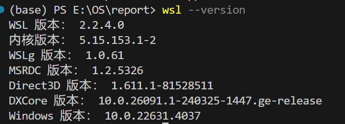

使用的`Linux` 发行版为 `Ubuntu 22.04`：

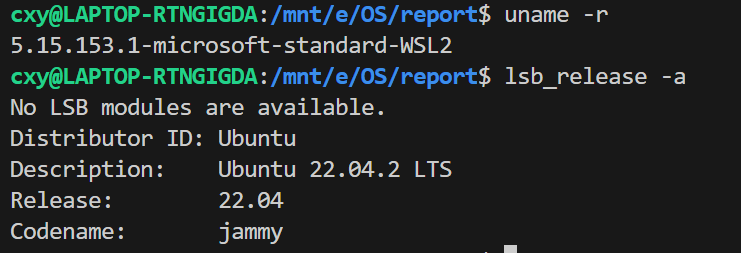

编译、运行、调试 `xv6` 的工具链（部分）版本信息如下所示：

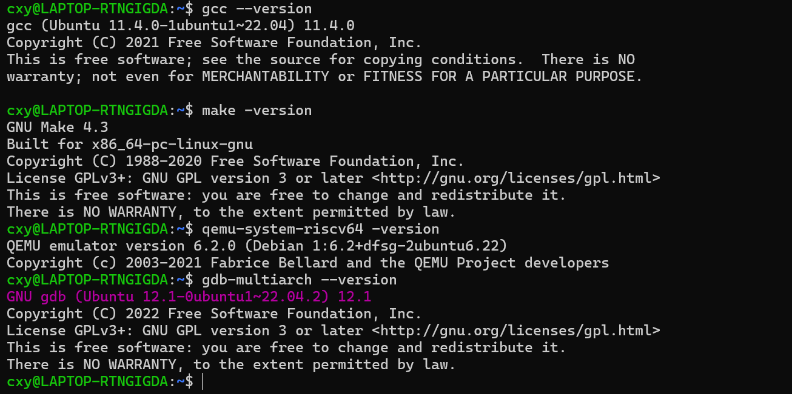

`git`我一直不太会配置。做`xv6`的实验，需要从`MIT`的`git`上拉取分支，修改之后又推到自己的`Github`上，后来偶然间就设置成了这样，发现基本上可以满足自己的的需要：

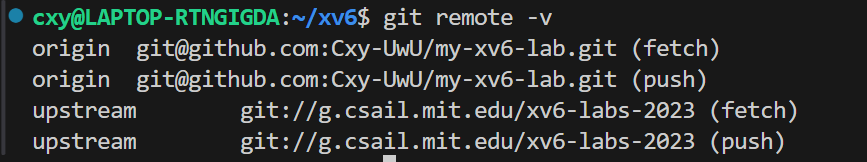


# Lab1 Xv6 and Unix utilities

## 1.1 sleep

### 实验目的

本实验的目标是实现 `sleep` 命令。

### 实现步骤

可以通过翻阅手册（[xv6: a simple, Unix-like teaching operating system (mit.edu)](https://pdos.csail.mit.edu/6.828/2023/xv6/book-riscv-rev3.pdf) ，第11页）的方式查询 xv6 所提供的系统调用，xv6 已经提供了系统调用 `sleep`，如下所示：

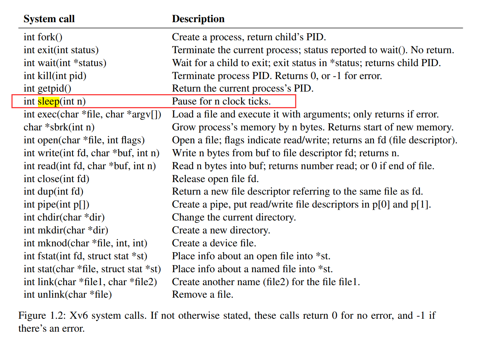

需要编写一个用户级的程序来使用这个系统调用：

```C
#include "kernel/types.h"
#include "kernel/stat.h"
#include "user/user.h"
int main(int argc, char *argv[])
{
    if (argc < 2)
    {
        fprintf(2, "Wrong arguments!\nUsage: sleep time\n");
        exit(1);
    }
    sleep(atoi(argv[1]));
    exit(0);
}
```

### 实验心得

本次实验让我学会了查阅xv6的文档，并使用xv6提供的系统调用。

我之前编写的C语言程序大多是通过标准输入来向 `main` 函数传递数据的，通过本实验尝试了使用 `argc` 和 `argv` 向 `main` 函数传参。在命令行形式的用户界面之下，这样的传参方法是普遍使用的。


## 1.2 pingpong

### 实验目的

本实验旨在编写一个用户级程序，该程序使用 xv6 系统调用在两个进程之间通过一对管道传递一个字节，实现所谓的 "ping-pong" 效果。具体要求如下：

- 父进程向子进程发送一个字节；
- 子进程打印 "<pid>: received ping"，其中 `<pid>` 是其进程 ID；
- 子进程将字节写回给父进程，然后退出；
- 父进程读取子进程发送的字节，打印 "<pid>: received pong"，并退出。

### 实现步骤

1. **创建管道**： 使用 `pipe` 系统调用创建管道。
2. **创建子进程**： 使用 `fork` 系统调用创建子进程。子进程和父进程将通过管道进行通信。
3. **子进程执行任务**：
   - 关闭写入端文件描述符；
   - 从管道读取一个字节；
   - 打印 "<pid>: received ping"；
   - 将字节写回管道；
   - 关闭读取端文件描述符并退出。
4. **父进程执行任务**：
   - 关闭读取端文件描述符；
   - 向管道写入一个字节；
   - 关闭写入端文件描述符；
   - 等待子进程结束；
   - 从管道读取字节；
   - 打印 "<pid>: received pong"；
   - 退出。

```C
#include "kernel/types.h"
#include "kernel/stat.h"
#include "user/user.h"

int main()
{
    int p[2];
    if (pipe(p) != 0)
    {
        printf("pipe err");
        exit(1);
    }

    if (fork() == 0) // child
    {
        close(p[1]); // close write end
        char temp;
        read(p[0], &temp, 1);
        printf("%d: received ping\n", getpid());
        write(p[0], &temp, 1); // write back to parent
        close(p[0]);           // close read end
        exit(0);
    }
    else
    {
        close(p[0]); // close read end
        char temp = 'x';
        write(p[1], &temp, 1);
        close(p[1]); // close write end
        wait((int *)0);
        close(p[1]);          // close write end
        read(p[0], &temp, 1); // read from child
        printf("%d: received pong\n", getpid());
    }

    exit(0);
}
```

### 实验心得

本实验有两个收获：

1. 理论课上说，进程间通信的实现方式之一就是管道，本次实验尝试使用pipe系统调用创建管道，完成了进程间通信。

2. 学会了使用fork系统调用创建子进程，了解了`if (fork() == 0)... else ...`这种通过返回值来区分父子进程的方法。


## 1.3 primes 

### 实验目的

实现一个多进程素数筛，该程序基于 Doug McIlroy 提出的设计思想，使用管道在多个进程之间传递数据，以并发的方式筛选素数。

### 实现步骤

我认为这个题目有两大难点：

1. 素数筛到底是怎么工作的？
2. 如何利用xv6提供给我们的系统调用，来实现多进程的素数筛？

因此，实验步骤也分为这两个部分来介绍。

#### 素数筛的工作原理

MIT的实验网页提供了一个参考资料（[Bell Labs and CSP Threads (swtch.com)](https://swtch.com/~rsc/thread/)），介绍了多进程素数筛的工作原理：


第一个子进程会筛掉所有2的倍数，第二个子进程会筛掉所有3的倍数，第三个子进程会筛掉所有5的倍数，以此类推。每个进程未被筛掉的最小数字必定是素数，直接将其打印出来即可。

#### 多进程素数筛的具体实现

*每个子进程*需要从它的父亲进程**读取上一层筛出的结果**，打印第一个数字，进行自己的这一轮筛除后，再**把自己筛出的结果发送给它的子进程**。所以需要一个`pleft`管道从左侧读取，和一个`pright`管道向右侧发送。

对于每个子进程而言，它的 `pright` 管道都是自己新建立的，而它的 `pleft` 管道则是上一个父进程的 `pright` 。每一个进程运行的都是同一份C代码，我们需要让不同的进程走进不同的 `if` 分支来，这样才能完成正确的逻辑。

```c
int main(void)
{
    int pleft[2];
    pipe(pleft);

    if (fork() == 0)
    {
        // 子进程处理筛选
        int prime;
        close(pleft[1]); // 子进程不需要写入初始管道

        while (read(pleft[0], &prime, sizeof(prime)) != 0)
        {
            printf("prime %d\n", prime);

            int pright[2];
            pipe(pright);

            if (fork() == 0)
            {
                // 下一个子进程处理剩余的数字
                close(pright[1]);
                close(pleft[0]);
                pleft[0] = pright[0]; // 把当前的读端换成新管道的读端
                continue;
            }
            else
            {
                // 当前子进程过滤数字并传递给下一个子进程
                close(pright[0]);
                int num;
                while (read(pleft[0], &num, sizeof(num)) != 0)
                {
                    if (num % prime != 0)
                    {
                        write(pright[1], &num, sizeof(num));
                    }
                }
                close(pright[1]);
                close(pleft[0]);
                wait(0); // 等待子进程完成
                exit(0);
            }
        }
        close(pleft[0]);
        exit(0);
    }
    else
    {
        // 父进程写入数字 2 到 35
        close(pleft[0]);
        for (int i = 2; i <= 35; i++)
        {
            write(pleft[1], &i, sizeof(i));
        }
        close(pleft[1]);
        wait(0); // 等待所有子进程完成
        exit(0);
    }
}
```

### 实验心得

本实验难度较大，我参照了已有的代码才完成了`primes.c`。多进程编程在一定程度上是“违背直觉”的。每一个进程运行的都是同一份C代码，但能够通过fork返回值的不同而进入不同的分支，也可以通过管道获取和发送不同的数据，很难一次性完全想清楚。我最不理解的是`pleft[0] = pright[0]`这一行，明明是要向右侧传递数字，为什么是更改`pleft`而不是`pright`呢？但其实跟着代码逻辑向下走就能明白，这次赋值更改的`pleft`是下一个子进程读取的内容，子进程的 `pleft` 管道实际上是上一个父进程的 `pright`，`pleft[0] = pright[0]`这一行实际上就是把父进程的右管道和子进程的左管道“接”在一起，完成数据传递。

通过本实验，初步尝试了使用多进程编程的方式来解决实际问题。


## 1.4 find 

### 实验目的

实现find。在给定的目录的树中查找特定文件名的文件。

### 实现步骤

访问文件系统，遍历当前目录的操作在`user/ls.c`里面就有，主要是`dirent`的使用。与 `ls.c` 不同的是搜索功能的实现，可以使用递归的方式完成：

1. 如果是文件夹，则函数递归地调用自身，继续向内层搜索。

2. 如果是文件，则通过 `strcmp` 比较文件名是否一致。

   ```c
   void find(char *path, char *key)
   {
       char buf[512], *p;
       int fd;
       struct dirent de;
       struct stat st;
       ...........处理错误情况............
       switch (st.type)
       {
       case T_FILE:
           if (strcmp(fmtname(path), key) == 0)
           {
               printf("%s\n", path);
           }
           break;
   
       case T_DIR:
           ...........处理错误情况............
           strcpy(buf, path);
           p = buf + strlen(buf);
           *p++ = '/';
           while (read(fd, &de, sizeof(de)) == sizeof(de))
           {
               if (de.inum == 0 || strcmp(de.name, ".") == 0 || strcmp(de.name, "..") == 0)
                   continue;
               memmove(p, de.name, DIRSIZ);
               p[DIRSIZ] = 0;
               find(buf, key);
           }
           break;
       }
       close(fd);
   }
   ```

### 实验心得

可以说 `find` 就是一个带字符串比较和递归访问的 `ls` 而已。先大致阅读 `ls.c` ，再来实现 `find.c` ，会比较容易。


## 1.5 xargs

### 实验目的

本实验的目的是要实现 `xargs` 命令。

`xargs` 是 Unix 和 Linux 系统中的一个命令行工具，用于构建和执行由标准输入传递的参数列表。假设有一个文件 `test.txt`，其中内容如下：

```
file1
file2
file3
```

可以使用 `xargs` 将这些文件名作为参数传递给 `rm` 命令来删除这些文件：

```
cat test.txt | xargs rm
```

`cat test.txt` 会输出 `test.txt` 的内容，也就是file1、file2、file3的名字。这三个文件名作为参数传给rm命令，等价于执行了：

```
rm file1 file2 file3
```

### 实现步骤

#### 参数从哪里来：首先搞明白管道符 `|` 的作用

使用`xargs`时，右边那个命令的参数到底从哪里来？

还是以上面这个 `cat test.txt | xargs rm` 为例子，命令的参数是直接从 `test.txt` 里面直接取出来的吗？我一开始也是这样以为的，但实际上这样说并不准确。更确切的说法是：

1. `cat` 的作用是把 `test.txt`  文件的内容输出到**标准输出**
2. 管道符 `|` 将 `cat test.txt` 的输出**重定向**到 `xargs` 的**标准输入**。
3. `xargs` **从标准输入读取** `cat test.txt` 的输出内容，将这些内容作为参数传递给 `rm` 命令。
4. `rm` 命令删除 `test.txt` 文件中列出的所有文件。

理解管道符在 `cat test.txt | xargs rm` 这行命令中的作用，就能明白我们的 `xargs` 要从哪里读取参数了——我们的程序只要读**标准输入**就可以了！

#### 读取标准输入stdin的参数，然后通过exec系统调用来执行

读标准输入，用 `read` 系统调用。它的用法是`read(int fd, void *buf, size_t count);` 其中参数`fd==0`时就是从stdin读数据了。

执行命令用 `exec` 系统调用，一开始，我很难理解exec的用法：

```C
exec(args[0], args);
fprintf(2, "exec %s failed\n", args[0]);
exit(1);
```

这个`fprintf`之前没有`if`分支，如果按照顺序执行的直觉来看，这一句“exec failed”似乎是一定会被打印出来的，但是实际运行并不会把这个failed信息打印出来，而是执行完exec就结束了。

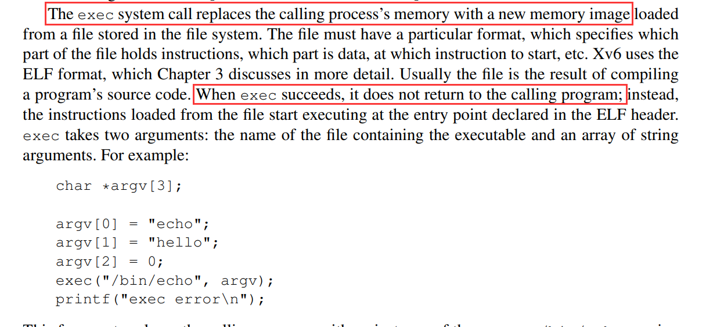

查询手册（[xv6: a simple, Unix-like teaching operating system (mit.edu)](https://pdos.csail.mit.edu/6.828/2023/xv6/book-riscv-rev3.pdf)，第12页）可以知道，`exec` 函数只会在执行失败时返回。如果 `exec` 成功执行，新程序将覆盖当前进程的地址空间，并且永远不会返回到原来的代码中。

```C
while ((n = read(0, p, sizeof(char))) > 0)
    {
        /*
        一次只读一个字符。
        如果读到了换行，直接新开一个子进程，用exec执行这个带参数的命令。
        */
        if (*p == '\n')
        {
            *p = '\0';
            args[argi - 1] = buf;
            args[argi] = 0;

            if (fork() == 0)
            {
                exec(args[0], args);
                fprintf(2, "exec %s failed\n", args[0]);
                exit(1);
            }
            else
            {
                wait(0);
            }

            p = buf;
        }
        else
        {
            p++;
        }
    }
```

### 实验心得

我个人觉得这个实验主要困扰我的点是理解`xargs`的作用和工作过程。在之前我都不知道 `xargs` 是什么东西，更是从来没有用过，管道符`|`也只是一知半解。好在通过查资料、读文档，终于理解实现`xargs`该做什么了：其实 `xargs` 就是read(0,,)读stdin，然后exec。

在本实验中首次尝试了 `exec` 系统调用。


# Lab2 system calls

## 2.1 Using `gdb`

### 实验目的

试着用`gdb`来调试`xv6`中的代码，按要求回答几个问题。

### 实现步骤

使用`gdb`调试xv6需要开两个控制台窗口。

首先确保当前目录处于`xv6-labs-2023`文件夹，运行`make qemu-gdb`，现象如下：

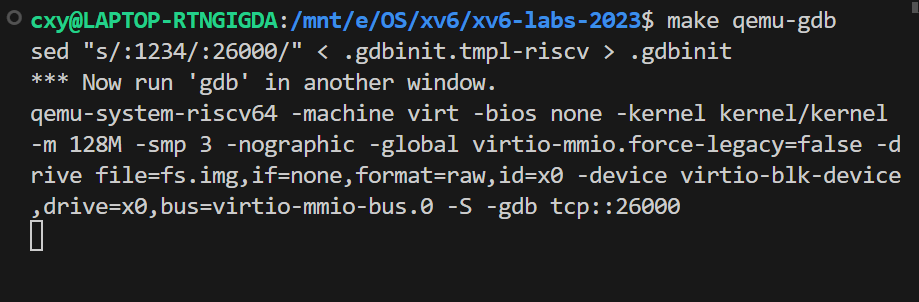

在**另一个控制台**中，运行`gdb-multiarch`（启动支持`risc-v`体系结构的调试器）、`target remote localhost:26000`（按照指定端口远程调试）

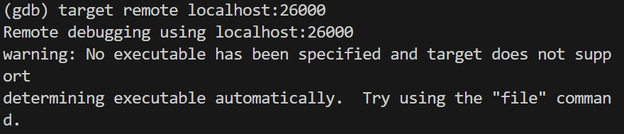

使用`symbol-file kernel/kernel`加载符号

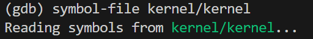

使用`b syscall`打断点

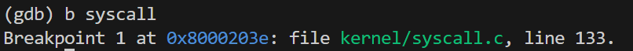

使用`c`(continue)让程序继续运行下去，直到命中断点：

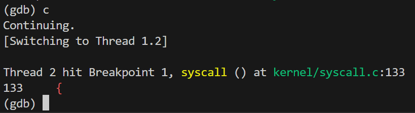

### 回答问题

1. **哪个函数调用了`syscall()`？**

   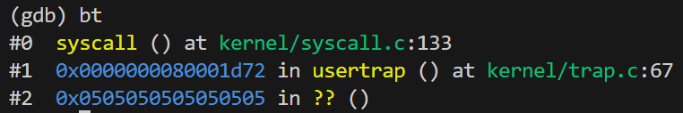

   使用`bt`（back-trace）即可查看调用信息，发现是`usertrap()`调用了`syscall()`。

2. **使用`n`单步执行，运行完`struct proc *p = myproc()`这一句后，使用` p /x *p`。查看`p->trapframe->a7`的值，并分析这个值表示什么。**

   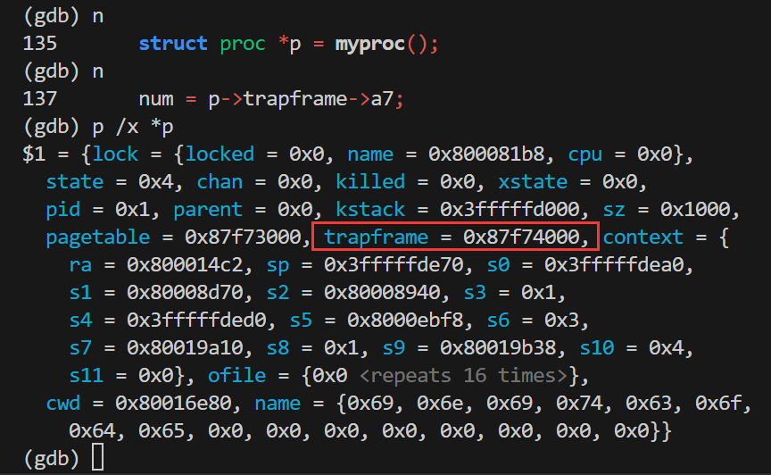

​	`p /x *p` 的作用是打印当前进程的 `proc` 结构体。`p` 是 `gdb` 的命令，`/x` 表示以十六进制格式显示，`*p` 表示打印 `p` 指针指向的整个 `proc` 结构体，如上图所示。但是到这一步尚且还只能看到`trapframe`的地址，为了看到`p->trapframe->a7`的值，直接在gdb里使用`p p->trapframe->a7`命令：

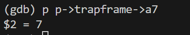

​	也就是说`p->trapframe->a7`的值为7。

​	这个值表示什么？实验指导提醒我去`user/initcode.asm`这个文件看看：

```assembly
# exec(init, argv)
.globl start
start:
        la a0, init
   0:	00000517          	auipc	a0,0x0
   4:	00050513          	mv	a0,a0
        la a1, argv
   8:	00000597          	auipc	a1,0x0
   c:	00058593          	mv	a1,a1
        li a7, SYS_exec
  10:	00700893          	li	a7,7
        ecall
  14:	00000073          	ecall
```

​	这段代码会将 `SYS_exec`（值为 `7`）加载到 `a7` 寄存器。所以`p->trapframe->a7`的值为7，表示当前正在请求执行 `exec` 系统调用。

3. **此前，CPU处于什么状态？**

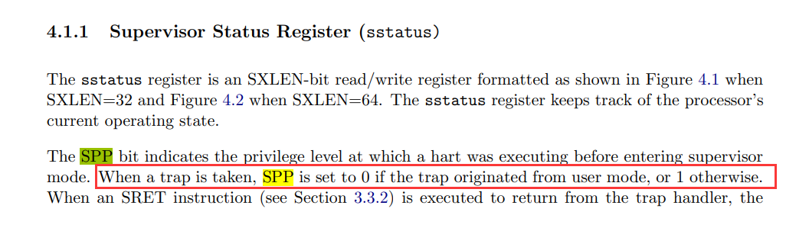

​	在 RISC-V 特权指令集手册（https://github.com/riscv/riscv-isa-manual/releases/download/Priv-v1.12/riscv-privileged-20211203.pdf，4.1.1，P63）中可以得知，`sstatus`寄存器的SPP位用于记录陷入前的CPU模式。

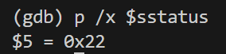

​	

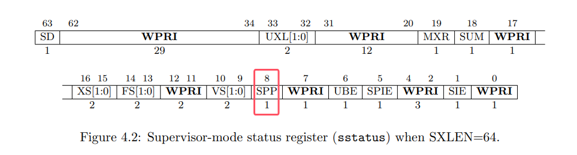

​	打印出`sstatus`寄存器的值为0x22，其二进制为：**0**0100010，对应的SPP位值为0。因此，之前CPU处于用户态。

4. **记录是哪一条汇编指令引发了 kernel panic ，并记录哪个寄存器对应于变量 `num`。**

​	在 `syscall.c` 中 `void syscall(void){` 的开头，将语句 `num = p->trapframe->a7;` 替换为 `num = * (int *) 0;` ，再重新编译运行，会遇到kernel panic。

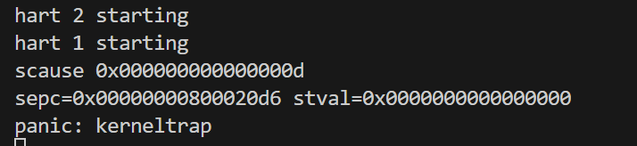

​	`sepc`的值为`0x00000000800020d6`，去`kernel/kernel.asm` 文件中搜索这个值，可以找到：

```assembly
800020d6:	00002903          	lw	s2,0(zero) # 0 <_entry-0x80000000>
```

​	对应`num`值的寄存器为`s2`。

5. **为什么发生了kernel panic？**

​	**`scause` 的值**：`0x000000000000000d`

​	查RISC-V 特权指令集手册（P70~71）：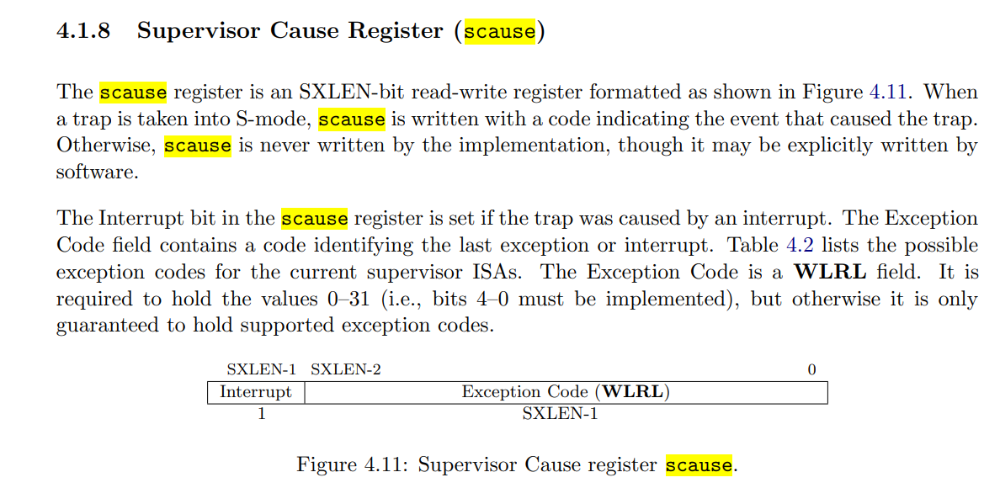

​	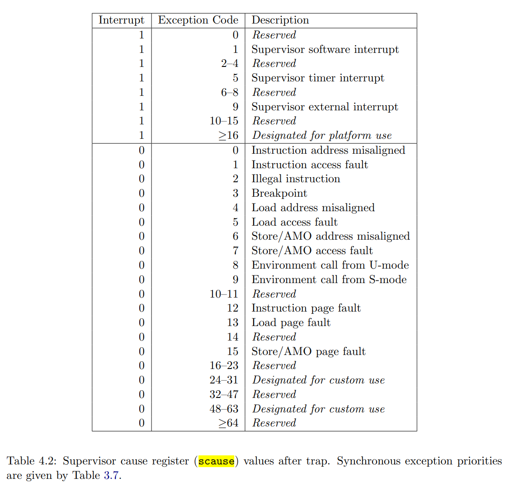	

​	现在**`scause` 的值**：`0x000000000000000d`，Interrupt=0，Exception Code=13，对应 Load page fault，表示在加载数据时发生了页面错误，因而发生了kernel panic。

6. **内核崩溃时运行的二进制文件的名称是什么？它的PID是什么？**

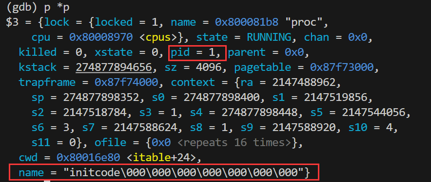

​	名称为 `initcode`, `pid` 为 1;

### 实验心得

​	初步学习使用了GDB，例如使用`b`来打断点，利用`bt`查看调用堆栈，用`p`来显示变量/寄存器值等；第一次尝试查询了RISC-V 特权指令手册，明白了在手册中查找寄存器（例如`scause`）各个位的含义，以辅助调试。

> 一些题外话：
>
> ​	在命令行使用GDB似乎有些太“原始”了，需要输入命令才能使用相应的功能，不够“现代”。我使用VS Code作为完成xv6实验的工具，能否使用VS Code来配置GDB，直接用鼠标在代码里打断点呢？我发现是可以的，参照网络上的 [这篇博客](https://sanbuphy.github.io/p/%E4%BC%98%E9%9B%85%E7%9A%84%E8%B0%83%E8%AF%95%E5%9C%A8vscode%E4%B8%8A%E5%AE%8C%E7%BE%8E%E8%B0%83%E8%AF%95xv6%E5%AE%8C%E7%BB%93/) 就能做到。

---


## 2.2 System call tracing

### 实验目的

本实验的目标是为 `xv6` 操作系统添加一个新的 `trace` 系统调用，该调用可以控制系统调用的跟踪。通过使用这个系统调用，用户可以指定要跟踪哪些系统调用，并在这些系统调用返回时打印出相关信息，包括进程ID、系统调用名称和返回值。

### 实现步骤

1. **更新 `Makefile`**
   用户级程序 `trace.c`已经提供，要使它被编译，需要在 `Makefile` 中添加：

   ```c
   +    $U/_trace\
   ```

2. **添加系统调用编号**
   在 `kernel/syscall.h` 中添加 `SYS_trace` 的系统调用编号：

   ```c
   +#define SYS_trace  22 // 添加trace的系统调用编号
   ```

3. **修改 `proc` 结构体**
   在 `kernel/proc.h` 中的 `proc` 结构体中新增一个 `trace_mask` 变量，用于记录掩码，表明要跟踪哪些系统调用：

   ```c
   +  int trace_mask; // 新增一个掩码变量，用于实现trace系统调用
   ```

   在 `kernel/proc.c` 中修改 `fork` 函数以复制父进程的 `trace_mask` 到子进程：

   ```c
   +  np->trace_mask = p->trace_mask; // 为子进程的掩码赋值
   ```

4. **更新系统调用处理**
   在 `kernel/syscall.c` 中：

   - 添加 `sys_trace` 函数的声明：
     ```c
     +extern uint64 sys_trace(void);
     ```

   - 在系统调用表中添加 `sys_trace` 的条目：
     ```c
     +[SYS_trace]   sys_trace,
     ```

   - 添加系统调用名称数组，方便根据系统调用编号来输出系统调用的名字：
     ```c
     +static char *syscall_names[] = {
     +  [SYS_fork]    "fork",
     +  [SYS_exit]    "exit",
     +  // ... 省略部分内容 ...
     +  [SYS_trace]   "trace", 
     +};
     ```

   - 修改 `syscall` 函数，如果发生了系统调用，恰好这个调用又是需要被跟踪的，则打印信息：
     ```c
     +    if (p->trace_mask & (1 << num)) {
     +      printf("%d: syscall %s -> %d\n", p->pid, syscall_names[num], p->trapframe->a0);
     +    }
     ```

5. **实现 `sys_trace` 系统调用**
   在 `kernel/sysproc.c` 中实现 `sys_trace` 函数。这个函数修改 `proc` 结构体里的 `trace_mask`。

   > 遇到的问题：不知道怎样给系统调用传入参数！
   >
   > 解决办法：去阅读已有的代码，看到`sys_sleep(void)`用了 `argint(0, &n)`来获取参数，其原理是读取`trapframe`中寄存器的值。

   ```c
   +uint64 sys_trace(void) {
   +    int mask;
   +    // 在实现系统调用时，需要从用户空间获取参数。
   +    argint(0, &mask);           // 通过 argint 获取第一个参数（位置 0）赋值给mask。其实也就是读了 p->trapframe->a0 的值;
   +    struct proc *p = myproc();  // 获取当前进程的PCB
   +    p->trace_mask = mask;       // 修改当前进程PCB的trace_mask
   +    return 0;
   +}
   ```

6. **更新用户空间的头文件和系统调用定义**
   在 `user/user.h` 中添加 `trace` 系统调用的声明：

   ```c
   +int trace(int mask); // 在user/user.h中添加系统调用trace的声明
   ```

   在 `user/usys.pl` 中添加 `trace` 系统调用的入口：
   ```c
   +entry("trace"); # 添加系统调用trace
   ```

### 实验心得

Lab1只是使用已有的系统调用实现用户级程序，而在本实验中第一次尝试了在 `xv6` 操作系统中添加新的系统调用。

总结下来，添加系统调用可以遵循以下几个步骤：

- 在宏定义中添加系统调用的名称和编号，更新系统调用表，添加函数声明。

- 对已有的内核代码进行相关的修改，例如在结构体里新增必要的成员等，以支持新的系统调用。
- 实现系统调用的具体功能。
- 让一个用户级的程序来使用系统调用，测试该系统调用是否能正常工作。

（后来的实验中经常需要实现系统调用，确实也多次重复经历了上述这些步骤）

另外，本实验接触到了`proc`结构体。从它的成员来看，这个结构体应该就是xv6的PCB了吧。


## 2.3 Sysinfo

### 实验目的

给xv6增加一个系统调用 `sysinfo`，它能够收集系统运行的信息，获取当前可用的内存大小和当前的进程数量。

### 实验步骤

既然`sysinfo`的目标是要获取可用内存和当前进程数量，可以分别实现一个 `uint64 freemem()` 函数来统计可用内存，和一个 `uint64 nproc(void)` 来统计进程数量。在 `sys_sysinfo` 函数里面只要调用这两个函数就可以了。

因此 `sys_sysinfo` 函数是这个样子：

```C
uint64 sys_sysinfo(void)
{
  struct sysinfo info;
  struct proc *p = myproc();
  uint64 addr;

  argaddr(0, &addr);

  // 获取可用内存
  info.freemem = freemem();

  // 获取当前进程数量
  info.nproc = nproc();

  if (copyout(p->pagetable, addr, (char *)&info, sizeof(info)) < 0)
      return -1;

  return 0;
}
```

其中调用的`freemem()`函数，用于统计空闲内存空间。`kmem` 的成员有 `struct run *freelist`，它是xv6的空闲内存链表。`struct run` 是这个空闲链表的链表节点结构,它们通过 `next` 指针相连接。通过遍历`freelist`链表，循环累加单个内存块的大小，即可获得所有空闲内存的大小。

```C
uint64 freemem(){
  struct run *r;
  uint64 free = 0;

  // 获取 kmem.lock 锁以保护空闲内存链表的访问
  acquire(&kmem.lock);
  for (r = kmem.freelist; r; r = r->next)
    free += PGSIZE;
  release(&kmem.lock);

  return free;
}
```

xv6通过数组 `struct proc proc[NPROC]` 来记录各个进程的情况。`nproc()` 函数遍历`proc`数组，找到数组元素中`proc.state!=UNUSED`的个数就是当前系统中的进程个数了。

```C
uint64 nproc(void)
{
  struct proc *p;
  uint64 count = 0;

  for (p = proc; p < &proc[NPROC]; p++)
    if (p->state != UNUSED)
      count++;

  return count;
}
```

> *更改makefile*、*添加系统调用编号*之类的步骤，和上个实验完全一样，这里不再赘述了。

还有两点可以说一下，一个是`argaddr`，它和上面的`argint`差不多，都是用于把系统调用的参数从用户空间传进来的，不同的是这次传进来的是结构体的地址而不是整数；另一个是`copyout`，它反过来把内核空间里的数据拷贝到用户空间。它们俩造成的效果就是，用户运行完`sysinfo(&info);`，之后会发现info的内容真的被系统调用给更改了。

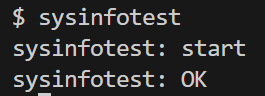

### 实验心得

查看系统当前的运行状况是很实用的功能，写完 `sysinfo` 之后，感觉都可以给xv6做一个360加速球了（开个玩笑），虽然现在只能看占用情况而不能够真的加速。

通过本实验还初次窥见了 xv6 系统中管理资源的数据结构，例如 `freelist` 空闲内存链表和 `proc` 进程数组，对于空闲空间管理和进程管理有了一点点的、很少很浅显的概念。


# Lab3 page tables

## 3.1 Speed up system calls

### 实验目的

一些现代操作系统（如 Linux）会在用户空间和内核之间共享一篇只读的内存区域，加快某些系统调用的速度。本实验的目标是实现这一特性，以优化 `getpid()` 系统调用的执行效率。

### 实现步骤

原本的 `getpid()` 系统调用如下所示：

```C
uint64 sys_getpid(void){
 return myproc()->pid;
}
```

这个函数表面上非常简洁。但每次调用 `getpid()` 时，系统都需要从用户态切换到内核态，额外的上下文切换开销较大。

解决方式就是在每个进程的内存空间中分配一片共享的只读区域，用户态程序可以直接访问，而不需要状态切换。

##### 1. 定义共享区域usyscall：

下图的USYSCALL的位置、大小和数据结构已经帮我们定义好了。

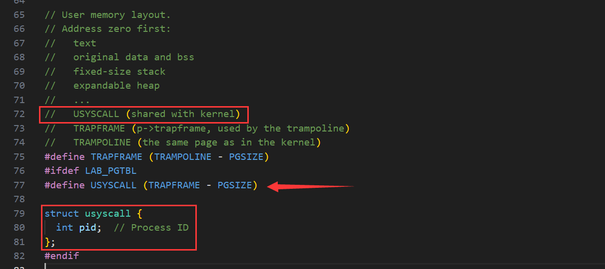

这个`usyscall`结构体是所有进程都会有的。所以把它添加为`proc`结构体的成员。

```c
+++ b/kernel/proc.h
@@ -104,4 +104,5 @@ struct proc {
   struct file *ofile[NOFILE];  // Open files
   struct inode *cwd;           // Current directory
   char name[16];               // Process name (debugging)
+  struct usyscall *usyscall;   // sharing data in a read-only region between userspace and the kernel
 };
```


##### 2. usyscall的初始化：

当创建新进程时，需要在 `allocproc()` 函数中为 `usyscall` 分配一页物理内存，并将 `pid` 存入 `usyscall` 结构。

```C
  //(在proc.c中的static struct proc* allocproc(void)函数内)
  if ((p->usyscall = (struct usyscall *)kalloc()) == 0)
  {
    freeproc(p);
    release(&p->lock);
    return 0;
  }
  p->usyscall->pid = p->pid;
```

在进程的页表初始化时，在`proc_pagetable()` 函数建立 `usyscall` 结构与进程的虚拟内存空间之间的映射。`mappages` 是 `xv6` 操作系统中用于在页表中设置虚拟地址到物理地址映射的函数：

```c
int
mappages(pagetable_t pagetable, uint64 va, uint64 size, uint64 pa, int perm)
```

`usyscall`是“用户只读”的，所以调用`mappages`时，在`perm`参数里为它设置 `PTE_R | PTE_U` 两个比特位。

```c
+  // 在pagetable_t proc_pagetable(struct proc *p)函数内
+  if (mappages(pagetable, USYSCALL, PGSIZE,
+               (uint64)p->usyscall, PTE_R | PTE_U) < 0)
+  {
+    uvmunmap(pagetable, USYSCALL, 1, 0);
+    uvmfree(pagetable, 0);
+    return 0;
+  }
+
```


##### 3. 解除映射并释放：

在`proc_freepagetable`中新增了一行 `uvmunmap(pagetable, USYSCALL, 1, 0);` 用于解除 `usyscall` 结构在虚拟地址空间中的映射。这样可以确保在进程结束时，`usyscall` 不再被映射到虚拟内存。

```c
void
proc_freepagetable(pagetable_t pagetable, uint64 sz)
{
  uvmunmap(pagetable, TRAMPOLINE, 1, 0);
  uvmunmap(pagetable, TRAPFRAME, 1, 0);
  uvmunmap(pagetable, USYSCALL, 1, 0); // 新增这一行
  uvmfree(pagetable, sz);
}
```

在 `freeproc` 函数中，新增了 `kfree((void *)p->usyscall);`，用于释放之前为 `usyscall` 分配的物理内存，避免内存泄漏：

```c
  //(在proc.c中的 freeproc 函数内)
@@ -158,6 +166,9 @@ freeproc(struct proc *p)
   if(p->trapframe)
     kfree((void*)p->trapframe);
   p->trapframe = 0;
+  if (p->usyscall)
+    kfree((void *)p->usyscall);
+  p->usyscall = 0;
   if(p->pagetable)
     proc_freepagetable(p->pagetable, p->sz);
   p->pagetable = 0;
```

`ugetpid`是已经在`ulib.c`里面写好的，不用实现这一部分。所以可以直接交给打分程序来检验了：

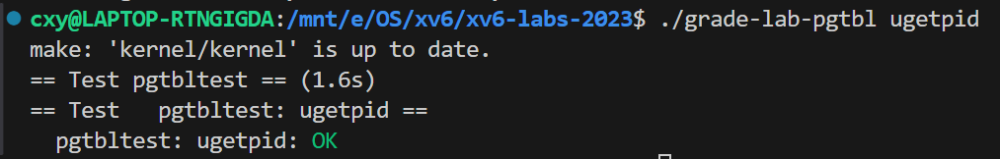

#### 遇到的问题

> 在编译时，makefile 的第93行会为本实验添加上 LAB_PGTBL 这个宏定义， 但是编辑器（VSCode）事先并不知道这个宏，一直给我的相关代码划红色波浪线。例如，VSCode读不到LAB_PGTBL 这个宏，所以不认识USYSCALL。
>
>  所以我在编写代码时重复进行定义\#define LAB_PGTBL，编译前再把它注释掉就好了。这个解决办法并不优雅。

### 回答问题

**Which other xv6 system call(s) could be made faster using this shared page? Explain how.**

这种加速方式适用于**只涉及读取内核数据而不需要修改或执行复杂操作的调用**。

除了`getpid()`以外，`uptime()`、`fstat()`等系统调用也符合这个特征，能够被加速。


### 实验心得

之前会觉得系统调用总要经历***用户态发起调用 - 陷入内核态 - 内核处理 - 返回用户态***这样的一整套过程。本实验的`ugetpid`很特殊，通过在进程页表中插入只读页，就能实现在用户空间直接读取`pid`的功能，让`ugetpid`成为了一个**不用陷入内核态**的“系统调用”。

通过本实验了解了xv6中内存分配、页表映射、设置权限位、解除映射和内存释放的过程，对内存管理有了更深刻的理解。


## 3.2 Print a page table

### 实验目的

实现一个函数 `vmprint()`，用于层次化地打印 RISC-V 页表的内容，以帮助可视化和调试页表结构。它的输出像是这样，用缩进来体现页表的层级：

```C
page table 0x0000000087f6b000
 ..0: pte 0x0000000021fd9c01 pa 0x0000000087f67000
 .. ..0: pte 0x0000000021fd9801 pa 0x0000000087f66000
 .. .. ..0: pte 0x0000000021fda01b pa 0x0000000087f68000
 .. .. ..1: pte 0x0000000021fd9417 pa 0x0000000087f65000
 .. .. ..2: pte 0x0000000021fd9007 pa 0x0000000087f64000
 .. .. ..3: pte 0x0000000021fd8c17 pa 0x0000000087f63000
 ..255: pte 0x0000000021fda801 pa 0x0000000087f6a000
 .. ..511: pte 0x0000000021fda401 pa 0x0000000087f69000
 .. .. ..509: pte 0x0000000021fdcc13 pa 0x0000000087f73000
 .. .. ..510: pte 0x0000000021fdd007 pa 0x0000000087f74000
 .. .. ..511: pte 0x0000000020001c0b pa 0x0000000080007000
init: starting sh
```

### 实现步骤

先读了xv6 book [[xv6: a simple, Unix-like teaching operating system (mit.edu)](https://pdos.csail.mit.edu/6.828/2023/xv6/book-riscv-rev3.pdf)]与内存相关的部分，很快就找到了这张图（P33, Figure 3.2）： 

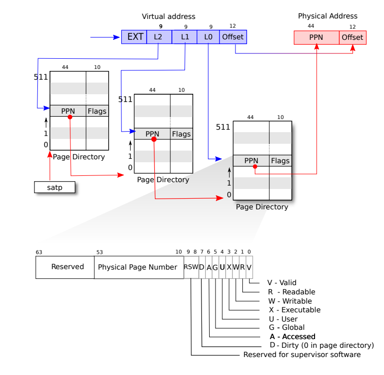

xv6使用三级页表，要打印出所有的有效页表项，只要从第一级出发，检查PTE_V标志位。若PTE_V为1，则打印当前项并通过PTE2PA进入下一级页表继续打印；若PTE_V为0，则前往下一个页表项。

这是一个递归的过程。我在`vmprint(pagetable_t pagetable)` 中调用递归函数 `vmprint_recursive(pagetable_t pagetable, int level)`，通过`level`参数的传递来决定打印的缩进，体现出页表层级。

1. **在 `kernel/defs.h` 中新增声明**：
   
   ```c
   void vmprint(pagetable_t pagetable);
   ```
   
2. **在 `kernel/vm.c` 中实现 `vmprint()` 函数及其递归部分**：
   - `vmprint()` 负责调用 `vmprint_recursive()`，打印页表整体结构：
   ```c
   void vmprint(pagetable_t pagetable) {
       printf("page table %p\n", pagetable);
       vmprint_recursive(pagetable, 2);  // 从最顶层（第三级）页表开始递归打印
   }
   ```

   - `vmprint_recursive()` 递归打印每个页表项和物理地址，检查PTE_V为1：
   ```c
   void vmprint_recursive(pagetable_t pagetable, int level) {
       if(level < 0)
           return;
       for (int i = 0; i < 512; i++) {
           pte_t pte = pagetable[i];
           if (pte & PTE_V) {  // 仅打印有效的PTE
               for (int j = 0; j < 3 - level; j++)
                   printf(" ..");
               uint64 child = PTE2PA(pte);
               printf("%d: pte %p pa %p\n", i, pte, child);
               vmprint_recursive((pagetable_t)child, level - 1);
           }
       }
   }
   ```

3. **在 `kernel/exec.c` 中插入调用 `vmprint()`**：
   - 在 `exec()` 函数的返回前加入 `vmprint()` 调用，打印第一个进程的页表：
   ```c
   if (p->pid == 1)
       vmprint(p->pagetable);
   ```

这时`make qemu`，能够在系统启动时打印出页表：

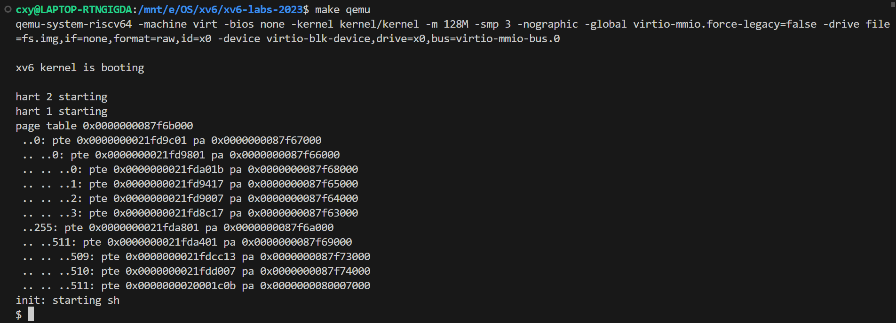

#### **遇到的问题**

   三级页表的的level（级数）是从哪里开始数的？

   最初我认为最远离物理内存的页表是第一级页表，之后是第二级、第三级。这样写也能够打印出相同的页表，在输出上看不出任何差别（因为`vmprint`只要层数是3层就可以了，不用管是 1 2 3  ，3 2 1还是 2 1 0）。

   但是后来偶然注意到xv6的walk函数使用` for(int level = 2; level > 0; level--)`来访问页表，这样可以与`PX()`宏定义保持一致:

   ```c
   \#define PX(level, va) ((((uint64) (va)) >> PXSHIFT(level)) & PXMASK)
   ```

   实际上这也与这RISC-V手册里面的Sv39 scheme规定的虚拟地址格式一致：

   ```c
   // The risc-v Sv39 scheme has three levels of page-table
   // pages. A page-table page contains 512 64-bit PTEs.
   // A 64-bit virtual address is split into five fields:
   //   39..63 -- must be zero.
   //   30..38 -- 9 bits of level-2 index.
   //   21..29 -- 9 bits of level-1 index.
   //   12..20 -- 9 bits of level-0 index.
   //    0..11 -- 12 bits of byte offset within the page.
   ```

   这让我意识到`level`的值并不是随意的，还是按照`L2-L1-L0`的层级来写比较好。所以`vmprint_recursive`最初的`level`为2，每次递归地进入新一层，让`level`减一，以`level<0`作为递归返回的条件。

#### 实验心得

通过实现 `vmprint()` 递归打印页表的功能，了解了 RISC-V 虚拟地址格式与xv6中三级页表的访问方法，对于虚拟内存管理有了更深的理解。


## 3.3 Detect which pages have been accessed

### 实验目的
实现 `pgaccess()` 系统调用，通过检查 RISC-V 页表中的访问位，报告哪些页面已被访问过。这个功能可以帮助垃圾收集器等程序优化内存管理。

### 实现步骤


依然是这张图。Flags中有`A-Accessed`标志位来标记当前页是否有被访问。本实验利用它来实现是否访问的检测功能。

1. **定义访问位标志**：
   在 `kernel/riscv.h` 中，添加 `PTE_A` 标志，用于标记页面是否被访问过：

   ```c
   #define PTE_A (1L << 6) // accessed
   ```

2. **实现 `pgaccess()` 系统调用**：
   在 `kernel/sysproc.c` 中实现 `sys_pgaccess()` 函数，该函数接收三个参数：起始虚拟地址、检查的页面数量以及存储结果的位掩码地址。

   - **从用户空间获取参数**，通过 `argaddr()` 和 `argint()` 来完成。
   - **遍历指定的页面来检查**。使用 `walk()` 函数获取页表项（PTE），并检测PTE是否设置了 `PTE_A` 位。如果该位被设置，则清除它，并在结果掩码中记录该页面已被访问。
   - 最后，**使用 `copyout()` 函数将结果result复制到用户空间的mask**。

   ```c
   int sys_pgaccess(void) {
       uint64 base;
       int len;
       uint64 mask;
       argaddr(0, &base);
       argint(1, &len);
       argaddr(2, &mask);
       
       uint64 result = 0;
       struct proc *proc = myproc();
       
       for (int i = 0; i < len; i++) {
           pte_t *pte = walk(proc->pagetable, base + i * PGSIZE, 0);
           if (*pte & PTE_A) {
               *pte -= PTE_A;
               result |= (1L << i);
           }
       }
       
       if (copyout(proc->pagetable, mask, (char *)&result, sizeof(result)) < 0)
           panic("sys_pgaccess copyout error");
       
       return 0;
   }
   ```

### 实验心得
本实验实现了 `pgaccess()` 系统调用。

- 复习了lab2中创建新的系统调用的过程以及从用户获取参数、把结果拷贝回用户空间的方法；
- 在实验指导的提示下，阅读了walk函数的代码实现，并理解了它的作用；
- 查看了RISC-V手册里对Flags位的定义。


Lab3 的评分如下：

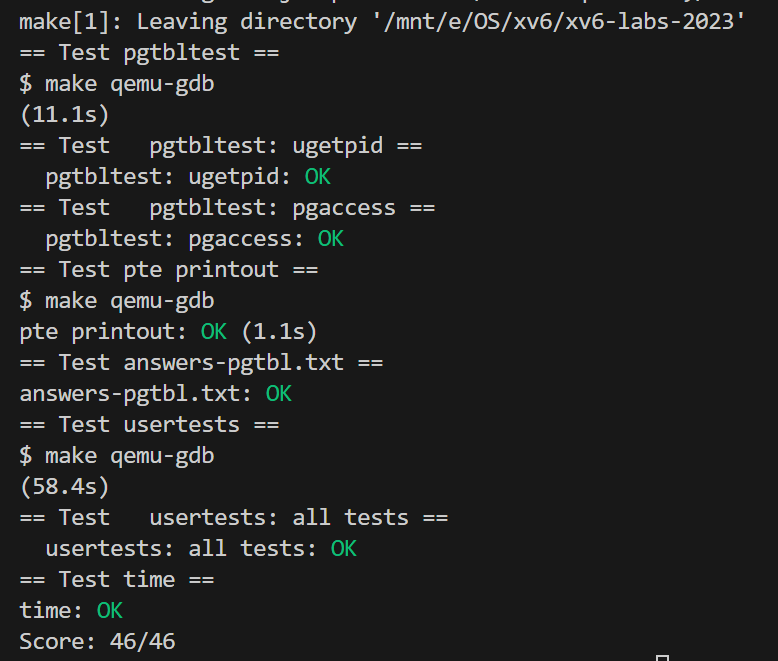


# Lab4 traps

## 4.1 RISC-V assembly

### 实验目的

了解一些 RISC-V 汇编很重要。在 xv6 repo 中有一个文件 user/call.c。make fs.img 会对其进行编译，并生成 user/call.asm 中程序的可读汇编版本。

### 实验步骤

`call.c`的C语言代码如下：

```C
#include "kernel/param.h"
#include "kernel/types.h"
#include "kernel/stat.h"
#include "user/user.h"

int g(int x) {
  return x+3;
}

int f(int x) {
  return g(x);
}

void main(void) {
  printf("%d %d\n", f(8)+1, 13);
  exit(0);
}
```

运行`make fs.img`，然后阅读`call.asm`中的汇编代码。

### 回答问题

1. **Which registers contain arguments to functions? For example, which register holds 13 in main's call to `printf`?**

   ```assembly
   printf("%d %d\n", f(8)+1, 13);
     24:	4635                	li	a2,13
     26:	45b1                	li	a1,12
     28:	00000517          	auipc	a0,0x0
     2c:	7b850513          	addi	a0,a0,1976 # 7e0 <malloc+0xe6>
     30:	00000097          	auipc	ra,0x0
     34:	612080e7          	jalr	1554(ra) # 642 <printf>
   ```

   在 RISC-V 架构中，**`a0` 到 `a7` 寄存器**用于传递函数的前八个参数。

   > 如果函数的参数超过了8个（即超过了寄存器 `a0` 到 `a7` 的容量），多余的参数会被存储在栈上，由被调用函数从栈中读取这些参数。

   在上面的代码片段中：

   - `li a2, 13`：将 `13` 加载到 `a2` 寄存器中。

   因此，在 `main` 函数调用 `printf` 时，**`13` 被存放在 `a2` 寄存器中**，并作为第三个参数传递给 `printf` 函数。

2. **Where is the call to function `f` in the assembly code for main? Where is the call to `g`? (Hint: the compiler may inline functions.)**

   这是`f` 函数内本该调用 `g` 函数的地方：

   ```assembly
   000000000000000e <f>:
   
   int f(int x) {
      e:	1141                	addi	sp,sp,-16
     10:	e422                	sd	s0,8(sp)
     12:	0800                	addi	s0,sp,16
     return g(x);
   }
     14:	250d                	addiw	a0,a0,3
     16:	6422                	ld	s0,8(sp)
     18:	0141                	addi	sp,sp,16
     1a:	8082                	ret
   ```

   这是本该调用`f` 的地方：

   ```assembly
   printf("%d %d\n", f(8)+1, 13);
     24:	4635                	li	a2,13
     26:	45b1                	li	a1,12
     28:	00000517          	auipc	a0,0x0
     2c:	7b850513          	addi	a0,a0,1976 # 7e0 <malloc+0xe6>
     30:	00000097          	auipc	ra,0x0
     34:	612080e7          	jalr	1554(ra) # 642 <printf>
   ```

   然而看起来`int f(int x)`内部**并没有调用函数`g(x)`**，而是直接 `addi a0, a0, 3`，给`a0`加三了（也就是`g`的等效操作）；`f(8)+1`**也并没有调用`f`**，而是直接把结果12（12=8+3+1）写到了`a1`里。

   `f` 函数和 `g` 函数的调用都没有明确地显示出来，这是因为编译器将这些函数进行了**内联优化**，这两个函数的逻辑都直接内联到了主函数 `main` 中，没有显示的函数调用指令。

3. **At what address is the function `printf` located?**

   ```assembly
   void
   printf(const char *fmt, ...)
   {
    642:	711d                	addi	sp,sp,-96
    644:	ec06                	sd	ra,24(sp)
    646:	e822                	sd	s0,16(sp)
    648:	1000                	addi	s0,sp,32
    64a:	e40c                	sd	a1,8(s0)
    64c:	e810                	sd	a2,16(s0)
   ```

   `printf` 函数的地址位于 `0x642`。

4. **What value is in the register `ra` just after the `jalr` to `printf` in `main`?**

   ```assembly
     34:	612080e7          	jalr	1554(ra) # 642 <printf>
     exit(0);
     38:	4501                	li	a0,0
   ```

   不知道`jalr`是什么。翻RISC-V手册：

   https://github.com/riscv/riscv-isa-manual/releases/download/Ratified-IMAFDQC/riscv-spec-20191213.pdf      

   第39页：

   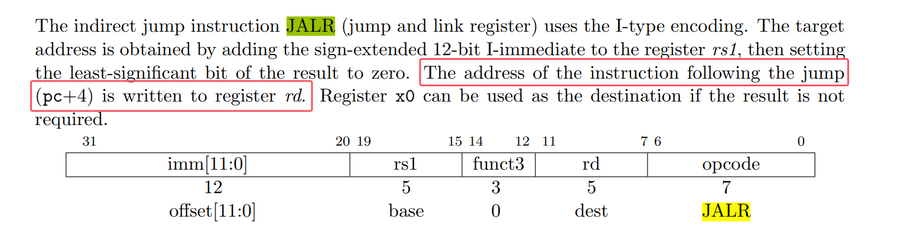

   执行完`jalr`后，`ra`的值变为pc+4，也就是0x38。

5. **Run the following code.**

	```
	unsigned int i = 0x00646c72;
	printf("H%x Wo%s", 57616, &i);      
	```
	
	**What is the output? [Here's an ASCII table](https://www.asciitable.com/) that maps bytes to characters.**
	
	**The output depends on that fact that the RISC-V is little-endian. If the RISC-V were instead big-endian what would you set `i` to in order to yield the same output? Would you need to change `57616` to a different value?**
	
	输出为 `He110 World`。
	
	`%x`表示以16进制打印，`57616` （10进制）转换为 16 进制为 `e110`，`H%x`打印出`He110`。
	
	在ascii码表中，`72 6c 64` 分别对应字母 `'r'`、`'l'`、`'d'`。
	
	小端与大端的区别：
	
	​	 `0x00646c72` 在小端系统中按顺序存储为`72 6c 64 00`，而在大端系统中按顺序存储为 `00 64 6c 72`。
	
	因此，**小端模式下，打印的 ASCII 字符为 `rld`**，后面是字符串尾`\0`；**大端模式理论上打不出这三个字符**，因为`00`一上来就认为是字符串尾了。
	
	要让大端打印也打印`rld`，把`i`的值改成 `0x726c6400`即可。
	
6. **In the following code, what is going to be printed after `'y='`? (note: the answer is not a specific value.) Why does this happen?**

   `printf("x=%d y=%d", 3);` 

   输出内容的 `'y='`后方应该是`a2`寄存器按`int`型来打印的值。由于`prinf` 少传递了一个参数，`a2`中的值应该是无效的，所以不同的时候输出可能会不同。

### 实验心得

通过本实验了解了一些RISC-V汇编的知识。我没有系统地学习过RISC-V汇编，但是在本实验中对照着C语言的源代码来查看汇编代码，还是能够猜测出一部分意思，在一定程度上消除了我对于汇编的陌生感和恐惧感。


## 4.2 Backtrace

### 实验目的

实现一个回溯（`backtrace`）功能，用于在操作系统内核发生错误时，输出调用堆栈上的函数调用列表。这有助于调试和定位错误发生的位置。

### 实验步骤

在 `xv6` 中实现 `backtrace()` 函数，步骤如下：

1. **访问帧指针**：
   
   - 根据实验指导的要求，在 `kernel/riscv.h` 中添加如下的一个 `r_fp()` 函数，使用内联汇编获取当前的帧指针（`s0`寄存器）。
   
     ```c
     static inline uint64 r_fp() {
       uint64 x;
       asm volatile("mv %0, s0" : "=r" (x) );
       return x;
     }
     ```
   
2. **实现 `backtrace()`**：
   
   - 在 `kernel/defs.h` 中添加 `backtrace` 函数的声明。
     ```c
        void            printf(char*, ...);
        void            panic(char*) __attribute__((noreturn));
        void            printfinit(void);
        void            backtrace(void); // newly add in lab 4.2
	- 在 `kernel/printf.c`中实现 `backtrace()`:
	
     ```c
     void backtrace(void)
     {
       printf("backtrace:\n");
       uint64 fp = r_fp();
       uint64 this_page = PGROUNDDOWN(fp);   // 页边界
       while (PGROUNDDOWN(fp) == this_page)  // 判断是否超出了页边界
       {
         uint64 ra = *(uint64 *)(fp - 8);    // 获取返回地址
         printf("%p\n", ra);
         fp = *(uint64 *)(fp - 16);          // 获取前一个帧指针
       }
     }
     ```
   
     - 使用 `r_fp()` 获取当前的帧指针
   
     - 实验指导中给出了返回地址和前一个帧指针的`offset`（`-8`和`-16`）。我们利用已知的offset来获取并打印返回地址`ra`，然后前往前一个帧指针来遍历栈，逐步回溯栈中的调用链。
   
     - 什么时候停下来？实验指导给了这样一个提示：
   
       > A useful fact is that the memory allocated for each kernel stack consists of a single page-aligned page, so that all the stack frames for a given stack are on the same page. You can use `PGROUNDDOWN(fp)` (see `kernel/riscv.h`) to identify the page that a frame pointer refers to.
   
       所以我先设置一个`uint64 this_page = PGROUNDDOWN(fp);`来记录当前页的边界，之后`PGROUNDDOWN(fp) == this_page`每次循环都检查当前的`fp`地址是否还在同一个页上，这样就能在抵达栈底后停止，避免无限循环。
   
4. **在 `sys_sleep` 中调用 `backtrace()`**：
   
   - 将 `backtrace()` 函数的调用添加到 `sys_sleep` 函数中，以便在运行 `bttest` 时触发回溯。
   
   - ```C
     int sys_sleep(void) {
         backtrace();  // 添加调用以生成回溯
         ...
     ```
   
5. **调试**：
   
   - 运行 `bttest` 并记录输出的地址，然后使用 `addr2line` 工具将地址转换为源代码中的行号，验证 `backtrace()` 的正确性。
   
     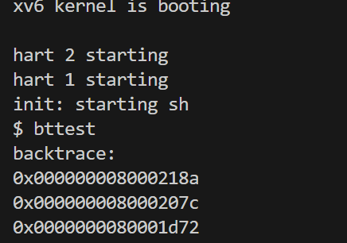
   
     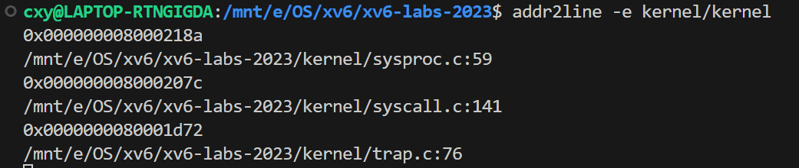
   
     能够看到调用栈的代码行号。

### 实验中遇到的问题和解决方法

1. **什么时候停止：** 

   `backtrace`需要遍历整个调用堆栈，并在栈底停止。怎么判断循环是否应该停止了呢？实验指导说，**同一个栈的栈帧都在同一页上**，所以很显然，**帧指针`fp`走出了当前页就停止了**。

   我一开始是使用`PGROUNDDOWN()`来判断 **`fp`是否和`ra`在同一页上**，代码是这样写的：

   ```C
   if (PGROUNDDOWN(fp) != PGROUNDDOWN(ra))
       break;
   ```

   然后就发现，这个循环的`break`好像来得有些意外的早，循环体跑了一次就直接`break`了，不能完整地输出调用堆栈信息。这个错误是我没有理解`ra`这个地址导致的。`ra`是函数的返回地址，它是在函数被调用处附近，而不是在栈帧中，两个位置差得远了，判断`fp`和`ra`两个地址是否在同一页没有任何意义！

   解决办法是先设置一个`uint64 this_page = PGROUNDDOWN(fp);`，**在最开始记录当前页的边界**，之后`PGROUNDDOWN(fp) == this_page`**每次循环都检查当前的`fp`地址是否还在同一个页上**。这样才能正确地判断栈底，终止循环。

2. **改哪里的代码：** 

   没有注意路径名，错误地把`void backtrace(void)`的定义写在了`user/printf.c`里面，编译都没有通过。实际上应该放在`kernel/printf.c`里的。这很合理，因为查看栈帧信息是内核才能做的事情。

   > 但是为什么编译会报错呢？似乎该引用的头文件都引了，在编译时应该是能够找到相应的函数的。这个问题我还没想懂。我猜测可能和makefile里面的某些设置有关？

### 实验心得

实现了 `backtrace` 函数，其本质是遍历调用栈帧的信息并依次打印返回地址。这让我学习了调用堆栈和帧指针的概念，对于函数调用和返回的机制有了更深的了解。尤其是由于偶然出现的问题1，让我对返回地址`ra`有了更深刻的体会。

`gdb`就有`backtrace`功能。本质应当差不多，都是通过栈这种后进先出的数据结构来记录函数调用的先后信息。当一个函数被调用时，其返回地址和局部变量等信息被压入堆栈；函数执行完毕后，这些信息从堆栈弹出，恢复执行到调用函数的下一条指令。


## 4.3 Alarm

### 实验目的
本实验的目标是在 `xv6` 操作系统中实现一个 `sigalarm` 系统调用，使得进程可以在消耗一定 CPU 时间后，周期性地执行用户定义的处理函数。这对于需要限制 CPU 时间或定期执行某些操作的计算密集型进程非常有用。

### 实现步骤

#### 1. 配置`makefile`并增加系统调用入口
在 `Makefile` 中添加本实验的用户测试程序，使相应的代码被编译；在 `kernel/syscall.h` 中定义 `SYS_sigalarm` 和 `SYS_sigreturn` 系统调用号；在`kernel/syscall.c`中更改`syscalls`数组；在 `usys.pl` 中添加相应的`entry`……这些添加系统调用的步骤与Lab2相同，不再赘述。

```diff
--- a/Makefile
+++ b/Makefile
@@ -188,7 +188,8 @@ UPROGS=\
        $U/_grind\
        $U/_wc\
        $U/_zombie\
+       $U/_alarmtest\
+       $U/_usertests\
```
```diff
--- a/kernel/syscall.h
+++ b/kernel/syscall.h
@@ -20,3 +20,5 @@
 #define SYS_link   19
 #define SYS_mkdir  20
 #define SYS_close  21
+#define SYS_sigalarm 22
+#define SYS_sigreturn 23
```

#### 2. 修改 `proc` 结构体

在 `kernel/proc.h` 中为每个进程增加以下字段，用于存储 `sigalarm` 的相关信息：
- `handler_va`：用户定义的处理函数的虚拟地址。
- `alarm_ticks`：定时器设定的定时时长，以`ticks`为单位。
- `passed_ticks`：记录自上次调用处理函数以来经过的`tick`数。这个值不断自增（后面的代码会实现），通过比较`passed_ticks`和`alarm_ticks`的大小来判断设定的时钟是否到时间。
- `saved_trapframe`：保存中断时的寄存器状态。
- `have_return`：标记处理函数是否已经完成，以防止重入。

```c
--- a/kernel/proc.h
+++ b/kernel/proc.h
@@ -84,6 +84,11 @@ enum procstate { UNUSED, USED, SLEEPING, RUNNABLE, RUNNING, ZOMBIE };
 // Per-process state
 struct proc {
   struct spinlock lock;
+  uint64 handler_va;
+  int alarm_ticks;
+  int passed_ticks;
+  struct trapframe saved_trapframe;
+  int have_return;
```

#### 3. 实现 `sys_sigalarm` 和 `sys_sigreturn`
在 `kernel/sysproc.c` 中实现 `sys_sigalarm` 和 `sys_sigreturn`。

`sys_sigalarm` 用于设置闹钟时间间隔和处理函数地址：

```c
uint64
sys_sigalarm(void)
{
  int ticks;
  uint64 handler_va;
  argint(0, &ticks);
  argaddr(1, &handler_va);
  struct proc *proc = myproc();
  proc->alarm_ticks = ticks;
  proc->handler_va = handler_va;
  proc->have_return = 1;
  return 0;
}
```
`sys_sigreturn` 用于从处理函数返回时恢复进程的上下文：

``` c
uint64
sys_sigreturn(void)
{
  struct proc *proc = myproc();
  *proc->trapframe = proc->saved_trapframe; // 恢复上下文
  proc->have_return = 1;
  return proc->trapframe->a0;
}
```

#### 4. 在 `usertrap` 中处理alarm

在 `kernel/trap.c` 中的 `usertrap()` 函数内，添加对计时器中断的处理。当定时器触发时，判断是否达到用户设定的时间间隔，如果是，则保存当前上下文并跳转到用户定义的处理函数。

```c
void
usertrap(void)
{
  ......................................
  // give up the CPU if this is a timer interrupt.
  if(which_dev == 2)
  {
    struct proc *proc = myproc();
    if (proc->alarm_ticks && proc->have_return)     // 定时不为0，且已经返回
    {
      proc->passed_ticks++;                         // 计时增加
      if (proc->passed_ticks == proc->alarm_ticks)  // 是否到时间
      {
        proc->saved_trapframe = *p->trapframe;      // 保存上下文
        proc->trapframe->epc = proc->handler_va;    /*  将 trapframe 中的 epc 设置为用户定义的 handler 的地址，
                                                      这样再次恢复用户态时会执行该 handler 函数。*/
        proc->passed_ticks = 0;                     // 重置计时变量
        proc->have_return = 0;                      // bool标志改为未返回，避免重入
      }
    }
    yield();
  }

  usertrapret();
}
```

#### 测试
完成以上步骤后，使用 `alarmtest` 进行测试，能够通过 `test0`, `test1`, `test2`, 和`test3` 。 

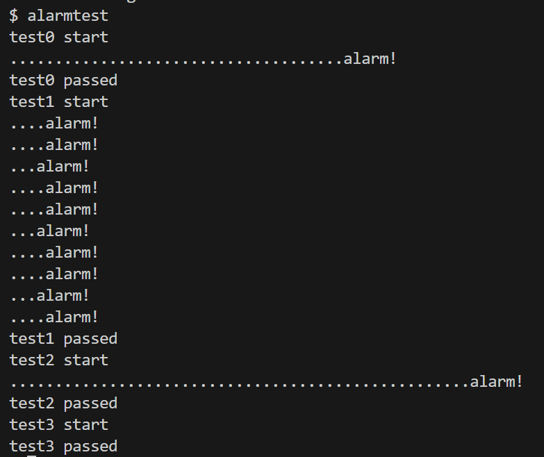

使用`usertests -q` 测试，证明内核的其他功能没有被此次修改的代码损坏。

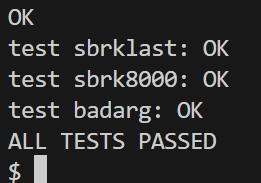


### 实验中遇到的问题和解决方法

1. **怎样“调用”handler函数？**

   我们在`proc`里面保存了一份`handler`的虚拟地址。定时到了，就要**进入`handler`函数运行**，之后在`handler`函数末尾**又通过`sigreturn`返回之前的运行状态**，这整个流程如何做到？

   - 我了解到 `trapframe->epc` 是中断发生时的`user program counter`的值，如果在内核态修改了`trapframe->epc`，那么在返回用户态的时候，就会从新的值所指向的指令继续执行。所以，**进行赋值`proc->trapframe->epc = proc->handler_va;`，返回用户态后就会导致用户程序在接下来的执行中跳转到 `handler_va` 所指向的地址处执行，造成一种handler函数被“调用”的假象**。（严格意义上这只是跳转，不能算是函数调用，因为没有经压栈传参之类的过程）。

   - `sigreturn`如何返回之前的运行状态？**先在`saved_trapframe`中保存进入陷阱时的寄存器状态和上下文信息，在`sigreturn`中再通过`*proc->trapframe = proc->saved_trapframe;`恢复上下文即可**。虽然在进入`handler`的时候我们改了`epc`，但在这里我们不用额外担心`epc`的问题，因为`saved_trapframe`其实也恢复了原来的`epc`信息了，能够重新回到发生陷入时的状态，造成`handler`执行完后返回原先位置的效果。

2. **被`test2`卡住：怎样避免handler函数重入** 

   错误提示：`test2 failed: alarm handler called more than once`

   实验指导这样写道：

   - Prevent re-entrant calls to the handler----if a handler hasn't returned yet, the kernel shouldn't call it again. `test2` tests this.

   `test2`没有通过，是因为`handler`还没有返回就被重新调用。 **解决方式是增加一个`have_return`变量，用于表示`handler`此时是否可以进入。** 进入了`handler`而尚未返回时，这个值为0，阻止重新进入；从未进入`handler`或上一次进入`handler`后完成了`sigreturn`，这个值为1，可以正常进入`handler`。

3. **被`test3`卡住：寄存器`a0`的值被更改** 

   本来是习惯性地在sys_sigreturn里面`return 0`：

   ``` c
   uint64
   sys_sigreturn(void)
   {
     struct proc *proc = myproc();
     *proc->trapframe = proc->saved_trapframe;
     proc->have_return = 1;
     return 0;
   }
   ```

   错误提示：`test3 failed: register a0 changed`

   实验指导这样写道：

   - Make sure to restore a0. `sigreturn` is a system call, and its return value is stored in a0.

   `register a0`充当了保存返回值的作用。在sys_sigreturn里面`return 0`，会导致回到用户态的时候，`a0`的值被改成`0`了，意味着运行进入`handler`又退出，没能保持用户态上下文的一致。

   **解决办法是  `return proc->trapframe->a0;`，这样做会通过这次返回把原来`a0`的值又写到`a0`里面。**

### 实验心得

这个实验的难度是hard，确实很花时间。最开始觉得只是开一个变量数一下tick_count，然后到时间输出就完事了，但是越写越觉得不简单。我认为最具挑战性的部分是关乎怎么运行进入`handler`的这一部分，需要注意到`trapframe`的`epc`字段的作用，并更改它的值。这个实验还引导我查看和更改了xv6内核中的`usertrap`函数，用户态发生中断、异常、系统调用，都会交由这个函数来处理，是操作系统的一个重要函数。


Lab 04 打分：

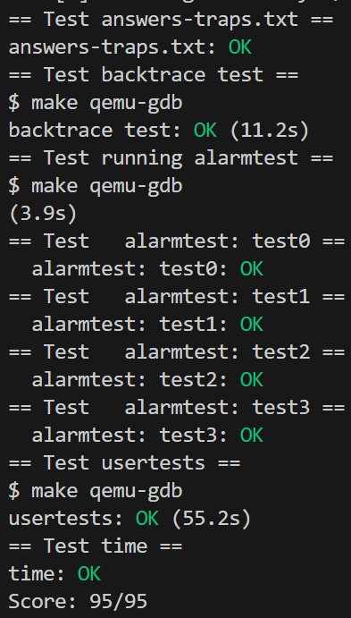


# Lab 5 Copy-on-Write Fork for xv6

在传统的 `xv6` 操作系统中，`fork()` 系统调用会将父进程的所有用户空间内存复制到子进程中。这种内存复制的方式在父进程占用较大内存时，可能会导致显著的性能开销，尤其是当子进程紧接着执行 `exec()` 系统调用时，这些复制的内存通常会被丢弃，从而造成资源浪费。本实验的目的是通过实现写时复制（Copy-On-Write, COW）技术，优化 `fork()` 的性能，使得物理内存的分配和复制仅在实际需要时才进行，从而大大减少不必要的内存开销。


## 5.1 Implement copy-on-write fork

### 实验目的
本实验的目标是通过实现写时复制（Copy-On-Write, COW）的 fork() 方法，优化 xv6 中的内存管理。具体而言，COW fork() 机制通过延迟分配和复制物理内存页，减少不必要的内存复制操作。在 COW fork() 中，子进程只创建页表，其用户内存的页表项指向父进程的物理页，并且将这些页表项标记为只读。当父进程或子进程尝试写入这些共享页面时，CPU 会触发页错误。内核页错误处理程序随后为发生错误的进程分配新的物理页，并将原始页面复制到新页中，最后更新页表项以指向新页，并允许写操作。通过这种机制，可以有效减少内存浪费，并在需要时动态分配内存资源。

### 实现步骤

#### 1. 定义`ref_count[]` 

`ref_count[]`数组用于跟踪物理内存页面的被多少个进程使用；并且确保在多个进程共享同一物理页面时，只有在所有进程都释放了该页面后，物理页面才会真正被释放。私以为，整个COW功能的实现都是围绕`ref_count[]`这个引用计数机制来展开的。

定义一个`int`型的数组`ref_count`，它的元素个数与`xv6`的页面数相同，每个元素对应一个物理页面，会记录该页面被多少个进程引用。

后来在测试的时候发现，多个进程可能会同时访问或修改同一物理页面的引用计数，导致`ref_count[]`中的值出现错误，所以增加一个自旋锁保护它的读写。

```c
uint32 ref_count[PHYSTOP / PGSIZE] = {0};   // 页表引用次数，用于实现COW
struct spinlock ref_count_lock;             // 保护 ref_count 的自旋锁
```

#### 2. 在 `riscv.h`添加宏

`PTE_RSW` 是页表项中“为软件保留”的标志位，本实验中用它来表示一个页面是不是还未复制的COW页面。

`PA2INDEX`宏用于把物理地址转换为页编号。知道物理地址的页编号，就能够去`ref_count[index]`里面知道引用计次了。

```c
#define PTE_RSW (1L << 8) // reserved for software, 标记COW映射
#define PA2INDEX(pa) (((uint64)(pa)) / PGSIZE) // 从物理地址获取页面编号
```

#### 3. 拷贝页面时，先不复制

在 `vm.c` 中，修改了 `uvmcopy` 函数，使其支持写时复制。在拷贝页表时，我们将页面标记为只读，并设置 COW 标记，同时增加引用计数。

```c
int
uvmcopy(pagetable_t old, pagetable_t new, uint64 sz)
{
  pte_t *pte;
  uint64 pa, i;
  uint flags;

  for(i = 0; i < sz; i += PGSIZE){
    if((pte = walk(old, i, 0)) == 0)
      panic("uvmcopy: pte should exist");
    if((*pte & PTE_V) == 0)
      panic("uvmcopy: page not present");

    // 若父进程内存页设置了 PTE_W ，则父子进程都清除 PTE_W 并设置 COW 位
    if (*pte & PTE_W) 
    {
      *pte |= PTE_RSW;
      *pte -= PTE_W;
    }

    pa = PTE2PA(*pte);
    flags = PTE_FLAGS(*pte);

    // 引用计数++
    acquire(&ref_count_lock);
    ++ref_count[PA2INDEX(pa)];
    release(&ref_count_lock);

    // uvmcopy 中不再需要 kalloc
    // if ((mem = kalloc()) == 0) goto err;
    // memmove(mem, (char*)pa, PGSIZE);

    if(mappages(new, i, PGSIZE, (uint64)pa, flags) != 0){
      // kfree(mem);
      goto err;
    }
  }
  return 0;

 err:
  uvmunmap(new, 0, i / PGSIZE, 1);
  return -1;
}
```

#### 4. 分配新页的情形：用户态写入

`fork()`后再写内存，会试图写入没有`PTE_W`的页，发生页面错误。在 `usertrap` 函数中，我们通过`r_scause()`的值来判断页面错误导致的陷入，然后使用 `cowhandler` 来处理写时复制逻辑。

`scause`寄存器记录中断或异常的原因，值为15 表示 Store/AMO page fault：


`stval`寄存器在发生异常时存储与异常相关的地址或其他信息。对于页面异常，`stval` 中保存的值就是引发缺页异常的虚拟地址：

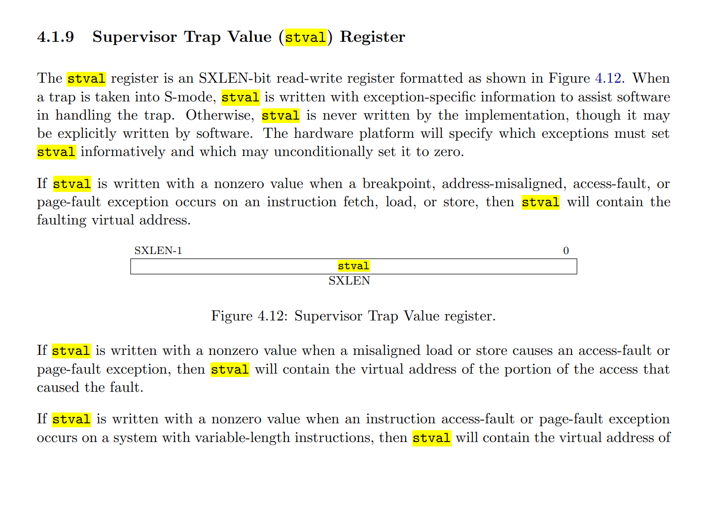

`scause` 存储异常的原因，而 `stval` 提供了与该异常相关的额外上下文信息。所以通过`r_scause()`和`r_stval()`的组合使用，我们能够在`usertrap`中处理COW模式下的页面错误。

```c
  // 当COW页面发生写操作时，产生页面错误
  else if (r_scause() == 15) // scause 寄存器的值为15 表示 Store/AMO page fault
  {
    uint64 va = r_stval();
    if (va >= p->sz)
      setkilled(p);
    int ret = cowhandler(p->pagetable, va);
    if (ret != 0)
      setkilled(p);
  }
```

增加 `cowhandler` 函数，用于处理当进程试图写入只读页面时触发的页面错误。此函数会分配新的物理内存并将数据从旧页面复制到新页面，并且将页表项更新为可写。

```c
int cowhandler(pagetable_t pagetable, uint64 va)
{
  char *mem;
  // 如果虚拟地址va超过最大虚拟地址MAXVA，返回错误
  if (va >= MAXVA)
    return -1;
  // 获取虚拟地址va对应的页表项指针PTE
  pte_t *pte = walk(pagetable, va, 0);
  // 如果没有找到对应的页表项，返回错误
  if (pte == 0)
    return -1;
  // 检查PTE是否有效，即检查PTE是否具有COW标志位、用户态访问权限和有效位
  if ((*pte & PTE_RSW) == 0 || (*pte & PTE_U) == 0 || (*pte & PTE_V) == 0)
    return -1;
  // 为新页面分配物理内存，如果分配失败则返回错误
  if ((mem = kalloc()) == 0)
    return -1;
  // 获取旧的物理地址
  uint64 pa = PTE2PA(*pte);
  // 将旧页面的数据复制到新分配的页面中
  memmove((char *)mem, (char *)pa, PGSIZE);
  // 注意：
  // 因为分配了新的页面，所以要减少旧页面的引用计数
  kfree((void *)pa);
  // 获取旧的页表项标志
  uint flags = PTE_FLAGS(*pte);
  // 将PTE_W标志位设置为1，并将页表项指向新分配的物理页面(mem)
  *pte = (PA2PTE(mem) | flags | PTE_W);
  // 将COW标志位PTE_RSW清除
  *pte &= ~PTE_RSW;
  // 返回0表示成功
  return 0;
}
```

#### 5. 分配新页的情形：内核态写回

`copyout`负责把数据正确地拷贝回用户态，而此时要写的页可能没有`PTE_W`，所以需要修改`copyout`，在内核态给进程页表写数据的时候，进行新页的分配和数据的复制、更改。

```c
int
copyout(pagetable_t pagetable, uint64 dstva, char *src, uint64 len)
{
  uint64 n, va0, pa0;
  pte_t *pte;

  while(len > 0){
    va0 = PGROUNDDOWN(dstva);
    if(va0 >= MAXVA)
      return -1;
    pte = walk(pagetable, va0, 0);
    if (pte == 0 || (*pte & PTE_V) == 0 || (*pte & PTE_U) == 0) // 在此处不检查 PTE_W。因为写时复制的页本来就设置的是不可写的。
      return -1;
    pa0 = PTE2PA(*pte);

    struct proc *p = myproc();
    if (*pte == 0) // 如果PTE无效（为0），则标记进程为killed并返回错误
    {
      setkilled(p);
      return -1;
    }

    // 检查是否是COW页面
    // 如果页表项中PTE_W标志位没有设置（即页面不可写），但页面有COW标记（通过PTE_RSW标志位检测），需要触发写时复制。
    if ((*pte & PTE_W) == 0)
    {
      if (*pte & PTE_RSW)
      {
        // 执行写时复制
        char *mem = kalloc();
        if (mem == 0) // 如果分配新的物理页失败，标记进程为killed并返回错误
        {
          setkilled(p);
          return -1;
        }
        memmove(mem, (char *)pa0, PGSIZE);      // 将旧页面的数据复制到新分配的页面中
        uint flags = PTE_FLAGS(*pte);           // 保存旧的页表项标志
        uvmunmap(pagetable, va0, 1, 1);         // 取消映射旧的页表项，同时释放旧的物理页面
        *pte = (PA2PTE(mem) | flags | PTE_W);   // 更新页表项，使其指向新分配的页面，并设置可写标志
        *pte &= ~PTE_RSW;                       // 清除COW标志位
        pa0 = (uint64)mem;                      // 更新 pa0 到新的物理地址
      }
      else
      {
        return -1; // 如果不是COW页面但仍不可写，返回错误
      }
    }


    n = PGSIZE - (dstva - va0);
    if(n > len)
      n = len;
    memmove((void *)(pa0 + (dstva - va0)), src, n);

    len -= n;
    src += n;
    dstva = va0 + PGSIZE;
  }
  return 0;
}
```

#### 6. 在`kalloc`中初始化`ref_count`

一个页面被`kalloc`初次分配的时候，引用计数为1。

```c
void *
kalloc(void)
{
  struct run *r;

  acquire(&kmem.lock);
  r = kmem.freelist;
  if(r)
    kmem.freelist = r->next;
  release(&kmem.lock);

  if(r)
  {
    memset((char *)r, 5, PGSIZE); // fill with junk
    uint32 index = PA2INDEX(r);
    acquire(&ref_count_lock);
    ref_count[index] = 1; // 新分配的页面初始引用计数为 1
    release(&ref_count_lock);
  }

  return (void*)r;
}
```

#### 7. 修改`kfree`

当`ref_count`大于0的时候，释放页面意味着减少该页面的`ref_count`；当减少`ref_count`后，该页面没有被引用（`ref_count`等于0），那么才真正地释放内存。

```c
void
kfree(void *pa)
{
  struct run *r;

  if(((uint64)pa % PGSIZE) != 0 || (char*)pa < end || (uint64)pa >= PHYSTOP)
    panic("kfree");

  // 获取页面索引
  uint32 index = PA2INDEX(pa);

  // 减少引用计数
  acquire(&ref_count_lock);
  if (ref_count[index] > 0)
    ref_count[index]--;
  else 
    ref_count[index] = 0;
  uint32 this_count = ref_count[index];
  release(&ref_count_lock);

  // 仅当引用计数为零时释放页面
  if (this_count == 0)
  {
    // Fill with junk to catch dangling refs.
    memset(pa, 1, PGSIZE);

    r = (struct run *)pa;

    acquire(&kmem.lock);
    r->next = kmem.freelist;
    kmem.freelist = r;
    release(&kmem.lock);
  }
}
```


### 实验中遇到的问题和解决方法

**并发访问导致`ref_count[]`出错**

测试的时候，发现测试用例中有多个进程同时访问或修改同一物理页面的引用计数的情形，导致`ref_count[]`中的值出现错误。

举例来说，一个父进程的多个子进程在短时间内创建孙子进程，会存在两个进程同时读取同一个 `ref_count` 值并进行操作，然后写回修改后的值，最终的 `ref_count` 可能只反映了一次更新，而丢失了其他更新，导致`ref_count[index]`的值偏小。之后这些进程依次销毁，偏小的`ref_count[index]`会提前减小到0，导致`kfree`提前调用，过早释放了别的进程仍然要使用的内存，引发kernel panic。

解决办法就是给`ref_count[]`加一个自旋锁来保护它的读写。

### 实验心得

Copy-on-write机制非常实用，在创建子进程时进行了更高效的内存管理。测试程序中，一个进程占用了超过一半的物理内存，又通过fork()创建子进程，原本这会因为内存不足而直接导致`fork()`失败，而实现`COW`机制后就能够应对这样的情形，这是操作系统内存虚拟化带来的实打实的益处。

本实验还让我了解到了`riscv`下`scause`寄存器和`stval`寄存器的作用。`scause` 存储异常的原因，而 `stval` 提供了与该异常相关的额外上下文信息。所以通过`r_scause()`和`r_stval()`的组合使用，我们能够在`usertrap`中处理COW模式下的页面错误。


# Lab 6 Multithreading

## 6.1 Uthread: switching between threads

### 实验目的

设计并实现一个用户级线程系统的上下文切换机制。补充完成一个用户级线程的创建和切换上下文的代码。需要创建线程、保存/恢复寄存器以在线程之间切换，并且确保解决方案通过测试。

### 实验步骤

1. 在`user/uthread.c`定义一个结构体，保存寄存器内容，充当线程切换的上下文：

```c
struct uthread_context
{
  uint64 ra;
  uint64 sp;

  // callee-saved
  uint64 s0;
  uint64 s1;
     ... 
  uint64 s10;
  uint64 s11;
};
```

2. 每个线程都需要保存这样一个结构体，所以把`uthread_context`作为一个成员加入到`thread`结构体中。这个`thread`结构体应该就是线程控制块了。

```c
struct thread {
  char       stack[STACK_SIZE]; 
  int        state;          
  struct     uthread_context context; 
};
```

3. 创建线程时，`ra`指向线程处理的函数，`sp`指向栈空间的高地址。

```c
void 
thread_create(void (*func)())
{
  struct thread *t;

  for (t = all_thread; t < all_thread + MAX_THREAD; t++) {
    if (t->state == FREE) break;
  }
  t->state = RUNNABLE;
  // YOUR CODE HERE
  t->context.ra = (uint64)func;
  t->context.sp = (uint64)&t->stack[STACK_SIZE - 1];
}
```

3. 在`uthread_switch.S`中实现切换线程上下文的`thread_switch`函数：

 ```assembly
   thread_switch:
   	/* YOUR CODE HERE */
   	sd ra, 0(a0)
       sd sp, 8(a0)
       sd s0, 16(a0)
       sd s1, 24(a0)
       sd s2, 32(a0)
       sd s3, 40(a0)
       sd s4, 48(a0)
       sd s5, 56(a0)
       sd s6, 64(a0)
       sd s7, 72(a0)
       sd s8, 80(a0)
       sd s9, 88(a0)
       sd s10, 96(a0)
       sd s11, 104(a0)
   
       ld ra, 0(a1)
       ld sp, 8(a1)
       ld s0, 16(a1)
       ld s1, 24(a1)
       ld s2, 32(a1)
       ld s3, 40(a1)
       ld s4, 48(a1)
       ld s5, 56(a1)
       ld s6, 64(a1)
       ld s7, 72(a1)
       ld s8, 80(a1)
       ld s9, 88(a1)
       ld s10, 96(a1)
       ld s11, 104(a1)
   	ret    /* return to ra */
 ```

4. 使用`thread_switch`函数：

   ```c
   /* YOUR CODE HERE
        * Invoke thread_switch to switch from t to next_thread:
        * thread_switch(??, ??);
        */
       thread_switch((uint64)&t->context, (uint64)&next_thread->context);
   ```

### 实验中遇到的问题和解决方法

1. **怎样从指定的函数开始运行？** 

   寄存器 `ra` 是返回地址寄存器（Return Address Register），它存储了函数调用后的返回地址。线程的切换由`thread_switch`这个函数完成，这个函数返回过后，就是从`ra`地址开始运行的。所以线程创建时，应当把函数的地址写进寄存器 `ra`，来让线程运行指定的函数。 

2. **`sp`指向哪里？** 

   每个线程拥有一个独立的的栈空间`char stack[STACK_SIZE]`，栈空间是从高往低生长的，也就是说 `stack pointer` 应该指向这个栈内存空间的高地址。而另一方面， C 语言的一个数组的空间是从低地址向高地址分配的，所以此`sp`应当赋值为`(uint64)&t->stack[STACK_SIZE - 1];`才是栈空间的高地址。

### 实验心得

这个实验让我更深入地理解了用户线程的概念，以及线程上下文切换的实现。

## 6.2 Using threads

### 实验目的

本实验旨在通过使用线程和锁实现并行编程，以及在多线程环境下处理哈希表。学习如何使用线程库创建和管理线程，以及如何通过加锁来实现一个线程安全的哈希表，使用锁来保护共享资源，以确保多线程环境下的正确性和性能。

### 实验步骤

1. 若不做更改，尝试直接运行，单线程`./ph 1`：

   ```
   100000 puts, 3.991 seconds, 25056 puts/second
   0: 0 keys missing
   100000 gets, 3.981 seconds, 25118 gets/second
   ```

   多线程`./ph 2`：

   ```
   100000 puts, 1.885 seconds, 53044 puts/second
   1: 16579 keys missing
   0: 16579 keys missing
   200000 gets, 4.322 seconds, 46274 gets/second
   ```

   可以注意到，双线程的情况发生了键值的丢失。

2. 修改代码，加锁保护：

   ```c
   
   +pthread_mutex_t lock[NBUCKET];
    
    double
    now()
   @@ -47,6 +48,8 @@ void put(int key, int value)
        if (e->key == key)
          break;
      }
   +
   +  pthread_mutex_lock(&lock[i]);
      if(e){
        // update the existing key.
        e->value = value;
   @@ -54,6 +57,7 @@ void put(int key, int value)
        // the new is new.
        insert(key, value, &table[i], table[i]);
      }
   +  pthread_mutex_unlock(&lock[i]);
    
    }
    
   @@ -118,6 +122,9 @@ main(int argc, char *argv[])
        keys[i] = random();
      }
    
   +  for (int i = 0; i < NBUCKET; ++i)
   +    pthread_mutex_init(&lock[i], NULL);
   +
      //
      // first the puts
      //
   @@ -130,6 +137,9 @@ main(int argc, char *argv[])
      }
      t1 = now();
    
   +  for (int i = 0; i < NBUCKET; ++i)
   +    pthread_mutex_destroy(&lock[i]);
   +
      printf("%d puts, %.3f seconds, %.0f puts/second\n",
             NKEYS, t1 - t0, NKEYS / (t1 - t0));
   
   ```

   

### 实验中遇到的问题和解决方法

1. **为什么不加锁的时候会丢失数据？**：

   分析两个线程的情况，这是一个会导致数据丢失的例子：

   1. **线程A开始插入一个键（假设是键X）**：
      - 线程A检查哈希表，以找到适合插入键X的桶。
      - 线程A发现该桶是空的，或者尚未包含键X。
   2. **线程B开始插入相同或不同的键（假设是键Y）**：
      - 在线程A尚未完成插入键X之前，线程B开始自己的操作。
      - 线程B检查同一个或者不同的桶。
   3. **线程A被抢占**：
      - 就在线程A决定插入键X但尚未实际执行插入之前，线程A被抢占（即，操作系统暂时停止线程A的运行）。
   4. **线程B插入其键**：
      - 线程B继续执行，并成功地将键Y插入到哈希表中。
   5. **线程A恢复并尝试插入键X**：
      - 线程A从停止的地方恢复，并尝试插入键X。
      - 由于竞争条件的存在，哈希表的状态可能已经发生了变化，导致线程A之前执行的检查结果已经过时。例如，如果线程A和线程B试图向同一个桶中插入键，线程A可能会无意中覆盖线程B的插入。

2. **怎样让多线程的哈希表更快？** 

   一开始我使用单个互斥锁来保护所有的put，这能够通过`ph_safe`测试，但是`ph_fast`得到了一个大大的fail。这是因为所有线程的所有写入都互斥，也就没有并行了，并不会达成比单线程显著更快的加速效果。

   正确的做法是给每个哈希桶配一个单独的锁，这样单个桶里的竞争能够消除，而同时插入到不同的桶不受影响。

### 实验心得

本实验不是xv6内完成的，而是真的在我的ubuntu 22.04上使用进行了多线程编程。在这个实验中我初步学习并实践了 POSIX 线程库的相关用法，了解了多线程的竞争问题，并且对于锁的粒度带来的性能影响有了直观的感受。简单来说，粗粒度锁实现简单、容易保证代码的安全性和数据的正确性，但是并发程度受到限制，很可能不能充分地加速；细粒度锁在实现上稍复杂，但是能够提高并发性，达到更优的性能。

## 6.3 Barrier

### 实验目的

本实验旨在通过实现一个线程屏障（barrier），即每个线程都要在 barrier 处等待，直到所有线程到达 barrier 之后才能继续运行，加深对多线程编程中同步和互斥机制的理解。在多线程应用中，线程屏障可以用来确保多个线程在达到某一点后都等待，直到所有其他参与的线程也达到该点。

### 实验步骤

1. 了解`pthread_cond_wait`和`pthread_cond_broadcast`:

   - `pthread_cond_wait` 用于使线程等待一个条件变量（`pthread_cond_t`）。调用该函数的线程会进入阻塞状态，直到收到其他线程发出的信号。

   - `pthread_cond_broadcast` 用于向等待同一条件变量的所有线程发出信号。它会唤醒所有处于等待状态的线程，使它们从 `pthread_cond_wait` 中返回。

2. 实现`barrier()`函数：

```c
static void 
barrier()
{
  pthread_mutex_lock(&bstate.barrier_mutex); // 锁定互斥锁，保护共享资源

  // 增加已到达此轮次的线程数
  bstate.nthread++;

  // 如果未达到所有线程数，则等待
  if (bstate.nthread < nthread) {
      pthread_cond_wait(&bstate.barrier_cond, &bstate.barrier_mutex); // 在条件变量上等待，释放互斥锁
  }

  // 如果所有线程都已到达屏障，则增加轮次计数并重置线程计数器
  if (bstate.nthread == nthread) {
      bstate.round++; // 增加轮次计数器
      bstate.nthread = 0; // 重置已到达的线程数
      pthread_cond_broadcast(&bstate.barrier_cond); // 唤醒所有等待线程
  }

  pthread_mutex_unlock(&bstate.barrier_mutex); // 释放互斥锁
}

```

**锁定互斥锁**：函数一开始锁定了一个互斥锁 `bstate.barrier_mutex`。这一步是为了保护接下来的共享变量（如 `bstate.nthread` 和 `bstate.round`），防止多个线程同时访问和修改它们，避免数据竞争。

**增加已到达的线程数**：每当一个线程调用 `barrier` 函数，它都会将 `bstate.nthread` 变量加1，表示该线程已经到达了屏障。

**等待其他线程**：如果当前到达屏障的线程数 `bstate.nthread` 小于总线程数 `nthread`，表示还有其他线程没有到达屏障。此时，线程会在 `bstate.barrier_cond` 条件变量上等待，并释放互斥锁。这一步确保了该线程会一直阻塞，直到所有线程都到达屏障。

**所有线程都到达屏障时**：当 `bstate.nthread` 等于 `nthread`，即所有线程都到达屏障时：

- **增加轮次计数器**：表示当前轮次的线程同步已经完成。
- **重置线程计数器**：将 `bstate.nthread` 重置为0，以便下一轮使用。
- **唤醒所有等待线程**：通过 `pthread_cond_broadcast` 函数，通知所有在条件变量 `bstate.barrier_cond` 上等待的线程可以继续执行。

**释放互斥锁**：最后，函数解锁互斥锁，允许其他线程进入临界区，修改共享资源。

### 实验心得

本实验实现的`barrier`是多线程的一种同步方式，能够让多个线程互相瞭望别人的进度，保持步调一致。通过本实验学习了`pthread_cond_wait`和`pthread_cond_broadcast`的作用和用法，加深了我对于多线程同步的理解。


`make grade`：

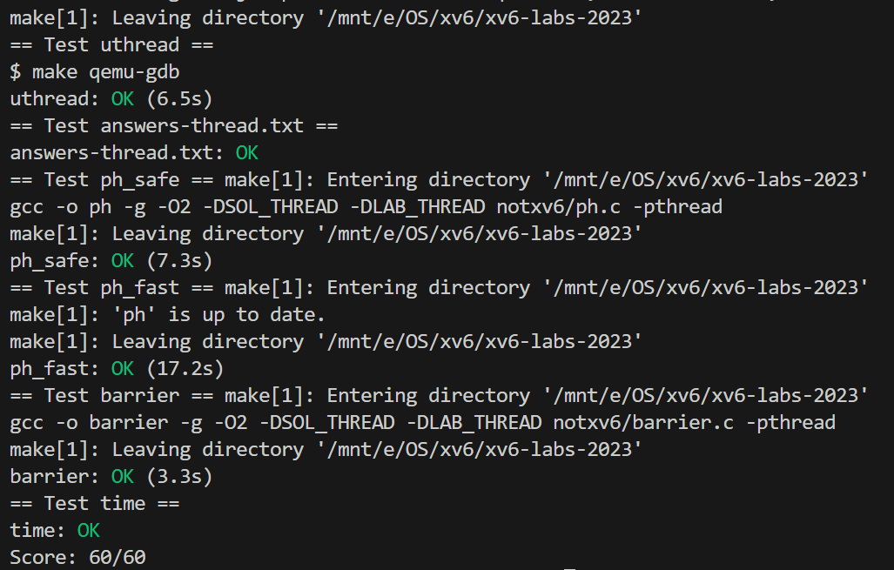


# Lab 7 networking

编写一个在xv6操作系统中用于网络接口卡（network interface card, NIC）的设备驱动程序。

### 实验目的
为 xv6 操作系统编写一个网络接口卡 (NIC) 的设备驱动程序。实验使用了 E1000 网络设备，该设备用于处理网络通信。在实验环境中，E1000 由 qemu 提供仿真，并通过 emulated LAN 实现与主机的通信。xv6 的 IP 地址为 10.0.2.15，主机的 IP 地址为 10.0.2.2。

### 实现步骤

E1000 驱动程序通过 DMA 技术从 RAM 中读取要传输的数据包，并将接收到的数据包写入 RAM。E1000 使用一个称为“接收环”或“接收队列”的环形结构来存储描述符，每个描述符包含一个内存地址，E1000 将接收到的数据包写入该地址。

在 `kernel/e1000.c` 中，需要完成 `e1000_transmit()` 和 `e1000_recv()` 函数，使驱动程序能够传输和接收数据包。

1. **e1000_transmit()**

   当network stackk需要发送一个packet的时候，会先将这个packet存放到**发送环形缓冲区tx_ring**，最后通过网卡将**这个**packet发送出去。

   - **获取Ring位置：** 获取锁并通过获取发送环的下一个可用位置（`tdt`）来确定将要使用的描述符在发送环中的位置。

   - **检查描述符状态：** 读取该位置的描述符（`send_desc`），检查该描述符的状态。如果描述符的状态不满足`E1000_TXD_STAT_DD`（表示描述符空闲，上一个传输已完成），则说明上一个传输还在进行中，所以释放锁并返回-1，表示传输失败。

   - **释放旧缓冲区：** 如果该位置的缓冲区`tx_mbufs[index]`不为空，则释放旧的缓冲区，这是为了确保资源被正确释放。

   - **设置描述符和缓冲区：** 将待发送的mbuf（数据包）指针存储在`tx_mbufs`数组中，然后将其地址（`head`）存储在对应描述符的`addr`字段中。描述符的`length`字段设置为mbuf的长度（`len`），`cmd`字段设置为`E1000_TXD_CMD_RS | E1000_TXD_CMD_EOP`，这表示将发送该数据包，并在发送完成后产生中断。

   - **更新Ring位置：** 更新`tdt`以指向下一个描述符，然后将更新后的`tdt`写回E1000的`E1000_TDT`寄存器中，这表示已经准备好发送这个数据包了。

   - **同步操作：** 最后，使用`__sync_synchronize()`确保所有前面的操作对其他线程可见，然后释放锁。

   ```C
   int
   e1000_transmit(struct mbuf *m)
   {
     // 获取 ring position
     acquire(&e1000_lock);
     /*由于要对共享的资源（传输环形缓冲区）进行操作，这里使用锁 `e1000_lock` 来确保操作的原子性。*/
   
       
      /*regs[E1000_TDT] 是 E1000 的传输描述符尾部指针寄存器，它指向下一个可以使用的传输描述符位置。index 计算出在环形缓冲区中的实际索引，send_desc 是当前要使用的传输描述符。*/
     uint64 tdt = regs[E1000_TDT];
     uint64 index = tdt % TX_RING_SIZE;
     struct tx_desc send_desc = tx_ring[index];
      /*send_desc.status 包含了描述符的状态位，其中 E1000_TXD_STAT_DD 表示传输已完成。如果描述符尚未完成（即，仍在使用中），函数将返回 -1，表示传输队列满。*/
     if(!(send_desc.status & E1000_TXD_STAT_DD)) {
       release(&e1000_lock);
       return -1;
     }
   
     if(tx_mbufs[index] != 0){
       // 如果当前环形缓冲区位置有一个旧的 mbuf，则先释放它的内存。
       mbuffree(tx_mbufs[index]);
     }
   
     tx_mbufs[index] = m; // 将新的 mbuf 放入环形缓冲区中对应的位置。
     tx_ring[index].addr = (uint64)tx_mbufs[index]->head;// 设置要传输的数据的内存地址。
     tx_ring[index].length = (uint16)tx_mbufs[index]->len;// 设置数据包的长度。
     tx_ring[index].cmd = E1000_TXD_CMD_RS | E1000_TXD_CMD_EOP;// 设置传输命令，其中 E1000_TXD_CMD_RS 表示发送完成后更新状态，E1000_TXD_CMD_EOP 表示这是数据包的最后一部分。
     tx_ring[index].status = 0;// 除状态位，以表明描述符已被更新，准备好发送。
   
      // TDT 寄存器更新为下一个传输描述符的位置，__sync_synchronize() 用于确保所有的内存操作在这个点之前完成。
     tdt = (tdt + 1) % TX_RING_SIZE;
     regs[E1000_TDT] = tdt;
     __sync_synchronize();
   
     release(&e1000_lock);
       // 操作完成后释放锁，并返回 0 表示传输已成功排入队列。
     return 0;
   }
   ```

2. **e1000_recv()**

   当网卡需要接收packet的时候，网卡会直接访问内存（DMA），先将接受到的RAM的数据（即packet的内容）写入到**接收环形缓冲区rx_ring**中。接着，网卡会向cpu发出一个*硬件中断*，当cpu接受到硬件中断后，cpu就可以从**接收环形缓冲区rx_ring**中读取packet传递到network stack中了（`net_rx()`）。

   - **获取Ring位置：** 获取接收环的下一个可用位置（`rdt`），确定将要处理的描述符在接收环中的位置。

   - **检查描述符状态：** 通过检查该位置的描述符的状态（`rx_ring[index].status`）来确定是否有新的数据包到达。

   - **循环处理数据包：** 进入一个循环，该循环用于处理在同一个位置上可能有多个到达的数据包。

     -  使用`mbufput`函数更新mbuf的长度，以告知数据包的实际长度。

     - 通过`rx_mbufs`数组中的数据，将当前位置的mbuf传递给`net_rx`函数，从而将数据包交给网络协议栈进行进一步处理。

     - 分配一个新的mbuf并写入描述符，将描述符的状态清零（设置为0），表示描述符可以重新使用以处理下一个数据包。

     - 更新`rdt`为当前处理过的位置，然后将其写回E1000的`E1000_RDT`寄存器中，即已经处理完这个数据包。

     - 最后，使用`__sync_synchronize()`确保所有的操作对其他线程可见。

   - **接收完成：** 函数的执行在循环中进行，直到所有到达的数据包都被处理完。

     ```C
     static void
     e1000_recv(void)
     {
       //
       // Your code here.
       //
       // Check for packets that have arrived from the e1000
       // Create and deliver an mbuf for each packet (using net_rx()).
       //
       // 获取接收 packet 的位置
       uint64 rdt = regs[E1000_RDT];
       uint64 index = (rdt + 1) % RX_RING_SIZE;
     
       if(!(rx_ring[index].status & E1000_RXD_STAT_DD)){
         // 查看新的 packet 是否有 E1000_RXD_STAT_DD 标志，如果没有，则直接返回
         return;
       }
       while(rx_ring[index].status & E1000_RXD_STAT_DD){
         // 使用 mbufput 更新长度并将其交给 net_rx() 处理
         struct mbuf* buf = rx_mbufs[index];
         mbufput(buf, rx_ring[index].length);
     
         // 分配新的 mbuf 并将其写入到描述符中并将状态码设置成 0
         rx_mbufs[index] = mbufalloc(0);
         rx_ring[index].addr = (uint64)rx_mbufs[index]->head;
         rx_ring[index].status = 0;
         rdt = index;
         regs[E1000_RDT] = rdt;
         __sync_synchronize();
     
         // 将数据包传递给net_rx()处理
         net_rx(buf);
     
         // 更新index，继续处理下一个接收到的数据包
         index = (regs[E1000_RDT] + 1) % RX_RING_SIZE;
       }
     }
     
     ```

运行`nettests`:

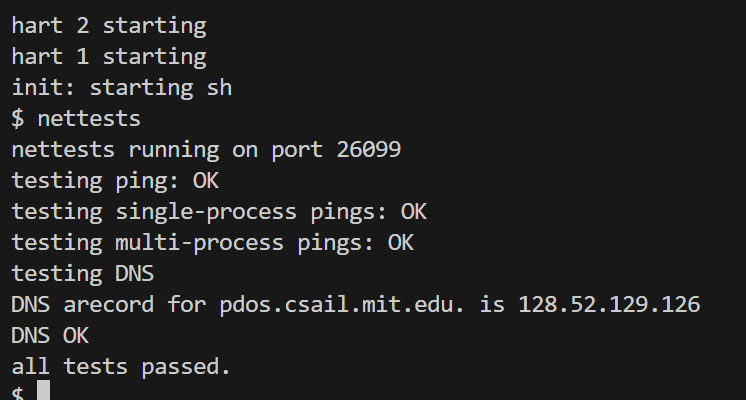

`make server`能够收到来自xv6的消息:


### 实验中遇到的问题和解决方法

**为什么发送需要锁来保护，而接收不需要？**

对于一个网卡而言，可能有多进程/多线程同时需要发送的情况，它们可能访问同一个`mbuf`，导致竞争出错；而接收是由硬件完成的，直接将接收的数据写入内存的特定位置，然后发出中断，不需要考虑多个线程竞争同一个接收缓冲区的情形。

### 实验心得

通过编写 E1000 网络驱动程序，了解了 DMA 技术以及网络设备驱动程序的工作原理，体会到了读手册、查资料、编写驱动程序的流程。

make grade：

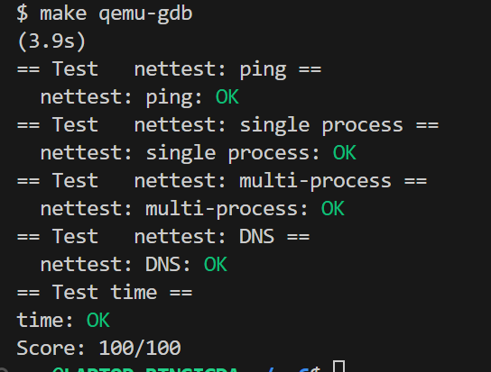


# Lab 8 locks

在多核机器上，锁竞争（lock contention）是并行性不足的常见症状。在 xv6 的内存分配器中，内存分配和释放函数 `kalloc()` 和 `kfree()` 使用了全局的 `kmem.lock` 锁，导致多个核心上的线程在执行这些函数时产生较大的锁竞争。


## 8.1 Memory allocator

### 实验目的

本实验的目标是通过重新设计内存分配器以减少锁竞争。你需要实现每个 CPU 的独立空闲链表，每个链表有自己独立的锁。这样，不同 CPU 可以并行地分配和释放内存，因为它们操作不同的链表。

当一个 CPU 的空闲链表为空时，允许它从其他 CPU 的空闲链表中“偷”一部分内存。这种“偷取”操作可能会引入一些锁竞争，但希望这种情况很少发生。

### 实现步骤

未改动时：

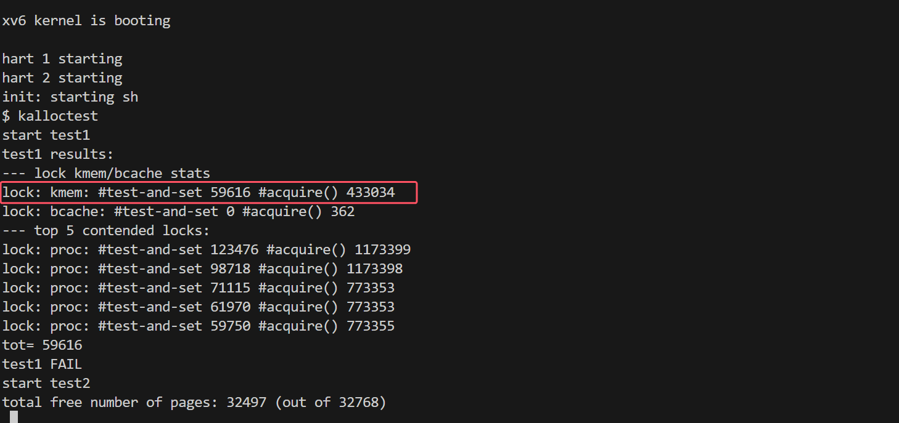

#### 1. 定义`kmem[NCPU]` 

```C
struct {
  struct spinlock lock;
  struct run *freelist;
} kmem[NCPU]; // 每个CPU有自己的空闲内存链表和锁
```

#### 2. 在`kinit()`中初始化锁

```C
void
kinit()
{
  for (int i = 0; i < NCPU; i++)
    initlock(&kmem[i].lock, "kmem"); // 初始化所有锁
  freerange(end, (void*)PHYSTOP);
}
```

#### 3. 根据CPU_id来处理`kfree()`

根据实验指导，获取`cpuid`必须关中断。取得id后即可获取相应的锁、操作相应的空闲链表。

```C
void
kfree(void *pa)
{
  struct run *r;

  if(((uint64)pa % PGSIZE) != 0 || (char*)pa < end || (uint64)pa >= PHYSTOP)
    panic("kfree");

  // Fill with junk to catch dangling refs.
  memset(pa, 1, PGSIZE);

  r = (struct run*)pa;

  // 必须关闭中断才能获取 CPU ID
  push_off();
  int cpu = cpuid();
  pop_off();

  // 根据 CPU ID 获取相应的锁、操作相应的空闲链表
  acquire(&kmem[cpu].lock);
  r->next = kmem[cpu].freelist;
  kmem[cpu].freelist = r;
  release(&kmem[cpu].lock);
}
```

#### 4.修改`kalloc`、实现从别的CPU拿取内存的功能

有空闲页则直接分配；没有空闲页则检查别的CPU的`freelist`。注意相应的锁的获取和释放。

```C
void *
kalloc(void)
{
  struct run *r;

  // 必须关闭中断才能获取 CPU ID
  push_off();
  int cpu = cpuid();
  pop_off();

  acquire(&kmem[cpu].lock);
  r = kmem[cpu].freelist;
  if (r)                            // 有空闲页直接用
  {
    kmem[cpu].freelist = r->next;
    release(&kmem[cpu].lock);
  }
  else                              // 没空闲页，从别的CPU那里拿来
  {
    release(&kmem[cpu].lock);
    for (int new_cpu = 0; new_cpu < NCPU; ++new_cpu)  // 遍历别的CPU
    {
      if (new_cpu == cpu) // 排除自身
        continue;
      acquire(&kmem[new_cpu].lock);
      r = kmem[new_cpu].freelist;
      if (r) // 找到空闲页
      {
        kmem[new_cpu].freelist = r->next;
        release(&kmem[new_cpu].lock);
        break;
      }
      release(&kmem[new_cpu].lock);
    }
  }

  if(r)
    memset((char*)r, 5, PGSIZE); // fill with junk
  return (void*)r;
}

```

验证结果，锁的争用现象得到缓解，能够通过`kalloctest`：

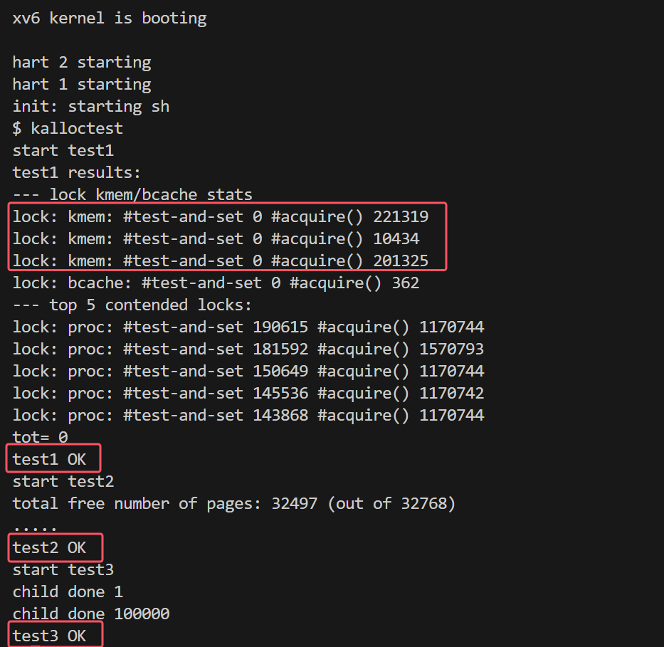

### 实验中遇到的问题和解决方法

**在 if/else 分支中处理锁**：申请锁后，不可以只在部分分支的代码中释放锁。需要确保运行到任何一个分支，获取锁和释放锁的逻辑都能顺利完成。

**死锁**：初次测试时，我把`release(&kmem[cpu].lock);`写在代码更下方的位置，`test3`跑了两分多钟都没有动静，发生了死锁。后来我把`release(&kmem[cpu].lock);`提前，避免这段程序在持有`kmem[cpu].lock`的同时还去申请`kmem[new_cpu].lock`，能够防止死锁的发生。

### 实验心得

锁可以保护数据的安全访问，但另一方面锁的争用问题也在限制性能。在多核的计算机中，对锁机制进行合理的改良，能够提高并行性，从而提升性能。

本实验偷取（stealing）别的CPU的`freelist`的想法很有意思，解决了把`kmem`分成多个锁、`freelist`分到各个CPU后，单个CPU内存不足的情形。


## 8.2 Buffer cache

### 实验目的

在 xv6 中，文件系统的缓存块（block cache）是通过 `bcache.lock` 锁来保护的。当多个进程密集使用文件系统时，这个锁会引发严重的锁竞争。为了减少锁竞争，实验要求重新设计缓存块的锁机制。

通过为缓存块实现一个基于哈希表的锁机制，减少对全局 `bcache.lock` 的依赖，减少锁竞争。你将为哈希表中的每个桶（bucket）分配一个独立的锁，避免不同块的并发访问产生冲突。

### 实现步骤

未改动时：


#### 1. 定义哈希表

哈希表使用13个桶来管理缓冲区，每个桶对应一个锁，以及一个双向循环链表头节点，用于存储该桶中的缓冲区。这样的设计允许对不同桶中的缓冲区并行访问，从而减少锁竞争。

```C
#define NBUCKETS 13
#define hash(num) num % NBUCKETS
struct
{
  struct spinlock bucket_lock[NBUCKETS];
  struct buf buf[NBUF];
  struct buf bucket_head[NBUCKETS];
} bcache;
```

哈希函数足够简单，直接写成宏定义了。


#### 2. 在`binit()`中初始化

在初始化函数`binit()`中，为每个桶的锁进行初始化，并设置每个桶的头结点，以形成空的循环链表。此外，将所有缓冲区根据其块号分配到相应的桶中。

```C
void
binit(void)
{
  struct buf *b;

  for (int i = 0; i < NBUCKETS; i++){
    initlock(&bcache.bucket_lock[i], "bcache"); 
  }

  // Create linked list of buffers
  for (int i = 0; i < NBUCKETS; i++){
    bcache.bucket_head[i].prev = &bcache.bucket_head[i]; // 初始化空循环链表
    bcache.bucket_head[i].next = &bcache.bucket_head[i];
  }

  for(b = bcache.buf; b < bcache.buf+NBUF; b++){
    b->next = bcache.bucket_head[hash(b->blockno)].next; // 根据blockno，把buffer放入不同的桶中
    b->prev = &bcache.bucket_head[hash(b->blockno)];
    initsleeplock(&b->lock, "buffer");
    bcache.bucket_head[hash(b->blockno)].next->prev = b;
    bcache.bucket_head[hash(b->blockno)].next = b;
  }
}
```

#### 3. 缓冲区的获取`bget()`

`bget()`函数用于获取或创建一个指定块号和设备的缓冲区。

首先尝试在相应的哈希桶中查找缓冲区，如果找到，增加引用计数并返回该缓冲区；如果没有找到，尝试从其他桶中回收一个未使用的缓冲区，设置该缓冲区的设备、块号、有效性、引用计数等信息，并将其移动到正确的桶中。由于是刚刚使用，将其插入到链表头。

```C
static struct buf*
bget(uint dev, uint blockno)
{
  struct buf *b;

  int id = hash(blockno);

  acquire(&bcache.bucket_lock[id]);

  // Is the block already cached?
  for (b = bcache.bucket_head[id].next; b != &bcache.bucket_head[id]; b = b->next)
  {
    if (b->dev == dev && b->blockno == blockno)
    {
      b->refcnt++;
      release(&bcache.bucket_lock[id]);
      acquiresleep(&b->lock);
      return b;
    }
  }

  // Not cached.
  // Recycle the least recently used (LRU) unused buffer.
  for (int i = (id + 1) % NBUCKETS; i != id; i = (i + 1) % NBUCKETS)
  {
    acquire(&bcache.bucket_lock[i]);
    struct buf *b;
    for (b = bcache.bucket_head[i].prev; b != &bcache.bucket_head[i]; b = b->prev)
    {
      if (b->refcnt == 0)
      {
        b->dev = dev;
        b->blockno = blockno;
        b->valid = 0;
        b->refcnt = 1;

        // Disconnect this buffer from its current position
        b->prev->next = b->next;
        b->next->prev = b->prev;

        release(&bcache.bucket_lock[i]);

        // Insert this buffer into the new bucket's chain
        b->prev = &bcache.bucket_head[id];
        b->next = bcache.bucket_head[id].next;
        b->next->prev = b;
        b->prev->next = b;
        release(&bcache.bucket_lock[id]);

        acquiresleep(&b->lock);
        return b;
      }
    }
    release(&bcache.bucket_lock[i]);
  }

  panic("bget: no buffers"); // If all buffers are in use, panic
}
```

#### 4. 缓冲区的释放

`brelse()`函数用于释放一个缓冲区。首先将缓冲区的引用计数减一。如果缓冲区的引用计数变为零，表示没有线程在等待该缓冲区，可以从链表中移除。

```C
void
brelse(struct buf *b)
{
  if(!holdingsleep(&b->lock))
    panic("brelse");

int id = hash(b->blockno);

  releasesleep(&b->lock);

  acquire(&bcache.bucket_lock[id]);
  b->refcnt--;
  if (b->refcnt == 0) {
    // no one is waiting for it.
    b->next->prev = b->prev;
    b->prev->next = b->next;
    b->next = bcache.bucket_head[id].next;
    b->prev = &bcache.bucket_head[id];
    bcache.bucket_head[id].next->prev = b;
    bcache.bucket_head[id].next = b;
  }

  release(&bcache.bucket_lock[id]);
}
```

#### 5. refcnt的增减

变化不大，获取到哈希桶id即可，带锁更改即可。

```C
void
bpin(struct buf *b) {
  int id = hash(b->blockno);
  acquire(&bcache.bucket_lock[id]);
  b->refcnt++;
  release(&bcache.bucket_lock[id]);
}

void
bunpin(struct buf *b) {
  int id = hash(b->blockno);
  acquire(&bcache.bucket_lock[id]);
  b->refcnt--;
  release(&bcache.bucket_lock[id]);
}
```


### 实验中遇到的问题和解决方法

**本实验有一个sleeplock，一个spinlock，有什么区别？**

首先是锁自身特点上的区别：睡眠锁（sleeplock）允许线程在无法获取锁时进入睡眠状态，减少了CPU的忙等，但增加了线程调度的开销；自旋锁（spinlock）是忙等待锁，会在获取锁之前一直忙等，这可能会导致CPU资源的浪费，但可以减少上下文切换的开销。前者适合于适合于锁持有时间较长或不需要频繁访问的资源，后者适合访问频繁且处理快速的情况。

### 实验心得

Buffer cache实验和之前的Memory allocator有共性。它们都是通过把单个的、保护整个数据结构的大锁，拆分成多个、保护数据结构各个部分的小锁，这样能减少争用现象。

此外，本实验还让我重新温习了双向循环链表的指针处理，以及LRU的替换机制。


make grade：

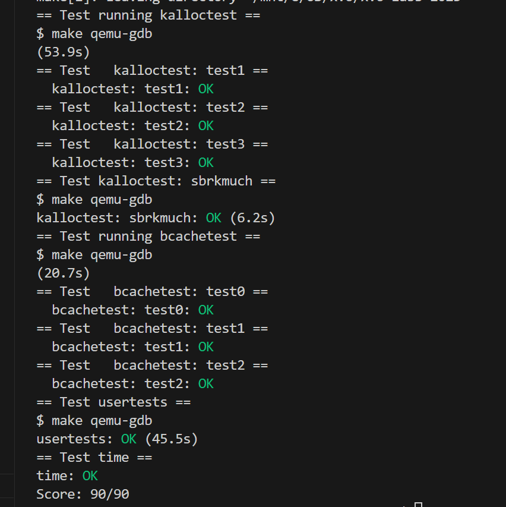


# Lab 9 File system

## 9.1 Large files

### 实验目的

当前 xv6 文件系统的限制是每个文件只能有 268 个块（12 个直接块 + 256 个单重间接块）。我们将通过添加一个“双重间接”块来扩展文件的大小，这个块可以指向 256 个单重间接块，每个单重间接块可以指向 256 个数据块，因此总共可以存储 65803 个块（256*256+256+11）。

### 实验步骤

xv6 book P95 figure 8.3：

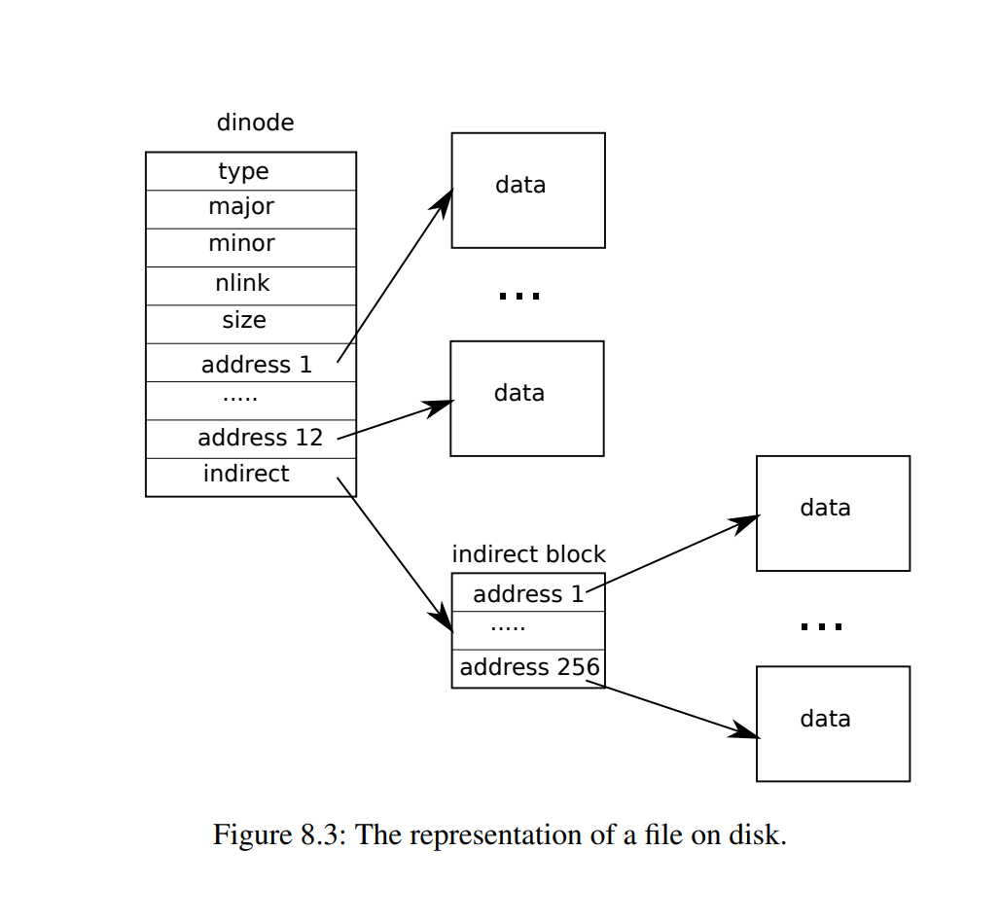

单重间接块是一个指向其他数据块地址的块，而这些数据块实际存储了文件的数据。

- 一个单重间接块包含多个指向数据块的指针。由于每个指针可以指向一个数据块，单重间接块可以扩展文件能够使用的数据块数量。
- 例如，在 xv6 中，一个块的大小为 1024 字节（`BSIZE = 1024`），如果每个指针占用 4 字节（`sizeof(uint) = 4`），那么一个单重间接块可以存储 256 个数据块的指针。这就意味着通过一个单重间接块，文件可以访问额外的 256 个数据块。

- 文件系统的 inode 结构包含 12 个直接块指针和 1 个单重间接块指针。那么这个文件最多可以使用 `12 + 256 = 268` 个数据块。

我们要做的是加一个双重间接块，也就是一个指向单重间接块地址的块：

- 一个双重间接块可以指向 256 个单重间接块，而每个单重间接块可以再指向 256 个数据块。因此，通过一个双重间接块，文件最多可以访问 `256 * 256 = 65536` 个数据块。

- 现在要是把文件系统的 inode 结构改成11 个直接块指针、1 个单重间接块指针和 1 个双重间接块指针，那么这个文件最多可以使用 `11 + 256 + 65536 = 65803` 个数据块，也就达成了本实验`Large files`的目的了。

#### 1. 结构体与常量定义的修改

首先，我们对文件系统中的一些关键数据结构和常量进行了修改。

- 将 `NDIRECT` 由12个直接块减少为11个直接块，以便为双重间接块腾出位置。

- 增加了 `NDOUBLEINDIRECT` 常量，用于计算双重间接块的容量。

- 修改 `inode` 结构中的 `addrs` 数组，将其大小由 `NDIRECT + 1` 扩展为 `NDIRECT + 2`，以存储双重间接块的地址。

  ```C
  (fs.h)
  #define NDIRECT 11                                    // 11个直接
  #define NINDIRECT (BSIZE / sizeof(uint))              // 1个单重间接
  #define NDOUBLEINDIRECT (NINDIRECT * NINDIRECT)       // 1个双重间接
  #define MAXFILE (NDIRECT + NINDIRECT + NDOUBLEINDIRECT)
  
  // On-disk inode structure
  struct dinode {
    short type;           // File type
    short major;          // Major device number (T_DEVICE only)
    short minor;          // Minor device number (T_DEVICE only)
    short nlink;          // Number of links to inode in file system
    uint size;            // Size of file (bytes)
    uint addrs[NDIRECT+2];   // Data block addresses
  };
  ```

  ```C
  (file.h)
  // in-memory copy of an inode
  struct inode {
    uint dev;           // Device number
    uint inum;          // Inode number
    int ref;            // Reference count
    struct sleeplock lock; // protects everything below here
    int valid;          // inode has been read from disk?
  
    short type;         // copy of disk inode
    short major;
    short minor;
    short nlink;
    uint size;
    uint addrs[NDIRECT+2];
  };
  ```

  

#### 2. 块映射函数 `bmap` 的修改

`bmap` 函数用于根据文件的逻辑块号查找或分配对应的物理块地址。我们在这个函数中增加了对双重间接块的处理逻辑。

- 当逻辑块号超出单重间接块的范围时，进入双重间接块的处理逻辑。

- 检查双重间接块是否存在，如果不存在则分配一个新的块，并将其地址存储在 `inode` 的 `addrs` 数组中。

- 使用两级索引机制，首先从双重间接块中找到单重间接块，然后再从单重间接块中找到实际的数据块地址。

- 如果对应的单重间接块或数据块不存在，分配新的块并更新相应的地址。

  ```C
  static uint
  bmap(struct inode *ip, uint bn)
  {
  ....
  
  // 双间接
    bn -= NINDIRECT;
  
    if (bn < NDOUBLEINDIRECT)
    {
      // 如果文件的双间接块不存在，则分配一个
      if ((addr = ip->addrs[NDIRECT + 1]) == 0)
      {
        addr = balloc(ip->dev);
        if (addr == 0)
          return 0;
        ip->addrs[NDIRECT + 1] = addr;
      }
  
      // 读取双间接块
      bp = bread(ip->dev, addr);
      a = (uint *)bp->data;
  
      // 计算在单间接块数组中的索引，即第几个单间接块
      uint index1 = bn / NINDIRECT;
  
      // 如果这个单间接块不存在，则分配一个
      if ((addr = a[index1]) == 0)
      {
        addr = balloc(ip->dev);
        if (addr == 0)
          return 0;
        a[bn / NINDIRECT] = addr;
        log_write(bp); // Record changes in the log
      }
      brelse(bp);
  
      // 读取相应的单间接块
      bp = bread(ip->dev, addr);
      a = (uint *)bp->data;
  
      // 计算在单间接块中的索引，即单间接块中的第几个数据块
      uint index2 = bn % NINDIRECT;
  
      // 如果这个数据块不存在，则分配一个
      if ((addr = a[index2]) == 0)
      {
        addr = balloc(ip->dev);
        if (addr == 0)
          return 0;
        a[bn % NINDIRECT] = addr;
        log_write(bp); // Record changes in the log
      }
      brelse(bp);
      return addr; // Returns the actual data block
    }
  ```


#### 3. 释放 `itrunc` 的修改

`itrunc` 函数用于释放文件所占用的所有数据块。当文件被删除或其大小被缩小时，需要释放这些块。

- 在 `itrunc` 中增加了对双重间接块的处理逻辑。

- 释放顺序确保了先释放低层次的数据块，然后再释放上层的索引块（单重间接块和双重间接块）。这保证了不会留下孤立的块引用。

  ```C
  void
  itrunc(struct inode *ip)
  {
    int i, j;
    struct buf *bp;
    uint *a;
  
    for(i = 0; i < NDIRECT; i++){
      if(ip->addrs[i]){
        bfree(ip->dev, ip->addrs[i]);
        ip->addrs[i] = 0;
      }
    }
  
    if(ip->addrs[NDIRECT]){
      bp = bread(ip->dev, ip->addrs[NDIRECT]);
      a = (uint*)bp->data;
      for(j = 0; j < NINDIRECT; j++){
        if(a[j])
          bfree(ip->dev, a[j]);
      }
      brelse(bp);
      bfree(ip->dev, ip->addrs[NDIRECT]);
      ip->addrs[NDIRECT] = 0;
    }
  
    if (ip->addrs[NDIRECT + 1])
    {
      // 读取双间接块
      bp = bread(ip->dev, ip->addrs[NDIRECT + 1]);
      a = (uint *)bp->data;
  
      for (i = 0; i < NINDIRECT; ++i)
      {
        if (a[i] == 0)
          continue;
  
        // 读取单间接块
        struct buf *bp2 = bread(ip->dev, a[i]);
        uint *b = (uint *)bp2->data;
        for (j = 0; j < NINDIRECT; ++j)
        {
          if (b[j])
            bfree(ip->dev, b[j]); // 释放数据块
        }
        brelse(bp2);
  
        bfree(ip->dev, a[i]); // 释放单间接块
        a[i] = 0;
      }
      brelse(bp);
  
      bfree(ip->dev, ip->addrs[NDIRECT + 1]); // 释放双间接块
      ip->addrs[NDIRECT + 1] = 0;
    }
  
    ip->size = 0;
    iupdate(ip);
  }
  
  ```

### 实验中遇到的问题和解决方法

* **理解逻辑块号到物理块号的映射**

  双重间接块涉及到两级索引，首先要找到双重间接块，然后在其中找到相应的单重间接块，最后找到实际的数据块地址，这一过程实现起来比我预想得复杂一些；再加上本来的`bmap()`函数内很多变量都是两个字母命名，例如`ip`、`bn`、`bp`等，有些难以理解，导致写代码时，逻辑层次不清晰，容易导致错误。

  解决办法是从头跟着`bmap()`函数走一遍，参考单重间接块的思路来实现两级索引的流程。

### 实验心得

通过本实验，在代码中阅读了xv6的inode等数据结构，又跟随实验指导查看了xv6 book对于文件系统的介绍，了解并修改了xv6从逻辑块号到物理块号的映射过程，建立了两级索引，扩大了xv6的文件大小上限，加深了我对 xv6 文件系统的了解。

## 9.2 Symbolic links

### 实验目的

在这个实验将向 xv6 文件系统添加符号链接（或软链接）功能。符号链接通过路径名引用一个文件，当符号链接被打开时，内核会跟随链接指向的文件。虽然符号链接类似于硬链接，但硬链接仅限于指向同一磁盘上的文件，而符号链接可以跨越磁盘设备。虽然 xv6 不支持多个设备，实现这个系统调用将有助于理解路径名查找的工作原理。

### 实验步骤

1. **添加系统调用的基本步骤：** 

   系统调用编号、声明、系统调用入口、用户态的测试程序等等。和Lab2相同，不再赘述。

   * `kernel/syscall.h`：

     ```c
     #define SYS_symlink 22  // lab 9.2
     ```

   * `kernel/syscall.c`：

     ```c
     extern uint64 SYS_symlink(void);
     
     static uint64 (*syscalls[])(void) = {
         ...
         [SYS_symlink] sys_symlink,
     };
     ```

   * `user/usys.pl` ：

     ```c
     entry("symlink");
     ```

   * `user/user.h`：

     ```c
     int symlink(char*, char*);
     ```

   

2. **宏定义：** 

   在 `fcntl.h` 中添加了新的标志 `O_NOFOLLOW`，用于 `open` 系统调用，指示在打开符号链接时不跟随链接。

   ```c
   #define O_NOFOLLOW 0x004
   ```

   在 `kernel/stat.h` 中添加一个新的文件类型 `T_SYMLINK`，用于表示符号链接。这

   ```c
   #define T_SYMLINK 4 
   ```

   在 `fs.h` 中添加了符号链接的最大深度定义 `NSYMLINK_MAX`，限制符号链接的最大嵌套深度。

   ```c
   #define NSYMLINK_MAX 10
   ```

   

3. **在 `kernel/sysfile.c` 中实现 `sys_symlink` 函数。**

   `sys_symlink` 函数即用来生成符号链接。

   - `sys_symlink` 从用户空间获取参数，

   - 调用 `create` 函数来创建一个新的文件，用`path` 指定符号链接的路径，`T_SYMLINK` 指定文件类型为符号链接。

   - `writei(ip, 0, (uint64)target, 0, MAXPATH)`：将目标路径 `target` 写入到符号链接文件 `ip` 中。`writei` 是一个写入数据到文件的函数，`(uint64)target` 是目标路径的地址。
   - `begin_op()`：开始一个新的操作，确保文件系统的操作是原子性的，并获得对文件系统的锁。
     `iunlockput(ip)`：释放文件 `ip` 的锁，并将其放回到 inode 缓存。
     `end_op()` 结束操作。

   ```c
   uint64 sys_symlink(void)
   {
     char path[MAXPATH], target[MAXPATH];
     struct inode *ip;
   
     if (argstr(0, target, MAXPATH) < 0 || argstr(1, path, MAXPATH) < 0)
       return -1;
   
     begin_op();
     if ((ip = create(path, T_SYMLINK, 0, 0)) == 0)
     {
       end_op();
       return -1;
     }
   
     if (writei(ip, 0, (uint64)target, 0, MAXPATH) < MAXPATH)
     {
       iunlockput(ip);
       end_op();
       return -1;
     }
   
     iunlockput(ip);
     end_op();
     return 0;
   }
   ```

   

4. **修改`sys_open()`：**

   `sys_open()` 函数用于打开文件的，对于符号链接一般情况下需要打开的是其链接的目标文件，因此需要对符号链接文件进行额外处理。

   - 如果 `omode` 不包含 `O_CREATE`，则需要处理路径中的符号链接。

   - `namei(path)` 查找路径 `path` 的 inode。

   - 如果 inode 的类型是符号链接（`T_SYMLINK`），并且 `omode` 不包含 `O_NOFOLLOW` 标志，则解析符号链接。

   - 跟踪符号链接的深度，如果超过了定义的最大深度 `NSYMLINK_MAX`，返回 `-1`。

   - 读取符号链接目标路径，更新 `path`，并继续解析。

   - 如果符号链接处理失败或读取目标路径失败，结束操作并返回 `-1`。

   ```c
   else
   {
     int depth = 0;
     while (1)
     {
       if ((ip = namei(path)) == 0)
       {
         end_op();
         return -1;
       }
       ilock(ip);
       if (ip->type == T_SYMLINK && (omode & O_NOFOLLOW) == 0)
       {
         if (++depth > NSYMLINK_MAX)
         {
           iunlockput(ip);
           end_op();
           return -1;
         }
         if (readi(ip, 0, (uint64)path, 0, MAXPATH) < MAXPATH)
         {
           iunlockput(ip);
           end_op();
           return -1;
         }
         iunlockput(ip);
       }
       else
         break;
     }
   }
   ```

### 实验中遇到的问题和解决方法

* **begin_op和end_op是什么？**

  我通过这两个函数，了解到了xv6的文件系统存在一个logging层，有利于提高文件系统的可靠性和一致性。`begin_op` 和 `end_op` 是 xv6 文件系统中用于管理文件系统操作的事务机制函数，它们能够包围一组需要原子执行的文件系统操作，为文件系统提供原子性，可以确保这些操作要么全部完成，要么在出现问题时系统能够回滚到操作前的一致状态。

### 实验心得

符号链接是一个类似于快捷方式的功能，此次修改在 xv6 操作系统中增加了符号链接的支持，能够方便地进行跳转，并且有最大层数检测和成环检测，增强了xv6文件系统的灵活性和功能，也加深了我对于文件系统的理解。


make grade：

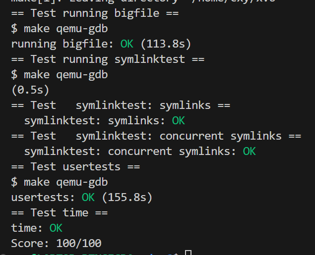


# Lab 10 mmap

### 实验目的

本实验的目的是在xv6操作系统中实现`mmap`和`munmap`系统调用，以支持将文件映射到进程的地址空间。通过实现这些系统调用，我们可以使进程能够对内存映射的文件区域进行读写操作，并在进程退出或调用`munmap`时正确地处理这些映射的区域。

### 实验步骤

#### 1. 初始化`mmap`和`munmap`系统调用

首先，我们在xv6中定义`mmap`和`munmap`系统调用的框架。

```c
[user.h]
char *mmap(void *, size_t, int, int, int, off_t);
int munmap(void *, size_t);

[usys.pl]
entry("mmap");
entry("munmap");

[syscall.h]
#define SYS_mmap 22
#define SYS_munmap 23

[syscall.c]
extern uint64 sys_mmap(void);
extern uint64 sys_munmap(void);
...
[SYS_mmap]    sys_mmap,
[SYS_munmap]  sys_munmap,
};
```

#### 2. VMA数据结构的设计

在每个进程的结构体中添加一个VMA（Virtual Memory Area）数组，用于记录内存映射区域的信息。该结构体包括映射的起始地址、长度、权限、文件描述符等。

```C
// Virtual memory mapping
struct vma
{
  int valid;      // 有效位，当值为 0 时表示无效，即为 empty element
  uint64 addr;    // 记录起始地址
  int len;        // 长度
  int prot;       // 权限（read/write）
  int flags;      // 区域类型（shared/private）
  int off;        // 偏移量
  struct file *f; // 映射的文件
  uint64 refcnt;  // （延迟申请）已经映射的页数量
};
#define VMA_MAX 16

struct proc {
  ...
  struct vma vma_array[VMA_MAX];
  uint64 vma_top_addr;
};    
```

在allocproc中，初始化进程的VMA结构体。

```C
static struct proc*
allocproc(void)
{
	...
	// Initialize the vma array and the currently available VMA top address. 
    for(int i = 0;i<VMA_MAX;i++)
    {
       p->vma_array[i].valid = 0;
       p->vma_array[i].refcnt = 0;
    }
    p->vma_top_addr = MAXVA-2*PGSIZE;
```


#### 3. 实现`mmap`

`mmap`的实现主要分为以下步骤：

- 寻找进程地址空间中未使用的区域来进行内存映射。
- 创建对应的VMA条目，增加文件的引用计数，以防止文件被提前关闭。

```C
uint64 sys_mmap(void)
{
  uint64 addr;
  int len, prot, flags, fd, off;
  argaddr(0, &addr);
  argint(1, &len);
  argint(2, &prot);
  argint(3, &flags);
  argint(4, &fd);
  argint(5, &off);

  struct proc* p = myproc();
  struct file* f = p->ofile[fd];
  
  // Check whether this operation is legal
  if((flags==MAP_SHARED && f->writable==0 && (prot&PROT_WRITE))) return -1;

  // Find an empty VMA struct. 
  int idx = 0;
  for(;idx<VMA_MAX;idx++)
    if(p->vma_array[idx].valid==0)
      break;
  if(idx==VMA_MAX)
    panic("All VMA struct is full!");
  // printf("sys_mmap: Find available VMA struct, idx = %d\n", idx);
  
  // Fill this VMA struct.
  struct vma* vp = &p->vma_array[idx];
  vp->valid = 1;
  vp->len = len;
  vp->flags = flags;
  vp->off = off;
  vp->prot = prot;
  vp->f = f;
  filedup(f); // This file's refcnt += 1. 
  p->vma_top_addr-=len;
  vp->addr = p->vma_top_addr; // The usable user virtual address. 
  // printf("sys_mmap: Successfully mapped a file, with addr=%p, len=%x\n", vp->addr, vp->len);
  return vp->addr;
}
```


#### 4. 实现页面错误处理

当访问映射区域时，如果相应的物理页面尚未分配，会触发页面错误。我们需要在页面错误处理程序中：

- 分配物理页面并将文件内容读入其中。
- 将页面映射到进程的地址空间中，并设置正确的权限。

```C
else if(r_scause()==13){ //usertrap, page fault
    // Handle load page fault (when a file is mapped in the vitrual address space, but the physical page is not loaded). 
    uint64 target_va = r_stval();
    struct vma* vp = 0;
    // printf("usertrap: Trying to visit va %p\n", target_va);

    // Find the VMA struct that this file belongs to. 
    for(struct vma *now = p->vma_array;now<p->vma_array+VMA_MAX;now++)
    {
      // printf("usertrap: VMA, addr=%p, len=%x, valid=%d\n", now->addr, now->len, now->valid);
      if(now->addr<=target_va && target_va<now->addr+now->len 
         && now->valid)
      {
        vp = now;
        break;
      }
    }

    if(vp)
    {
      // Allocate a page into physical memory, and map it to the virtual memory. 
      uint64 mem = (uint64)kalloc();
      memset((void *)mem, 0, PGSIZE); // Set the page to all zero. 
      if(mappages(p->pagetable, target_va, PGSIZE, mem, PTE_U|PTE_V|(vp->prot<<1))<0)
        panic("Cannot map a virtual page for the file!");
      
      // Load the content of the page. 
      vp->refcnt += 1;
      ilock(vp->f->ip);
      readi(vp->f->ip, 0, mem, target_va-vp->addr, PGSIZE); // Load a file page from the disk
      iunlock(vp->f->ip);
    }
    else
    {
      printf("Unable to find the VMA struct that the file belongs to!\n");
      goto unexpected_scause;
    }
  }
    else if((which_dev = devintr()) != 0){
```


#### 5. 实现`munmap`

`munmap`的实现包括以下步骤：

- 在VMA数组中找到对应的映射区域。

- 解除页面的映射，并在必要时将数据写回文件。

- 更新文件引用计数。

  ```C
  uint64 sys_munmap(void)
  {
    uint64 addr;
    int len;
    argaddr(0, &addr);
    argint(1, &len);
    struct proc* p = myproc();
  
    struct vma* vp = 0;
    // Find the VMA struct that this file belongs to. 
    for(struct vma *now = p->vma_array;now<p->vma_array+VMA_MAX;now++)
    {
      // printf("usertrap: VMA, addr=%p, len=%x, valid=%d\n", now->addr, now->len, now->valid);
      if(now->addr<=addr && addr<now->addr+now->len 
          && now->valid)
      {
        vp = now;
        break;
      }
    }
  
    if(vp)
    {
      if( walkaddr( p->pagetable , addr ) != 0)
      {
        // Write back and unmap. 
        if(vp->flags==MAP_SHARED) filewrite(vp->f, addr, len);
        uvmunmap(p->pagetable, addr, len/PGSIZE, 1);
        return 0;
      }
      // Update the file's refcnt. 
      vp->refcnt -= 1;
      if(vp->refcnt) // set the vma struct to invalid. 
      {
        fileclose(vp->f);
        vp->valid = 0;
      }
      return 0;
    }
    else
    {
      panic("Cannot find a vma struct representing this file!");
    }
  }
  ```

  

#### 6. 扩展`fork`和`exit`系统调用

- 在`fork`中，子进程需要继承父进程的映射区域，并增加文件的引用计数。

  ```C
    // Copy the struct vma array. 
    np->vma_top_addr = p->vma_top_addr;
    for(int i = 0;i<VMA_MAX;i++)
    {
      if(p->vma_array[i].valid)
      {
        filedup(p->vma_array[i].f);
        memmove(&np->vma_array[i], &p->vma_array[i], sizeof(struct vma));
      }
    }
  ```

- 在`exit`中，进程退出时需自动解除所有映射区域，并根据情况更新文件状态。

  ```C
   // Release the mapped files in the virtual memory. 
    for(int i = 0;i<VMA_MAX;i++)
    {
      if(p->vma_array[i].valid)
      {
        struct vma* vp = &p->vma_array[i];
        for(uint64 addr = vp->addr;addr<vp->addr+vp->len;addr+=PGSIZE)
        {
          if(walkaddr(p->pagetable, addr) != 0)
          {
            if(vp->flags==MAP_SHARED) filewrite(vp->f, addr, PGSIZE);
            uvmunmap(p->pagetable, addr, 1, 1);
          }
        }
        fileclose(p->vma_array[i].f);
        p->vma_array[i].valid = 0;
      }
    }
  ```

  

### 实验中遇到的问题和解决方法

* **什么时候把文件加载到内存？**

  这个过程有点像Copy on write，当进程访问一个映射的虚拟地址时，如果对应的物理页面还没有加载，会触发一个页面错误（Page Fault），操作系统的页面错误处理程序将执行以下操作：
  
  - **定位对应的 VMA**：根据触发页面错误的虚拟地址，操作系统会查找进程的 `VMA` 列表，确定该地址是否属于某个映射区域。
  - **分配物理内存**：如果确实属于某个映射区域，操作系统将分配一个物理页面来存放文件内容。
  - **加载文件内容**：操作系统会从文件中读取相应的数据块（ 4KB 的页面大小）到刚刚分配的物理内存。
  - **更新页表**：将这个物理页面与虚拟地址绑定，并设置正确的访问权限（例如，只读或可写）

### 实验心得

`mmap`是一个综合性很强的实验。涉及了系统调用的编写，涉及了内存管理，也涉及了用户态陷入时的错误处理，有一些COW的思想体现在里面，当然也有文件系统的知识。通过本次实验，在xv6中实现了`mmap`和`munmap`系统调用，能够文件映射到进程的虚拟内存中，并通过内存操作来读取文件的内容。这让我对操作系统有了更深入的理解。


make grade：

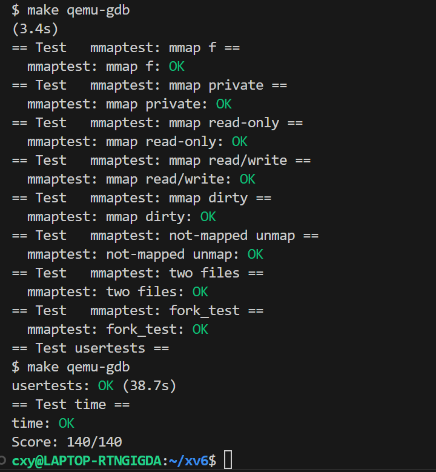

