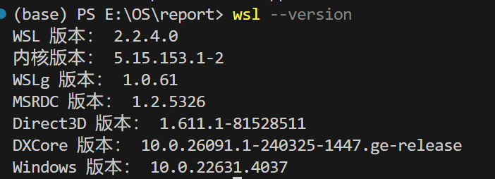
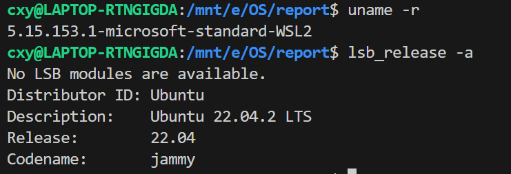
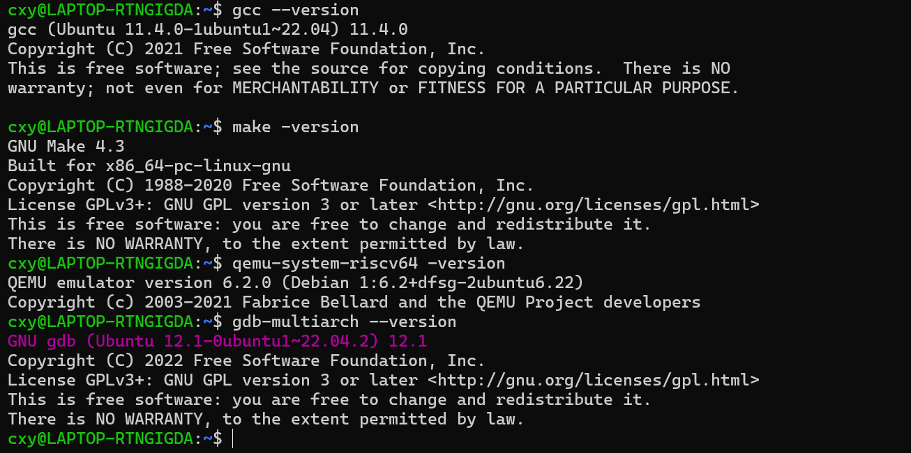

## 实验环境

本实验在 `WSL2` 下完成,，`WSL`的相关版本信息如下：

使用的`Linux` 发行版为 `Ubuntu 22.04`：

编译、运行、调试 `xv6` 的工具链（部分）版本信息如下所示：

`git`我一直不太会配置。做`xv6`的实验，需要从`MIT`的`git`上拉取分支，修改之后又推到自己的`Github`上，后来偶然间就设置成了这样，发现基本上可以满足自己的的需要：

