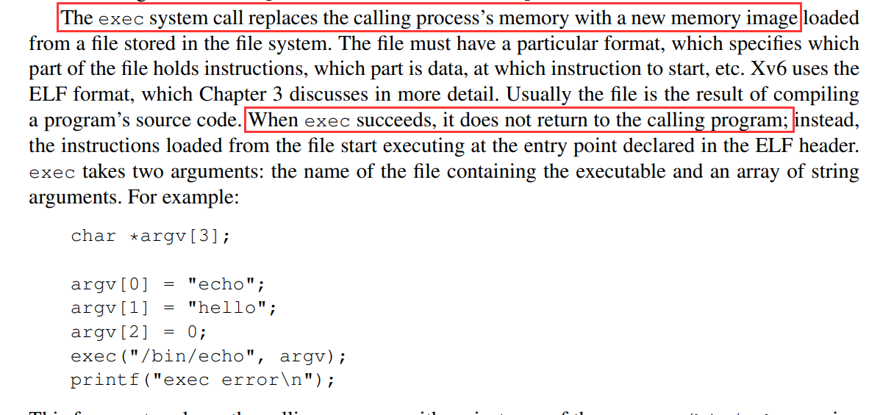

### sleep

#### 实验目的

本实验的目标是实现 `sleep` 命令。

#### 实现步骤

可以通过翻阅手册（[xv6: a simple, Unix-like teaching operating system (mit.edu)](https://pdos.csail.mit.edu/6.828/2023/xv6/book-riscv-rev3.pdf) ，第11页）的方式查询 xv6 所提供的系统调用，xv6 已经提供了系统调用 `sleep`，如下所示：


需要编写一个用户级的程序来使用这个系统调用：

```C
#include "kernel/types.h"
#include "kernel/stat.h"
#include "user/user.h"
int main(int argc, char *argv[])
{
    if (argc < 2)
    {
        fprintf(2, "Wrong arguments!\nUsage: sleep time\n");
        exit(1);
    }
    sleep(atoi(argv[1]));
    exit(0);
}
```

#### 实验心得

本次实验让我学会了查阅xv6的文档，并使用xv6提供的系统调用。

我之前编写的C语言程序大多是通过标准输入来向 `main` 函数传递数据的，通过本实验尝试了使用 `argc` 和 `argv` 向 `main` 函数传参。在命令行形式的用户界面之下，这样的传参方法是普遍使用的。


### pingpong

#### 实验目的

本实验旨在编写一个用户级程序，该程序使用 xv6 系统调用在两个进程之间通过一对管道传递一个字节，实现所谓的 "ping-pong" 效果。具体要求如下：

- 父进程向子进程发送一个字节；
- 子进程打印 "<pid>: received ping"，其中 `<pid>` 是其进程 ID；
- 子进程将字节写回给父进程，然后退出；
- 父进程读取子进程发送的字节，打印 "<pid>: received pong"，并退出。

#### 实现步骤

1. **创建管道**： 使用 `pipe` 系统调用创建管道。
2. **创建子进程**： 使用 `fork` 系统调用创建子进程。子进程和父进程将通过管道进行通信。
3. **子进程执行任务**：
   - 关闭写入端文件描述符；
   - 从管道读取一个字节；
   - 打印 "<pid>: received ping"；
   - 将字节写回管道；
   - 关闭读取端文件描述符并退出。
4. **父进程执行任务**：
   - 关闭读取端文件描述符；
   - 向管道写入一个字节；
   - 关闭写入端文件描述符；
   - 等待子进程结束；
   - 从管道读取字节；
   - 打印 "<pid>: received pong"；
   - 退出。

```C
#include "kernel/types.h"
#include "kernel/stat.h"
#include "user/user.h"

int main()
{
    int p[2];
    if (pipe(p) != 0)
    {
        printf("pipe err");
        exit(1);
    }

    if (fork() == 0) // child
    {
        close(p[1]); // close write end
        char temp;
        read(p[0], &temp, 1);
        printf("%d: received ping\n", getpid());
        write(p[0], &temp, 1); // write back to parent
        close(p[0]);           // close read end
        exit(0);
    }
    else
    {
        close(p[0]); // close read end
        char temp = 'x';
        write(p[1], &temp, 1);
        close(p[1]); // close write end
        wait((int *)0);
        close(p[1]);          // close write end
        read(p[0], &temp, 1); // read from child
        printf("%d: received pong\n", getpid());
    }

    exit(0);
}
```

#### 实验心得

本实验有两个收获：

1. 理论课上说，进程间通信的实现方式之一就是管道，本次实验尝试使用pipe系统调用创建管道，完成了进程间通信。

2. 学会了使用fork系统调用创建子进程，了解了`if (fork() == 0)... else ...`这种通过返回值来区分父子进程的方法。


### primes 

#### 实验目的

实现一个多进程素数筛，该程序基于 Doug McIlroy 提出的设计思想，使用管道在多个进程之间传递数据，以并发的方式筛选素数。

#### 实现步骤

我认为这个题目有两大难点：

1. 素数筛到底是怎么工作的？
2. 如何利用xv6提供给我们的系统调用，来实现多进程的素数筛？

因此，实验步骤也分为这两个部分来介绍。

##### 素数筛的工作原理

MIT的实验网页提供了一个参考资料（[Bell Labs and CSP Threads (swtch.com)](https://swtch.com/~rsc/thread/)），介绍了多进程素数筛的工作原理：


第一个子进程会筛掉所有2的倍数，第二个子进程会筛掉所有3的倍数，第三个子进程会筛掉所有5的倍数，以此类推。每个进程未被筛掉的最小数字必定是素数，直接将其打印出来即可。

##### 多进程素数筛的具体实现

*每个子进程*需要从它的父亲进程**读取上一层筛出的结果**，打印第一个数字，进行自己的这一轮筛除后，再**把自己筛出的结果发送给它的子进程**。所以需要一个`pleft`管道从左侧读取，和一个`pright`管道向右侧发送。

对于每个子进程而言，它的 `pright` 管道都是自己新建立的，而它的 `pleft` 管道则是上一个父进程的 `pright` 。每一个进程运行的都是同一份C代码，我们需要让不同的进程走进不同的 `if` 分支来，这样才能完成正确的逻辑。

```c
int main(void)
{
    int pleft[2];
    pipe(pleft);

    if (fork() == 0)
    {
        // 子进程处理筛选
        int prime;
        close(pleft[1]); // 子进程不需要写入初始管道

        while (read(pleft[0], &prime, sizeof(prime)) != 0)
        {
            printf("prime %d\n", prime);

            int pright[2];
            pipe(pright);

            if (fork() == 0)
            {
                // 下一个子进程处理剩余的数字
                close(pright[1]);
                close(pleft[0]);
                pleft[0] = pright[0]; // 把当前的读端换成新管道的读端
                continue;
            }
            else
            {
                // 当前子进程过滤数字并传递给下一个子进程
                close(pright[0]);
                int num;
                while (read(pleft[0], &num, sizeof(num)) != 0)
                {
                    if (num % prime != 0)
                    {
                        write(pright[1], &num, sizeof(num));
                    }
                }
                close(pright[1]);
                close(pleft[0]);
                wait(0); // 等待子进程完成
                exit(0);
            }
        }
        close(pleft[0]);
        exit(0);
    }
    else
    {
        // 父进程写入数字 2 到 35
        close(pleft[0]);
        for (int i = 2; i <= 35; i++)
        {
            write(pleft[1], &i, sizeof(i));
        }
        close(pleft[1]);
        wait(0); // 等待所有子进程完成
        exit(0);
    }
}
```

#### 实验心得

本实验难度较大，我参照了已有的代码才完成了`primes.c`。多进程编程在一定程度上是“违背直觉”的。每一个进程运行的都是同一份C代码，但能够通过fork返回值的不同而进入不同的分支，也可以通过管道获取和发送不同的数据，很难一次性完全想清楚。我最不理解的是`pleft[0] = pright[0]`这一行，明明是要向右侧传递数字，为什么是更改`pleft`而不是`pright`呢？但其实跟着代码逻辑向下走就能明白，这次赋值更改的`pleft`是下一个子进程读取的内容，子进程的 `pleft` 管道实际上是上一个父进程的 `pright`，`pleft[0] = pright[0]`这一行实际上就是把父进程的右管道和子进程的左管道“接”在一起，完成数据传递。

通过本实验，初步尝试了使用多进程编程的方式来解决实际问题。


### find 

#### 实验目的

实现find。在给定的目录的树中查找特定文件名的文件。

#### 实现步骤

访问文件系统，遍历当前目录的操作在`user/ls.c`里面就有，主要是`dirent`的使用。与 `ls.c` 不同的是搜索功能的实现，可以使用递归的方式完成：

1. 如果是文件夹，则函数递归地调用自身，继续向内层搜索。

2. 如果是文件，则通过 `strcmp` 比较文件名是否一致。

   ```c
   void find(char *path, char *key)
   {
       char buf[512], *p;
       int fd;
       struct dirent de;
       struct stat st;
       ...........处理错误情况............
       switch (st.type)
       {
       case T_FILE:
           if (strcmp(fmtname(path), key) == 0)
           {
               printf("%s\n", path);
           }
           break;
   
       case T_DIR:
           ...........处理错误情况............
           strcpy(buf, path);
           p = buf + strlen(buf);
           *p++ = '/';
           while (read(fd, &de, sizeof(de)) == sizeof(de))
           {
               if (de.inum == 0 || strcmp(de.name, ".") == 0 || strcmp(de.name, "..") == 0)
                   continue;
               memmove(p, de.name, DIRSIZ);
               p[DIRSIZ] = 0;
               find(buf, key);
           }
           break;
       }
       close(fd);
   }
   ```

#### 实验心得

可以说 `find` 就是一个带字符串比较和递归访问的 `ls` 而已。先大致阅读 `ls.c` ，再来实现 `find.c` ，会比较容易。


### xargs

#### 实验目的

本实验的目的是要实现 `xargs` 命令。

`xargs` 是 Unix 和 Linux 系统中的一个命令行工具，用于构建和执行由标准输入传递的参数列表。假设有一个文件 `test.txt`，其中内容如下：

```
file1
file2
file3
```

可以使用 `xargs` 将这些文件名作为参数传递给 `rm` 命令来删除这些文件：

```
cat test.txt | xargs rm
```

`cat test.txt` 会输出 `test.txt` 的内容，也就是file1、file2、file3的名字。这三个文件名作为参数传给rm命令，等价于执行了：

```
rm file1 file2 file3
```

#### 实现步骤

##### 参数从哪里来：首先搞明白管道符 `|` 的作用

使用`xargs`时，右边那个命令的参数到底从哪里来？

还是以上面这个 `cat test.txt | xargs rm` 为例子，命令的参数是直接从 `test.txt` 里面直接取出来的吗？我一开始也是这样以为的，但实际上这样说并不准确。更确切的说法是：

1. `cat` 的作用是把 `test.txt`  文件的内容输出到**标准输出**
2. 管道符 `|` 将 `cat test.txt` 的输出**重定向**到 `xargs` 的**标准输入**。
3. `xargs` **从标准输入读取** `cat test.txt` 的输出内容，将这些内容作为参数传递给 `rm` 命令。
4. `rm` 命令删除 `test.txt` 文件中列出的所有文件。

理解管道符在 `cat test.txt | xargs rm` 这行命令中的作用，就能明白我们的 `xargs` 要从哪里读取参数了——我们的程序只要读**标准输入**就可以了！

##### 读取标准输入stdin的参数，然后通过exec系统调用来执行

读标准输入，用 `read` 系统调用。它的用法是`read(int fd, void *buf, size_t count);` 其中参数`fd==0`时就是从stdin读数据了。

执行命令用 `exec` 系统调用，一开始，我很难理解exec的用法：

```C
exec(args[0], args);
fprintf(2, "exec %s failed\n", args[0]);
exit(1);
```

这个`fprintf`之前没有`if`分支，如果按照顺序执行的直觉来看，这一句“exec failed”似乎是一定会被打印出来的，但是实际运行并不会把这个failed信息打印出来，而是执行完exec就结束了。



查询手册（[xv6: a simple, Unix-like teaching operating system (mit.edu)](https://pdos.csail.mit.edu/6.828/2023/xv6/book-riscv-rev3.pdf)，第12页）可以知道，`exec` 函数只会在执行失败时返回。如果 `exec` 成功执行，新程序将覆盖当前进程的地址空间，并且永远不会返回到原来的代码中。

```C
while ((n = read(0, p, sizeof(char))) > 0)
    {
        /*
        一次只读一个字符。
        如果读到了换行，直接新开一个子进程，用exec执行这个带参数的命令。
        */
        if (*p == '\n')
        {
            *p = '\0';
            args[argi - 1] = buf;
            args[argi] = 0;

            if (fork() == 0)
            {
                exec(args[0], args);
                fprintf(2, "exec %s failed\n", args[0]);
                exit(1);
            }
            else
            {
                wait(0);
            }

            p = buf;
        }
        else
        {
            p++;
        }
    }
```

#### 实验心得

我个人觉得这个实验主要困扰我的点是理解`xargs`的作用和工作过程。在之前我都不知道 `xargs` 是什么东西，更是从来没有用过，管道符`|`也只是一知半解。好在通过查资料、读文档，终于理解实现`xargs`该做什么了：其实 `xargs` 就是read(0,,)读stdin，然后exec。

在本实验中首次尝试了 `exec` 系统调用。

