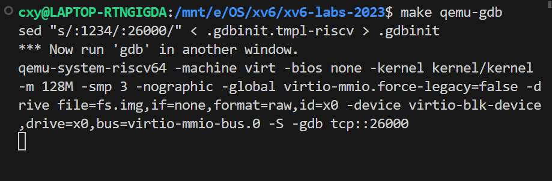
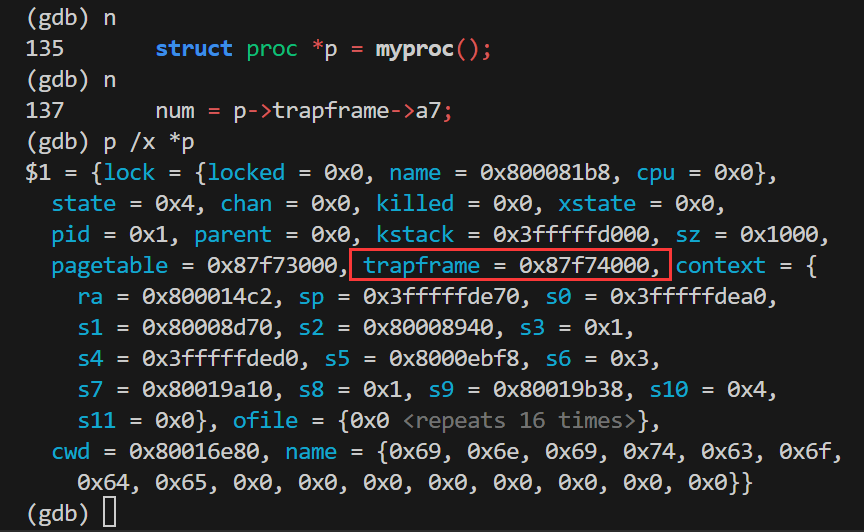
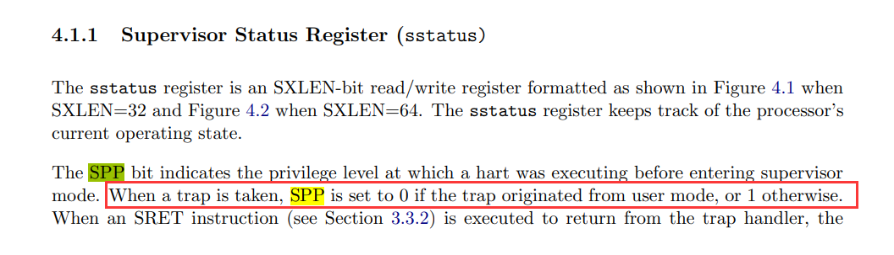
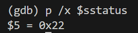
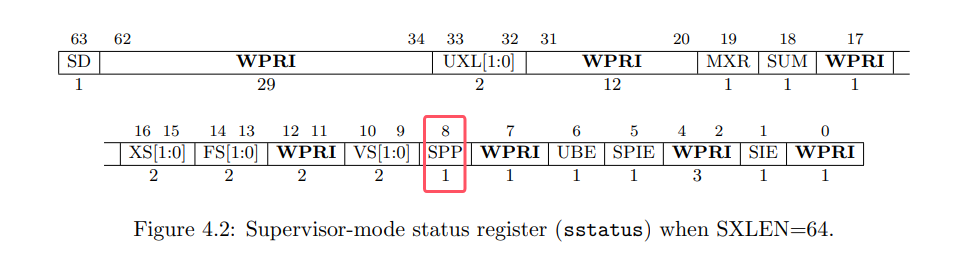
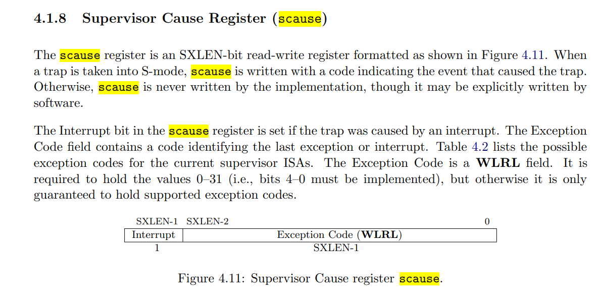
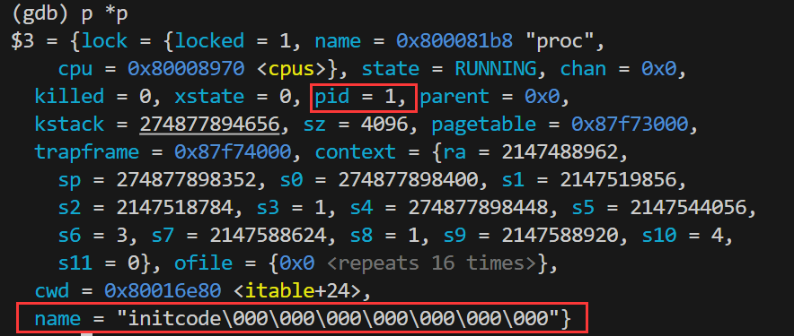
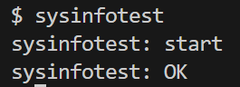

# Lab2 system calls

## 2.1 Using `gdb`

### 实验目的

试着用`gdb`来调试`xv6`中的代码，按要求回答几个问题。

### 实现步骤

使用`gdb`调试xv6需要开两个控制台窗口。

首先确保当前目录处于`xv6-labs-2023`文件夹，运行`make qemu-gdb`，现象如下：



在**另一个控制台**中，运行`gdb-multiarch`（启动支持`risc-v`体系结构的调试器）、`target remote localhost:26000`（按照指定端口远程调试）


使用`symbol-file kernel/kernel`加载符号


使用`b syscall`打断点


使用`c`(continue)让程序继续运行下去，直到命中断点：


### 回答问题

1. **哪个函数调用了`syscall()`？**

   

   使用`bt`（back-trace）即可查看调用信息，发现是`usertrap()`调用了`syscall()`。

2. **使用`n`单步执行，运行完`struct proc *p = myproc()`这一句后，使用` p /x *p`。查看`p->trapframe->a7`的值，并分析这个值表示什么。**

   

​	`p /x *p` 的作用是打印当前进程的 `proc` 结构体。`p` 是 `gdb` 的命令，`/x` 表示以十六进制格式显示，`*p` 表示打印 `p` 指针指向的整个 `proc` 结构体，如上图所示。但是到这一步尚且还只能看到`trapframe`的地址，为了看到`p->trapframe->a7`的值，直接在gdb里使用`p p->trapframe->a7`命令：


​	也就是说`p->trapframe->a7`的值为7。

​	这个值表示什么？实验指导提醒我去`user/initcode.asm`这个文件看看：

```assembly
# exec(init, argv)
.globl start
start:
        la a0, init
   0:	00000517          	auipc	a0,0x0
   4:	00050513          	mv	a0,a0
        la a1, argv
   8:	00000597          	auipc	a1,0x0
   c:	00058593          	mv	a1,a1
        li a7, SYS_exec
  10:	00700893          	li	a7,7
        ecall
  14:	00000073          	ecall
```

​	这段代码会将 `SYS_exec`（值为 `7`）加载到 `a7` 寄存器。所以`p->trapframe->a7`的值为7，表示当前正在请求执行 `exec` 系统调用。

3. **此前，CPU处于什么状态？**



​	在 RISC-V 特权指令集手册（https://github.com/riscv/riscv-isa-manual/releases/download/Priv-v1.12/riscv-privileged-20211203.pdf，4.1.1，P63）中可以得知，`sstatus`寄存器的SPP位用于记录陷入前的CPU模式。



​	



​	打印出`sstatus`寄存器的值为0x22，其二进制为：**0**0100010，对应的SPP位值为0。因此，之前CPU处于用户态。

4. **记录是哪一条汇编指令引发了 kernel panic ，并记录哪个寄存器对应于变量 `num`。**

​	在 `syscall.c` 中 `void syscall(void){` 的开头，将语句 `num = p->trapframe->a7;` 替换为 `num = * (int *) 0;` ，再重新编译运行，会遇到kernel panic。


​	`sepc`的值为`0x00000000800020d6`，去`kernel/kernel.asm` 文件中搜索这个值，可以找到：

```assembly
800020d6:	00002903          	lw	s2,0(zero) # 0 <_entry-0x80000000>
```

​	对应`num`值的寄存器为`s2`。

5. **为什么发生了kernel panic？**

​	**`scause` 的值**：`0x000000000000000d`

​	查RISC-V 特权指令集手册（P70~71）：

​		

​	现在**`scause` 的值**：`0x000000000000000d`，Interrupt=0，Exception Code=13，对应 Load page fault，表示在加载数据时发生了页面错误，因而发生了kernel panic。

6. **内核崩溃时运行的二进制文件的名称是什么？它的PID是什么？**



​	名称为 `initcode`, `pid` 为 1;

### 实验心得

​	初步学习使用了GDB，例如使用`b`来打断点，利用`bt`查看调用堆栈，用`p`来显示变量/寄存器值等；第一次尝试查询了RISC-V 特权指令手册，明白了在手册中查找寄存器（例如`scause`）各个位的含义，以辅助调试。

> 一些题外话：
>
> ​	在命令行使用GDB似乎有些太“原始”了，需要输入命令才能使用相应的功能，不够“现代”。我使用VS Code作为完成xv6实验的工具，能否使用VS Code来配置GDB，直接用鼠标在代码里打断点呢？我发现是可以的，参照网络上的 [这篇博客](https://sanbuphy.github.io/p/%E4%BC%98%E9%9B%85%E7%9A%84%E8%B0%83%E8%AF%95%E5%9C%A8vscode%E4%B8%8A%E5%AE%8C%E7%BE%8E%E8%B0%83%E8%AF%95xv6%E5%AE%8C%E7%BB%93/) 就能做到。

---


## 2.2 System call tracing

### 实验目的

本实验的目标是为 `xv6` 操作系统添加一个新的 `trace` 系统调用，该调用可以控制系统调用的跟踪。通过使用这个系统调用，用户可以指定要跟踪哪些系统调用，并在这些系统调用返回时打印出相关信息，包括进程ID、系统调用名称和返回值。

### 实现步骤

1. **更新 `Makefile`**
   用户级程序 `trace.c`已经提供，要使它被编译，需要在 `Makefile` 中添加：

   ```c
   +    $U/_trace\
   ```

2. **添加系统调用编号**
   在 `kernel/syscall.h` 中添加 `SYS_trace` 的系统调用编号：

   ```c
   +#define SYS_trace  22 // 添加trace的系统调用编号
   ```

3. **修改 `proc` 结构体**
   在 `kernel/proc.h` 中的 `proc` 结构体中新增一个 `trace_mask` 变量，用于记录掩码，表明要跟踪哪些系统调用：

   ```c
   +  int trace_mask; // 新增一个掩码变量，用于实现trace系统调用
   ```

   在 `kernel/proc.c` 中修改 `fork` 函数以复制父进程的 `trace_mask` 到子进程：

   ```c
   +  np->trace_mask = p->trace_mask; // 为子进程的掩码赋值
   ```

4. **更新系统调用处理**
   在 `kernel/syscall.c` 中：

   - 添加 `sys_trace` 函数的声明：
     ```c
     +extern uint64 sys_trace(void);
     ```

   - 在系统调用表中添加 `sys_trace` 的条目：
     ```c
     +[SYS_trace]   sys_trace,
     ```

   - 添加系统调用名称数组，方便根据系统调用编号来输出系统调用的名字：
     ```c
     +static char *syscall_names[] = {
     +  [SYS_fork]    "fork",
     +  [SYS_exit]    "exit",
     +  // ... 省略部分内容 ...
     +  [SYS_trace]   "trace", 
     +};
     ```

   - 修改 `syscall` 函数，如果发生了系统调用，恰好这个调用又是需要被跟踪的，则打印信息：
     ```c
     +    if (p->trace_mask & (1 << num)) {
     +      printf("%d: syscall %s -> %d\n", p->pid, syscall_names[num], p->trapframe->a0);
     +    }
     ```

5. **实现 `sys_trace` 系统调用**
   在 `kernel/sysproc.c` 中实现 `sys_trace` 函数。这个函数修改 `proc` 结构体里的 `trace_mask`。

   > 遇到的问题：不知道怎样给系统调用传入参数！
   >
   > 解决办法：去阅读已有的代码，看到`sys_sleep(void)`用了 `argint(0, &n)`来获取参数，其原理是读取`trapframe`中寄存器的值。

   ```c
   +uint64 sys_trace(void) {
   +    int mask;
   +    // 在实现系统调用时，需要从用户空间获取参数。
   +    argint(0, &mask);           // 通过 argint 获取第一个参数（位置 0）赋值给mask。其实也就是读了 p->trapframe->a0 的值;
   +    struct proc *p = myproc();  // 获取当前进程的PCB
   +    p->trace_mask = mask;       // 修改当前进程PCB的trace_mask
   +    return 0;
   +}
   ```

6. **更新用户空间的头文件和系统调用定义**
   在 `user/user.h` 中添加 `trace` 系统调用的声明：

   ```c
   +int trace(int mask); // 在user/user.h中添加系统调用trace的声明
   ```

   在 `user/usys.pl` 中添加 `trace` 系统调用的入口：
   ```c
   +entry("trace"); # 添加系统调用trace
   ```

### 实验心得

Lab1只是使用已有的系统调用实现用户级程序，而在本实验中第一次尝试了在 `xv6` 操作系统中添加新的系统调用。

总结下来，添加系统调用可以遵循以下几个步骤：

- 在宏定义中添加系统调用的名称和编号，更新系统调用表，添加函数声明。

- 对已有的内核代码进行相关的修改，例如在结构体里新增必要的成员等，以支持新的系统调用。
- 实现系统调用的具体功能。
- 让一个用户级的程序来使用系统调用，测试该系统调用是否能正常工作。

（后来的实验中经常需要实现系统调用，确实也多次重复经历了上述这些步骤）

另外，本实验接触到了`proc`结构体。从它的成员来看，这个结构体应该就是xv6的PCB了吧。


## 2.3 Sysinfo

### 实验目的

给xv6增加一个系统调用 `sysinfo`，它能够收集系统运行的信息，获取当前可用的内存大小和当前的进程数量。

### 实验步骤

既然`sysinfo`的目标是要获取可用内存和当前进程数量，可以分别实现一个 `uint64 freemem()` 函数来统计可用内存，和一个 `uint64 nproc(void)` 来统计进程数量。在 `sys_sysinfo` 函数里面只要调用这两个函数就可以了。

因此 `sys_sysinfo` 函数是这个样子：

```C
uint64 sys_sysinfo(void)
{
  struct sysinfo info;
  struct proc *p = myproc();
  uint64 addr;

  argaddr(0, &addr);

  // 获取可用内存
  info.freemem = freemem();

  // 获取当前进程数量
  info.nproc = nproc();

  if (copyout(p->pagetable, addr, (char *)&info, sizeof(info)) < 0)
      return -1;

  return 0;
}
```

其中调用的`freemem()`函数，用于统计空闲内存空间。`kmem` 的成员有 `struct run *freelist`，它是xv6的空闲内存链表。`struct run` 是这个空闲链表的链表节点结构,它们通过 `next` 指针相连接。通过遍历`freelist`链表，循环累加单个内存块的大小，即可获得所有空闲内存的大小。

```C
uint64 freemem(){
  struct run *r;
  uint64 free = 0;

  // 获取 kmem.lock 锁以保护空闲内存链表的访问
  acquire(&kmem.lock);
  for (r = kmem.freelist; r; r = r->next)
    free += PGSIZE;
  release(&kmem.lock);

  return free;
}
```

xv6通过数组 `struct proc proc[NPROC]` 来记录各个进程的情况。`nproc()` 函数遍历`proc`数组，找到数组元素中`proc.state!=UNUSED`的个数就是当前系统中的进程个数了。

```C
uint64 nproc(void)
{
  struct proc *p;
  uint64 count = 0;

  for (p = proc; p < &proc[NPROC]; p++)
    if (p->state != UNUSED)
      count++;

  return count;
}
```

> *更改makefile*、*添加系统调用编号*之类的步骤，和上个实验完全一样，这里不再赘述了。

还有两点可以说一下，一个是`argaddr`，它和上面的`argint`差不多，都是用于把系统调用的参数从用户空间传进来的，不同的是这次传进来的是结构体的地址而不是整数；另一个是`copyout`，它反过来把内核空间里的数据拷贝到用户空间。它们俩造成的效果就是，用户运行完`sysinfo(&info);`，之后会发现info的内容真的被系统调用给更改了。



### 实验心得

查看系统当前的运行状况是很实用的功能，写完 `sysinfo` 之后，感觉都可以给xv6做一个360加速球了（开个玩笑），虽然现在只能看占用情况而不能够真的加速。

通过本实验还初次窥见了 xv6 系统中管理资源的数据结构，例如 `freelist` 空闲内存链表和 `proc` 进程数组，对于空闲空间管理和进程管理有了一点点的、很少很浅显的概念。

