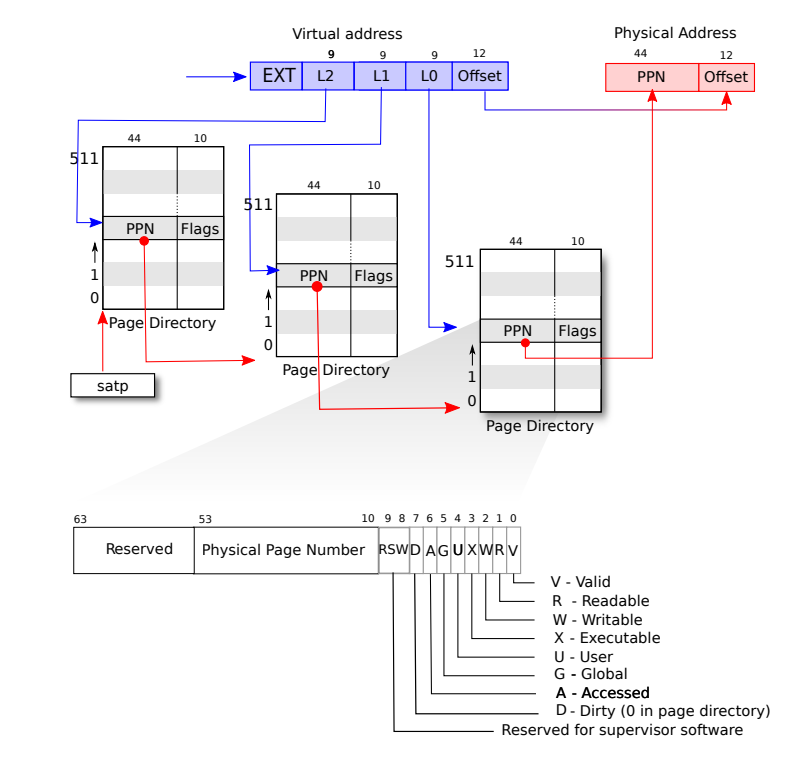

# Lab3 page tables

## 3.1 Speed up system calls

### 实验目的

一些现代操作系统（如 Linux）会在用户空间和内核之间共享一篇只读的内存区域，加快某些系统调用的速度。本实验的目标是实现这一特性，以优化 `getpid()` 系统调用的执行效率。

### 实现步骤

原本的 `getpid()` 系统调用如下所示：

```C
uint64 sys_getpid(void){
 return myproc()->pid;
}
```

这个函数表面上非常简洁。但每次调用 `getpid()` 时，系统都需要从用户态切换到内核态，额外的上下文切换开销较大。

解决方式就是在每个进程的内存空间中分配一片共享的只读区域，用户态程序可以直接访问，而不需要状态切换。

##### 1. 定义共享区域usyscall：

下图的USYSCALL的位置、大小和数据结构已经帮我们定义好了。


这个`usyscall`结构体是所有进程都会有的。所以把它添加为`proc`结构体的成员。

```c
+++ b/kernel/proc.h
@@ -104,4 +104,5 @@ struct proc {
   struct file *ofile[NOFILE];  // Open files
   struct inode *cwd;           // Current directory
   char name[16];               // Process name (debugging)
+  struct usyscall *usyscall;   // sharing data in a read-only region between userspace and the kernel
 };
```


##### 2. usyscall的初始化：

当创建新进程时，需要在 `allocproc()` 函数中为 `usyscall` 分配一页物理内存，并将 `pid` 存入 `usyscall` 结构。

```C
  //(在proc.c中的static struct proc* allocproc(void)函数内)
  if ((p->usyscall = (struct usyscall *)kalloc()) == 0)
  {
    freeproc(p);
    release(&p->lock);
    return 0;
  }
  p->usyscall->pid = p->pid;
```

在进程的页表初始化时，在`proc_pagetable()` 函数建立 `usyscall` 结构与进程的虚拟内存空间之间的映射。`mappages` 是 `xv6` 操作系统中用于在页表中设置虚拟地址到物理地址映射的函数：

```c
int
mappages(pagetable_t pagetable, uint64 va, uint64 size, uint64 pa, int perm)
```

`usyscall`是“用户只读”的，所以调用`mappages`时，在`perm`参数里为它设置 `PTE_R | PTE_U` 两个比特位。

```c
+  // 在pagetable_t proc_pagetable(struct proc *p)函数内
+  if (mappages(pagetable, USYSCALL, PGSIZE,
+               (uint64)p->usyscall, PTE_R | PTE_U) < 0)
+  {
+    uvmunmap(pagetable, USYSCALL, 1, 0);
+    uvmfree(pagetable, 0);
+    return 0;
+  }
+
```


##### 3. 解除映射并释放：

在`proc_freepagetable`中新增了一行 `uvmunmap(pagetable, USYSCALL, 1, 0);` 用于解除 `usyscall` 结构在虚拟地址空间中的映射。这样可以确保在进程结束时，`usyscall` 不再被映射到虚拟内存。

```c
void
proc_freepagetable(pagetable_t pagetable, uint64 sz)
{
  uvmunmap(pagetable, TRAMPOLINE, 1, 0);
  uvmunmap(pagetable, TRAPFRAME, 1, 0);
  uvmunmap(pagetable, USYSCALL, 1, 0); // 新增这一行
  uvmfree(pagetable, sz);
}
```

在 `freeproc` 函数中，新增了 `kfree((void *)p->usyscall);`，用于释放之前为 `usyscall` 分配的物理内存，避免内存泄漏：

```c
  //(在proc.c中的 freeproc 函数内)
@@ -158,6 +166,9 @@ freeproc(struct proc *p)
   if(p->trapframe)
     kfree((void*)p->trapframe);
   p->trapframe = 0;
+  if (p->usyscall)
+    kfree((void *)p->usyscall);
+  p->usyscall = 0;
   if(p->pagetable)
     proc_freepagetable(p->pagetable, p->sz);
   p->pagetable = 0;
```

`ugetpid`是已经在`ulib.c`里面写好的，不用实现这一部分。所以可以直接交给打分程序来检验了：


#### 遇到的问题

> 在编译时，makefile 的第93行会为本实验添加上 LAB_PGTBL 这个宏定义， 但是编辑器（VSCode）事先并不知道这个宏，一直给我的相关代码划红色波浪线。例如，VSCode读不到LAB_PGTBL 这个宏，所以不认识USYSCALL。
>
>  所以我在编写代码时重复进行定义\#define LAB_PGTBL，编译前再把它注释掉就好了。这个解决办法并不优雅。

### 回答问题

**Which other xv6 system call(s) could be made faster using this shared page? Explain how.**

这种加速方式适用于**只涉及读取内核数据而不需要修改或执行复杂操作的调用**。

除了`getpid()`以外，`uptime()`、`fstat()`等系统调用也符合这个特征，能够被加速。


### 实验心得

之前会觉得系统调用总要经历***用户态发起调用 - 陷入内核态 - 内核处理 - 返回用户态***这样的一整套过程。本实验的`ugetpid`很特殊，通过在进程页表中插入只读页，就能实现在用户空间直接读取`pid`的功能，让`ugetpid`成为了一个**不用陷入内核态**的“系统调用”。

通过本实验了解了xv6中内存分配、页表映射、设置权限位、解除映射和内存释放的过程，对内存管理有了更深刻的理解。


## 3.2 Print a page table

### 实验目的

实现一个函数 `vmprint()`，用于层次化地打印 RISC-V 页表的内容，以帮助可视化和调试页表结构。它的输出像是这样，用缩进来体现页表的层级：

```C
page table 0x0000000087f6b000
 ..0: pte 0x0000000021fd9c01 pa 0x0000000087f67000
 .. ..0: pte 0x0000000021fd9801 pa 0x0000000087f66000
 .. .. ..0: pte 0x0000000021fda01b pa 0x0000000087f68000
 .. .. ..1: pte 0x0000000021fd9417 pa 0x0000000087f65000
 .. .. ..2: pte 0x0000000021fd9007 pa 0x0000000087f64000
 .. .. ..3: pte 0x0000000021fd8c17 pa 0x0000000087f63000
 ..255: pte 0x0000000021fda801 pa 0x0000000087f6a000
 .. ..511: pte 0x0000000021fda401 pa 0x0000000087f69000
 .. .. ..509: pte 0x0000000021fdcc13 pa 0x0000000087f73000
 .. .. ..510: pte 0x0000000021fdd007 pa 0x0000000087f74000
 .. .. ..511: pte 0x0000000020001c0b pa 0x0000000080007000
init: starting sh
```

### 实现步骤

先读了xv6 book [[xv6: a simple, Unix-like teaching operating system (mit.edu)](https://pdos.csail.mit.edu/6.828/2023/xv6/book-riscv-rev3.pdf)]与内存相关的部分，很快就找到了这张图（P33, Figure 3.2）： 



xv6使用三级页表，要打印出所有的有效页表项，只要从第一级出发，检查PTE_V标志位。若PTE_V为1，则打印当前项并通过PTE2PA进入下一级页表继续打印；若PTE_V为0，则前往下一个页表项。

这是一个递归的过程。我在`vmprint(pagetable_t pagetable)` 中调用递归函数 `vmprint_recursive(pagetable_t pagetable, int level)`，通过`level`参数的传递来决定打印的缩进，体现出页表层级。

1. **在 `kernel/defs.h` 中新增声明**：
   
   ```c
   void vmprint(pagetable_t pagetable);
   ```
   
2. **在 `kernel/vm.c` 中实现 `vmprint()` 函数及其递归部分**：
   - `vmprint()` 负责调用 `vmprint_recursive()`，打印页表整体结构：
   ```c
   void vmprint(pagetable_t pagetable) {
       printf("page table %p\n", pagetable);
       vmprint_recursive(pagetable, 2);  // 从最顶层（第三级）页表开始递归打印
   }
   ```

   - `vmprint_recursive()` 递归打印每个页表项和物理地址，检查PTE_V为1：
   ```c
   void vmprint_recursive(pagetable_t pagetable, int level) {
       if(level < 0)
           return;
       for (int i = 0; i < 512; i++) {
           pte_t pte = pagetable[i];
           if (pte & PTE_V) {  // 仅打印有效的PTE
               for (int j = 0; j < 3 - level; j++)
                   printf(" ..");
               uint64 child = PTE2PA(pte);
               printf("%d: pte %p pa %p\n", i, pte, child);
               vmprint_recursive((pagetable_t)child, level - 1);
           }
       }
   }
   ```

3. **在 `kernel/exec.c` 中插入调用 `vmprint()`**：
   - 在 `exec()` 函数的返回前加入 `vmprint()` 调用，打印第一个进程的页表：
   ```c
   if (p->pid == 1)
       vmprint(p->pagetable);
   ```

这时`make qemu`，能够在系统启动时打印出页表：


#### **遇到的问题**

   三级页表的的level（级数）是从哪里开始数的？

   最初我认为最远离物理内存的页表是第一级页表，之后是第二级、第三级。这样写也能够打印出相同的页表，在输出上看不出任何差别（因为`vmprint`只要层数是3层就可以了，不用管是 1 2 3  ，3 2 1还是 2 1 0）。

   但是后来偶然注意到xv6的walk函数使用` for(int level = 2; level > 0; level--)`来访问页表，这样可以与`PX()`宏定义保持一致:

   ```c
   \#define PX(level, va) ((((uint64) (va)) >> PXSHIFT(level)) & PXMASK)
   ```

   实际上这也与这RISC-V手册里面的Sv39 scheme规定的虚拟地址格式一致：

   ```c
   // The risc-v Sv39 scheme has three levels of page-table
   // pages. A page-table page contains 512 64-bit PTEs.
   // A 64-bit virtual address is split into five fields:
   //   39..63 -- must be zero.
   //   30..38 -- 9 bits of level-2 index.
   //   21..29 -- 9 bits of level-1 index.
   //   12..20 -- 9 bits of level-0 index.
   //    0..11 -- 12 bits of byte offset within the page.
   ```

   这让我意识到`level`的值并不是随意的，还是按照`L2-L1-L0`的层级来写比较好。所以`vmprint_recursive`最初的`level`为2，每次递归地进入新一层，让`level`减一，以`level<0`作为递归返回的条件。

#### 实验心得

通过实现 `vmprint()` 递归打印页表的功能，了解了 RISC-V 虚拟地址格式与xv6中三级页表的访问方法，对于虚拟内存管理有了更深的理解。


## 3.3 Detect which pages have been accessed

### 实验目的
实现 `pgaccess()` 系统调用，通过检查 RISC-V 页表中的访问位，报告哪些页面已被访问过。这个功能可以帮助垃圾收集器等程序优化内存管理。

### 实现步骤


依然是这张图。Flags中有`A-Accessed`标志位来标记当前页是否有被访问。本实验利用它来实现是否访问的检测功能。

1. **定义访问位标志**：
   在 `kernel/riscv.h` 中，添加 `PTE_A` 标志，用于标记页面是否被访问过：

   ```c
   #define PTE_A (1L << 6) // accessed
   ```

2. **实现 `pgaccess()` 系统调用**：
   在 `kernel/sysproc.c` 中实现 `sys_pgaccess()` 函数，该函数接收三个参数：起始虚拟地址、检查的页面数量以及存储结果的位掩码地址。

   - **从用户空间获取参数**，通过 `argaddr()` 和 `argint()` 来完成。
   - **遍历指定的页面来检查**。使用 `walk()` 函数获取页表项（PTE），并检测PTE是否设置了 `PTE_A` 位。如果该位被设置，则清除它，并在结果掩码中记录该页面已被访问。
   - 最后，**使用 `copyout()` 函数将结果result复制到用户空间的mask**。

   ```c
   int sys_pgaccess(void) {
       uint64 base;
       int len;
       uint64 mask;
       argaddr(0, &base);
       argint(1, &len);
       argaddr(2, &mask);
       
       uint64 result = 0;
       struct proc *proc = myproc();
       
       for (int i = 0; i < len; i++) {
           pte_t *pte = walk(proc->pagetable, base + i * PGSIZE, 0);
           if (*pte & PTE_A) {
               *pte -= PTE_A;
               result |= (1L << i);
           }
       }
       
       if (copyout(proc->pagetable, mask, (char *)&result, sizeof(result)) < 0)
           panic("sys_pgaccess copyout error");
       
       return 0;
   }
   ```

### 实验心得
本实验实现了 `pgaccess()` 系统调用。

- 复习了lab2中创建新的系统调用的过程以及从用户获取参数、把结果拷贝回用户空间的方法；
- 在实验指导的提示下，阅读了walk函数的代码实现，并理解了它的作用；
- 查看了RISC-V手册里对Flags位的定义。


Lab3 的评分如下：


