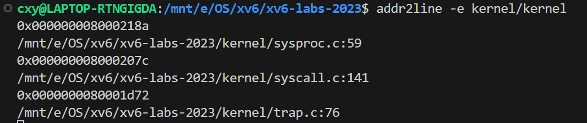

## RISC-V assembly

### 实验目的

了解一些 RISC-V 汇编很重要。在 xv6 repo 中有一个文件 user/call.c。make fs.img 会对其进行编译，并生成 user/call.asm 中程序的可读汇编版本。

### 实验步骤

`call.c`的C语言代码如下：

```C
#include "kernel/param.h"
#include "kernel/types.h"
#include "kernel/stat.h"
#include "user/user.h"

int g(int x) {
  return x+3;
}

int f(int x) {
  return g(x);
}

void main(void) {
  printf("%d %d\n", f(8)+1, 13);
  exit(0);
}
```

运行`make fs.img`，然后阅读`call.asm`中的汇编代码。

### 回答问题

1. **Which registers contain arguments to functions? For example, which register holds 13 in main's call to `printf`?**

   ```assembly
   printf("%d %d\n", f(8)+1, 13);
     24:	4635                	li	a2,13
     26:	45b1                	li	a1,12
     28:	00000517          	auipc	a0,0x0
     2c:	7b850513          	addi	a0,a0,1976 # 7e0 <malloc+0xe6>
     30:	00000097          	auipc	ra,0x0
     34:	612080e7          	jalr	1554(ra) # 642 <printf>
   ```

   在 RISC-V 架构中，**`a0` 到 `a7` 寄存器**用于传递函数的前八个参数。

   > 如果函数的参数超过了8个（即超过了寄存器 `a0` 到 `a7` 的容量），多余的参数会被存储在栈上，由被调用函数从栈中读取这些参数。

   在上面的代码片段中：

   - `li a2, 13`：将 `13` 加载到 `a2` 寄存器中。

   因此，在 `main` 函数调用 `printf` 时，**`13` 被存放在 `a2` 寄存器中**，并作为第三个参数传递给 `printf` 函数。

2. **Where is the call to function `f` in the assembly code for main? Where is the call to `g`? (Hint: the compiler may inline functions.)**

   这是`f` 函数内本该调用 `g` 函数的地方：

   ```assembly
   000000000000000e <f>:
   
   int f(int x) {
      e:	1141                	addi	sp,sp,-16
     10:	e422                	sd	s0,8(sp)
     12:	0800                	addi	s0,sp,16
     return g(x);
   }
     14:	250d                	addiw	a0,a0,3
     16:	6422                	ld	s0,8(sp)
     18:	0141                	addi	sp,sp,16
     1a:	8082                	ret
   ```

   这是本该调用`f` 的地方：

   ```assembly
   printf("%d %d\n", f(8)+1, 13);
     24:	4635                	li	a2,13
     26:	45b1                	li	a1,12
     28:	00000517          	auipc	a0,0x0
     2c:	7b850513          	addi	a0,a0,1976 # 7e0 <malloc+0xe6>
     30:	00000097          	auipc	ra,0x0
     34:	612080e7          	jalr	1554(ra) # 642 <printf>
   ```

   然而看起来`int f(int x)`内部**并没有调用函数`g(x)`**，而是直接 `addi a0, a0, 3`，给`a0`加三了（也就是`g`的等效操作）；`f(8)+1`**也并没有调用`f`**，而是直接把结果12（12=8+3+1）写到了`a1`里。

   `f` 函数和 `g` 函数的调用都没有明确地显示出来，这是因为编译器将这些函数进行了**内联优化**，这两个函数的逻辑都直接内联到了主函数 `main` 中，没有显示的函数调用指令。

3. **At what address is the function `printf` located?**

   ```assembly
   void
   printf(const char *fmt, ...)
   {
    642:	711d                	addi	sp,sp,-96
    644:	ec06                	sd	ra,24(sp)
    646:	e822                	sd	s0,16(sp)
    648:	1000                	addi	s0,sp,32
    64a:	e40c                	sd	a1,8(s0)
    64c:	e810                	sd	a2,16(s0)
   ```

   `printf` 函数的地址位于 `0x642`。

4. **What value is in the register `ra` just after the `jalr` to `printf` in `main`?**

   ```assembly
     34:	612080e7          	jalr	1554(ra) # 642 <printf>
     exit(0);
     38:	4501                	li	a0,0
   ```

   不知道`jalr`是什么。翻RISC-V手册：

   https://github.com/riscv/riscv-isa-manual/releases/download/Ratified-IMAFDQC/riscv-spec-20191213.pdf      

   第39页：

   

   执行完`jalr`后，`ra`的值变为pc+4，也就是0x38。

5. **Run the following code.**

	```
	unsigned int i = 0x00646c72;
	printf("H%x Wo%s", 57616, &i);      
	```
	
	**What is the output? [Here's an ASCII table](https://www.asciitable.com/) that maps bytes to characters.**
	
	**The output depends on that fact that the RISC-V is little-endian. If the RISC-V were instead big-endian what would you set `i` to in order to yield the same output? Would you need to change `57616` to a different value?**
	
	输出为 `He110 World`。
	
	`%x`表示以16进制打印，`57616` （10进制）转换为 16 进制为 `e110`，`H%x`打印出`He110`。
	
	在ascii码表中，`72 6c 64` 分别对应字母 `'r'`、`'l'`、`'d'`。
	
	小端与大端的区别：
	
	​	 `0x00646c72` 在小端系统中按顺序存储为`72 6c 64 00`，而在大端系统中按顺序存储为 `00 64 6c 72`。
	
	因此，**小端模式下，打印的 ASCII 字符为 `rld`**，后面是字符串尾`\0`；**大端模式理论上打不出这三个字符**，因为`00`一上来就认为是字符串尾了。
	
	要让大端打印也打印`rld`，把`i`的值改成 `0x726c6400`即可。
	
6. **In the following code, what is going to be printed after `'y='`? (note: the answer is not a specific value.) Why does this happen?**

   `printf("x=%d y=%d", 3);` 

   输出内容的 `'y='`后方应该是`a2`寄存器按`int`型来打印的值。由于`prinf` 少传递了一个参数，`a2`中的值应该是无效的，所以不同的时候输出可能会不同。

### 实验心得

通过本实验了解了一些RISC-V汇编的知识。我没有系统地学习过RISC-V汇编，但是在本实验中对照着C语言的源代码来查看汇编代码，还是能够猜测出一部分意思，在一定程度上消除了我对于汇编的陌生感和恐惧感。


## Backtrace

### 实验目的

实现一个回溯（`backtrace`）功能，用于在操作系统内核发生错误时，输出调用堆栈上的函数调用列表。这有助于调试和定位错误发生的位置。

### 实验步骤

在 `xv6` 中实现 `backtrace()` 函数，步骤如下：

1. **访问帧指针**：
   
   - 根据实验指导的要求，在 `kernel/riscv.h` 中添加如下的一个 `r_fp()` 函数，使用内联汇编获取当前的帧指针（`s0`寄存器）。
   
     ```c
     static inline uint64 r_fp() {
       uint64 x;
       asm volatile("mv %0, s0" : "=r" (x) );
       return x;
     }
     ```
   
2. **实现 `backtrace()`**：
   
   - 在 `kernel/defs.h` 中添加 `backtrace` 函数的声明。
     ```c
        void            printf(char*, ...);
        void            panic(char*) __attribute__((noreturn));
        void            printfinit(void);
        void            backtrace(void); // newly add in lab 4.2
	- 在 `kernel/printf.c`中实现 `backtrace()`:
	
     ```c
     void backtrace(void)
     {
       printf("backtrace:\n");
       uint64 fp = r_fp();
       uint64 this_page = PGROUNDDOWN(fp);   // 页边界
       while (PGROUNDDOWN(fp) == this_page)  // 判断是否超出了页边界
       {
         uint64 ra = *(uint64 *)(fp - 8);    // 获取返回地址
         printf("%p\n", ra);
         fp = *(uint64 *)(fp - 16);          // 获取前一个帧指针
       }
     }
     ```
   
     - 使用 `r_fp()` 获取当前的帧指针
   
     - 实验指导中给出了返回地址和前一个帧指针的`offset`（`-8`和`-16`）。我们利用已知的offset来获取并打印返回地址`ra`，然后前往前一个帧指针来遍历栈，逐步回溯栈中的调用链。
   
     - 什么时候停下来？实验指导给了这样一个提示：
   
       > A useful fact is that the memory allocated for each kernel stack consists of a single page-aligned page, so that all the stack frames for a given stack are on the same page. You can use `PGROUNDDOWN(fp)` (see `kernel/riscv.h`) to identify the page that a frame pointer refers to.
   
       所以我先设置一个`uint64 this_page = PGROUNDDOWN(fp);`来记录当前页的边界，之后`PGROUNDDOWN(fp) == this_page`每次循环都检查当前的`fp`地址是否还在同一个页上，这样就能在抵达栈底后停止，避免无限循环。
   
4. **在 `sys_sleep` 中调用 `backtrace()`**：
   
   - 将 `backtrace()` 函数的调用添加到 `sys_sleep` 函数中，以便在运行 `bttest` 时触发回溯。
   
   - ```C
     int sys_sleep(void) {
         backtrace();  // 添加调用以生成回溯
         ...
     ```
   
5. **调试**：
   
   - 运行 `bttest` 并记录输出的地址，然后使用 `addr2line` 工具将地址转换为源代码中的行号，验证 `backtrace()` 的正确性。
   
     
   
     
   
     能够看到调用栈的代码行号。

### 实验中遇到的问题和解决方法

1. **什么时候停止：** 

   `backtrace`需要遍历整个调用堆栈，并在栈底停止。怎么判断循环是否应该停止了呢？实验指导说，**同一个栈的栈帧都在同一页上**，所以很显然，**帧指针`fp`走出了当前页就停止了**。

   我一开始是使用`PGROUNDDOWN()`来判断**下一个`fp`是否和上一次的`ra`在同一页上**，代码是这样写的：

   ```C
   if (PGROUNDDOWN(fp) != PGROUNDDOWN(ra))
       break;
   ```

   然后就发现，这个循环的`break`好像来得有些意外的早，循环体跑了一次就直接`break`了，不能完整地输出调用堆栈信息。这个错误是我没有理解`ra`这个地址导致的。`ra`是函数的返回地址，它是在函数被调用处附近，而不是在栈帧中，两个位置差得远了，判断`fp`和`ra`两个地址是否在同一页没有任何意义！

   解决办法是先设置一个`uint64 this_page = PGROUNDDOWN(fp);`，**在最开始记录当前页的边界**，之后`PGROUNDDOWN(fp) == this_page`**每次循环都检查当前的`fp`地址是否还在同一个页上**。这样才能正确地判断栈底，终止循环。

2. **改哪里的代码：** 

   没有注意路径名，错误地把`void backtrace(void)`的定义写在了`user/printf.c`里面，编译都没有通过。实际上应该放在`kernel/printf.c`里的。这很合理，因为查看栈帧信息是内核才能做的事情。

   > 但是为什么编译会报错呢？似乎该引用的头文件都引了，在编译时应该是能够找到相应的函数的。这个问题我还没想懂。我猜测可能和makefile里面的某些设置有关？

### 实验心得

实现了 `backtrace` 函数，其本质是遍历调用栈帧的信息并依次打印返回地址。这让我学习了调用堆栈和帧指针的概念，对于函数调用和返回的机制有了更深的了解。尤其是由于偶然出现的问题1，让我对返回地址`ra`有了更深刻的体会。

`gdb`就有`backtrace`功能。本质应当差不多，都是通过栈这种后进先出的数据结构来记录函数调用的先后信息。当一个函数被调用时，其返回地址和局部变量等信息被压入堆栈；函数执行完毕后，这些信息从堆栈弹出，恢复执行到调用函数的下一条指令。

