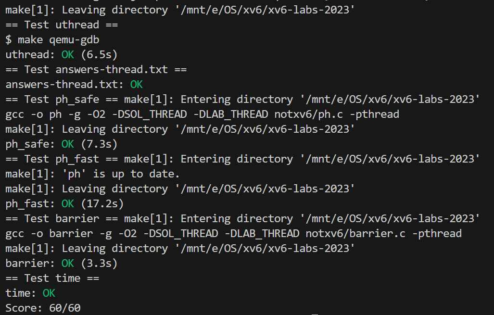

# Lab 6 Multithreading

## 6.1 Uthread: switching between threads

### 实验目的

设计并实现一个用户级线程系统的上下文切换机制。补充完成一个用户级线程的创建和切换上下文的代码。需要创建线程、保存/恢复寄存器以在线程之间切换，并且确保解决方案通过测试。

### 实验步骤

1. 在`user/uthread.c`定义一个结构体，保存寄存器内容，充当线程切换的上下文：

```c
struct uthread_context
{
  uint64 ra;
  uint64 sp;

  // callee-saved
  uint64 s0;
  uint64 s1;
     ... 
  uint64 s10;
  uint64 s11;
};
```

2. 每个线程都需要保存这样一个结构体，所以把`uthread_context`作为一个成员加入到`thread`结构体中。这个`thread`结构体应该就是线程控制块了。

```c
struct thread {
  char       stack[STACK_SIZE]; 
  int        state;          
  struct     uthread_context context; 
};
```

3. 创建线程时，`ra`指向线程处理的函数，`sp`指向栈空间的高地址。

```c
void 
thread_create(void (*func)())
{
  struct thread *t;

  for (t = all_thread; t < all_thread + MAX_THREAD; t++) {
    if (t->state == FREE) break;
  }
  t->state = RUNNABLE;
  // YOUR CODE HERE
  t->context.ra = (uint64)func;
  t->context.sp = (uint64)&t->stack[STACK_SIZE - 1];
}
```

3. 在`uthread_switch.S`中实现切换线程上下文的`thread_switch`函数：

 ```assembly
   thread_switch:
   	/* YOUR CODE HERE */
   	sd ra, 0(a0)
       sd sp, 8(a0)
       sd s0, 16(a0)
       sd s1, 24(a0)
       sd s2, 32(a0)
       sd s3, 40(a0)
       sd s4, 48(a0)
       sd s5, 56(a0)
       sd s6, 64(a0)
       sd s7, 72(a0)
       sd s8, 80(a0)
       sd s9, 88(a0)
       sd s10, 96(a0)
       sd s11, 104(a0)
   
       ld ra, 0(a1)
       ld sp, 8(a1)
       ld s0, 16(a1)
       ld s1, 24(a1)
       ld s2, 32(a1)
       ld s3, 40(a1)
       ld s4, 48(a1)
       ld s5, 56(a1)
       ld s6, 64(a1)
       ld s7, 72(a1)
       ld s8, 80(a1)
       ld s9, 88(a1)
       ld s10, 96(a1)
       ld s11, 104(a1)
   	ret    /* return to ra */
 ```

4. 使用`thread_switch`函数：

   ```c
   /* YOUR CODE HERE
        * Invoke thread_switch to switch from t to next_thread:
        * thread_switch(??, ??);
        */
       thread_switch((uint64)&t->context, (uint64)&next_thread->context);
   ```

### 实验中遇到的问题和解决方法

1. **怎样从指定的函数开始运行？** 

   寄存器 `ra` 是返回地址寄存器（Return Address Register），它存储了函数调用后的返回地址。线程的切换由`thread_switch`这个函数完成，这个函数返回过后，就是从`ra`地址开始运行的。所以线程创建时，应当把函数的地址写进寄存器 `ra`，来让线程运行指定的函数。 

2. **`sp`指向哪里？** 

   每个线程拥有一个独立的的栈空间`char stack[STACK_SIZE]`，栈空间是从高往低生长的，也就是说 `stack pointer` 应该指向这个栈内存空间的高地址。而另一方面， C 语言的一个数组的空间是从低地址向高地址分配的，所以此`sp`应当赋值为`(uint64)&t->stack[STACK_SIZE - 1];`才是栈空间的高地址。

### 实验心得

这个实验让我更深入地理解了用户线程的概念，以及线程上下文切换的实现。

## 6.2 Using threads

### 实验目的

本实验旨在通过使用线程和锁实现并行编程，以及在多线程环境下处理哈希表。学习如何使用线程库创建和管理线程，以及如何通过加锁来实现一个线程安全的哈希表，使用锁来保护共享资源，以确保多线程环境下的正确性和性能。

### 实验步骤

1. 若不做更改，尝试直接运行，单线程`./ph 1`：

   ```
   100000 puts, 3.991 seconds, 25056 puts/second
   0: 0 keys missing
   100000 gets, 3.981 seconds, 25118 gets/second
   ```

   多线程`./ph 2`：

   ```
   100000 puts, 1.885 seconds, 53044 puts/second
   1: 16579 keys missing
   0: 16579 keys missing
   200000 gets, 4.322 seconds, 46274 gets/second
   ```

   可以注意到，双线程的情况发生了键值的丢失。

2. 修改代码，加锁保护：

   ```c
   
   +pthread_mutex_t lock[NBUCKET];
    
    double
    now()
   @@ -47,6 +48,8 @@ void put(int key, int value)
        if (e->key == key)
          break;
      }
   +
   +  pthread_mutex_lock(&lock[i]);
      if(e){
        // update the existing key.
        e->value = value;
   @@ -54,6 +57,7 @@ void put(int key, int value)
        // the new is new.
        insert(key, value, &table[i], table[i]);
      }
   +  pthread_mutex_unlock(&lock[i]);
    
    }
    
   @@ -118,6 +122,9 @@ main(int argc, char *argv[])
        keys[i] = random();
      }
    
   +  for (int i = 0; i < NBUCKET; ++i)
   +    pthread_mutex_init(&lock[i], NULL);
   +
      //
      // first the puts
      //
   @@ -130,6 +137,9 @@ main(int argc, char *argv[])
      }
      t1 = now();
    
   +  for (int i = 0; i < NBUCKET; ++i)
   +    pthread_mutex_destroy(&lock[i]);
   +
      printf("%d puts, %.3f seconds, %.0f puts/second\n",
             NKEYS, t1 - t0, NKEYS / (t1 - t0));
   
   ```

   

### 实验中遇到的问题和解决方法

1. **为什么不加锁的时候会丢失数据？**：

   分析两个线程的情况，这是一个会导致数据丢失的例子：

   1. **线程A开始插入一个键（假设是键X）**：
      - 线程A检查哈希表，以找到适合插入键X的桶。
      - 线程A发现该桶是空的，或者尚未包含键X。
   2. **线程B开始插入相同或不同的键（假设是键Y）**：
      - 在线程A尚未完成插入键X之前，线程B开始自己的操作。
      - 线程B检查同一个或者不同的桶。
   3. **线程A被抢占**：
      - 就在线程A决定插入键X但尚未实际执行插入之前，线程A被抢占（即，操作系统暂时停止线程A的运行）。
   4. **线程B插入其键**：
      - 线程B继续执行，并成功地将键Y插入到哈希表中。
   5. **线程A恢复并尝试插入键X**：
      - 线程A从停止的地方恢复，并尝试插入键X。
      - 由于竞争条件的存在，哈希表的状态可能已经发生了变化，导致线程A之前执行的检查结果已经过时。例如，如果线程A和线程B试图向同一个桶中插入键，线程A可能会无意中覆盖线程B的插入。

2. **怎样让多线程的哈希表更快？** 

   一开始我使用单个互斥锁来保护所有的put，这能够通过`ph_safe`测试，但是`ph_fast`得到了一个大大的fail。这是因为所有线程的所有写入都互斥，也就没有并行了，并不会达成比单线程显著更快的加速效果。

   正确的做法是给每个哈希桶配一个单独的锁，这样单个桶里的竞争能够消除，而同时插入到不同的桶不受影响。

### 实验心得

本实验不是xv6内完成的，而是真的在我的ubuntu 22.04上使用进行了多线程编程。在这个实验中我初步学习并实践了 POSIX 线程库的相关用法，了解了多线程的竞争问题，并且对于锁的粒度带来的性能影响有了直观的感受。简单来说，粗粒度锁实现简单、容易保证代码的安全性和数据的正确性，但是并发程度受到限制，很可能不能充分地加速；细粒度锁在实现上稍复杂，但是能够提高并发性，达到更优的性能。

## 6.3 Barrier

### 实验目的

本实验旨在通过实现一个线程屏障（barrier），即每个线程都要在 barrier 处等待，直到所有线程到达 barrier 之后才能继续运行，加深对多线程编程中同步和互斥机制的理解。在多线程应用中，线程屏障可以用来确保多个线程在达到某一点后都等待，直到所有其他参与的线程也达到该点。

### 实验步骤

1. 了解`pthread_cond_wait`和`pthread_cond_broadcast`:

   - `pthread_cond_wait` 用于使线程等待一个条件变量（`pthread_cond_t`）。调用该函数的线程会进入阻塞状态，直到收到其他线程发出的信号。

   - `pthread_cond_broadcast` 用于向等待同一条件变量的所有线程发出信号。它会唤醒所有处于等待状态的线程，使它们从 `pthread_cond_wait` 中返回。

2. 实现`barrier()`函数：

```c
static void 
barrier()
{
  pthread_mutex_lock(&bstate.barrier_mutex); // 锁定互斥锁，保护共享资源

  // 增加已到达此轮次的线程数
  bstate.nthread++;

  // 如果未达到所有线程数，则等待
  if (bstate.nthread < nthread) {
      pthread_cond_wait(&bstate.barrier_cond, &bstate.barrier_mutex); // 在条件变量上等待，释放互斥锁
  }

  // 如果所有线程都已到达屏障，则增加轮次计数并重置线程计数器
  if (bstate.nthread == nthread) {
      bstate.round++; // 增加轮次计数器
      bstate.nthread = 0; // 重置已到达的线程数
      pthread_cond_broadcast(&bstate.barrier_cond); // 唤醒所有等待线程
  }

  pthread_mutex_unlock(&bstate.barrier_mutex); // 释放互斥锁
}

```

**锁定互斥锁**：函数一开始锁定了一个互斥锁 `bstate.barrier_mutex`。这一步是为了保护接下来的共享变量（如 `bstate.nthread` 和 `bstate.round`），防止多个线程同时访问和修改它们，避免数据竞争。

**增加已到达的线程数**：每当一个线程调用 `barrier` 函数，它都会将 `bstate.nthread` 变量加1，表示该线程已经到达了屏障。

**等待其他线程**：如果当前到达屏障的线程数 `bstate.nthread` 小于总线程数 `nthread`，表示还有其他线程没有到达屏障。此时，线程会在 `bstate.barrier_cond` 条件变量上等待，并释放互斥锁。这一步确保了该线程会一直阻塞，直到所有线程都到达屏障。

**所有线程都到达屏障时**：当 `bstate.nthread` 等于 `nthread`，即所有线程都到达屏障时：

- **增加轮次计数器**：表示当前轮次的线程同步已经完成。
- **重置线程计数器**：将 `bstate.nthread` 重置为0，以便下一轮使用。
- **唤醒所有等待线程**：通过 `pthread_cond_broadcast` 函数，通知所有在条件变量 `bstate.barrier_cond` 上等待的线程可以继续执行。

**释放互斥锁**：最后，函数解锁互斥锁，允许其他线程进入临界区，修改共享资源。

### 实验心得

本实验实现的`barrier`是多线程的一种同步方式，能够让多个线程互相瞭望别人的进度，保持步调一致。通过本实验学习了`pthread_cond_wait`和`pthread_cond_broadcast`的作用和用法，加深了我对于多线程同步的理解。


`make grade`：


