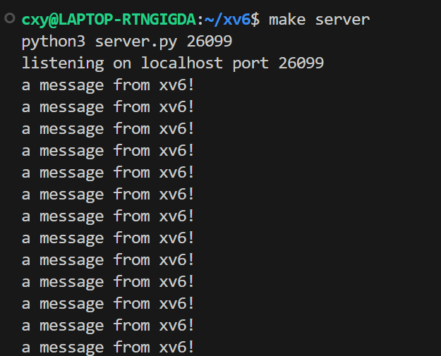
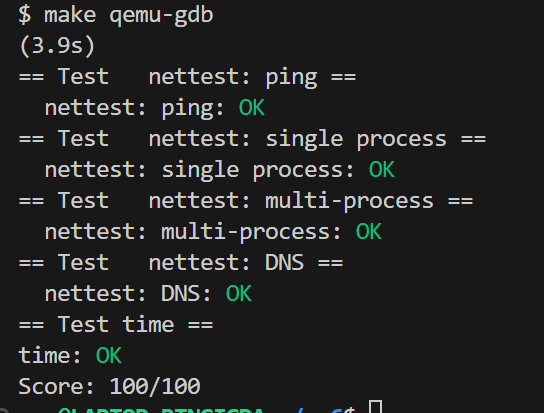

# Lab 7 networking

编写一个在xv6操作系统中用于网络接口卡（network interface card, NIC）的设备驱动程序。

### 实验目的
为 xv6 操作系统编写一个网络接口卡 (NIC) 的设备驱动程序。实验使用了 E1000 网络设备，该设备用于处理网络通信。在实验环境中，E1000 由 qemu 提供仿真，并通过 emulated LAN 实现与主机的通信。xv6 的 IP 地址为 10.0.2.15，主机的 IP 地址为 10.0.2.2。

### 实现步骤

E1000 驱动程序通过 DMA 技术从 RAM 中读取要传输的数据包，并将接收到的数据包写入 RAM。E1000 使用一个称为“接收环”或“接收队列”的环形结构来存储描述符，每个描述符包含一个内存地址，E1000 将接收到的数据包写入该地址。

在 `kernel/e1000.c` 中，需要完成 `e1000_transmit()` 和 `e1000_recv()` 函数，使驱动程序能够传输和接收数据包。

1. **e1000_transmit()**

   当network stackk需要发送一个packet的时候，会先将这个packet存放到**发送环形缓冲区tx_ring**，最后通过网卡将**这个**packet发送出去。

   - **获取Ring位置：** 获取锁并通过获取发送环的下一个可用位置（`tdt`）来确定将要使用的描述符在发送环中的位置。

   - **检查描述符状态：** 读取该位置的描述符（`send_desc`），检查该描述符的状态。如果描述符的状态不满足`E1000_TXD_STAT_DD`（表示描述符空闲，上一个传输已完成），则说明上一个传输还在进行中，所以释放锁并返回-1，表示传输失败。

   - **释放旧缓冲区：** 如果该位置的缓冲区`tx_mbufs[index]`不为空，则释放旧的缓冲区，这是为了确保资源被正确释放。

   - **设置描述符和缓冲区：** 将待发送的mbuf（数据包）指针存储在`tx_mbufs`数组中，然后将其地址（`head`）存储在对应描述符的`addr`字段中。描述符的`length`字段设置为mbuf的长度（`len`），`cmd`字段设置为`E1000_TXD_CMD_RS | E1000_TXD_CMD_EOP`，这表示将发送该数据包，并在发送完成后产生中断。

   - **更新Ring位置：** 更新`tdt`以指向下一个描述符，然后将更新后的`tdt`写回E1000的`E1000_TDT`寄存器中，这表示已经准备好发送这个数据包了。

   - **同步操作：** 最后，使用`__sync_synchronize()`确保所有前面的操作对其他线程可见，然后释放锁。

   ```C
   int
   e1000_transmit(struct mbuf *m)
   {
     // 获取 ring position
     acquire(&e1000_lock);
     /*由于要对共享的资源（传输环形缓冲区）进行操作，这里使用锁 `e1000_lock` 来确保操作的原子性。*/
   
       
      /*regs[E1000_TDT] 是 E1000 的传输描述符尾部指针寄存器，它指向下一个可以使用的传输描述符位置。index 计算出在环形缓冲区中的实际索引，send_desc 是当前要使用的传输描述符。*/
     uint64 tdt = regs[E1000_TDT];
     uint64 index = tdt % TX_RING_SIZE;
     struct tx_desc send_desc = tx_ring[index];
      /*send_desc.status 包含了描述符的状态位，其中 E1000_TXD_STAT_DD 表示传输已完成。如果描述符尚未完成（即，仍在使用中），函数将返回 -1，表示传输队列满。*/
     if(!(send_desc.status & E1000_TXD_STAT_DD)) {
       release(&e1000_lock);
       return -1;
     }
   
     if(tx_mbufs[index] != 0){
       // 如果当前环形缓冲区位置有一个旧的 mbuf，则先释放它的内存。
       mbuffree(tx_mbufs[index]);
     }
   
     tx_mbufs[index] = m; // 将新的 mbuf 放入环形缓冲区中对应的位置。
     tx_ring[index].addr = (uint64)tx_mbufs[index]->head;// 设置要传输的数据的内存地址。
     tx_ring[index].length = (uint16)tx_mbufs[index]->len;// 设置数据包的长度。
     tx_ring[index].cmd = E1000_TXD_CMD_RS | E1000_TXD_CMD_EOP;// 设置传输命令，其中 E1000_TXD_CMD_RS 表示发送完成后更新状态，E1000_TXD_CMD_EOP 表示这是数据包的最后一部分。
     tx_ring[index].status = 0;// 除状态位，以表明描述符已被更新，准备好发送。
   
      // TDT 寄存器更新为下一个传输描述符的位置，__sync_synchronize() 用于确保所有的内存操作在这个点之前完成。
     tdt = (tdt + 1) % TX_RING_SIZE;
     regs[E1000_TDT] = tdt;
     __sync_synchronize();
   
     release(&e1000_lock);
       // 操作完成后释放锁，并返回 0 表示传输已成功排入队列。
     return 0;
   }
   ```

2. **e1000_recv()**

   当网卡需要接收packet的时候，网卡会直接访问内存（DMA），先将接受到的RAM的数据（即packet的内容）写入到**接收环形缓冲区rx_ring**中。接着，网卡会向cpu发出一个*硬件中断*，当cpu接受到硬件中断后，cpu就可以从**接收环形缓冲区rx_ring**中读取packet传递到network stack中了（`net_rx()`）。

   - **获取Ring位置：** 获取接收环的下一个可用位置（`rdt`），确定将要处理的描述符在接收环中的位置。

   - **检查描述符状态：** 通过检查该位置的描述符的状态（`rx_ring[index].status`）来确定是否有新的数据包到达。

   - **循环处理数据包：** 进入一个循环，该循环用于处理在同一个位置上可能有多个到达的数据包。

     -  使用`mbufput`函数更新mbuf的长度，以告知数据包的实际长度。

     - 通过`rx_mbufs`数组中的数据，将当前位置的mbuf传递给`net_rx`函数，从而将数据包交给网络协议栈进行进一步处理。

     - 分配一个新的mbuf并写入描述符，将描述符的状态清零（设置为0），表示描述符可以重新使用以处理下一个数据包。

     - 更新`rdt`为当前处理过的位置，然后将其写回E1000的`E1000_RDT`寄存器中，即已经处理完这个数据包。

     - 最后，使用`__sync_synchronize()`确保所有的操作对其他线程可见。

   - **接收完成：** 函数的执行在循环中进行，直到所有到达的数据包都被处理完。

     ```C
     static void
     e1000_recv(void)
     {
       //
       // Your code here.
       //
       // Check for packets that have arrived from the e1000
       // Create and deliver an mbuf for each packet (using net_rx()).
       //
       // 获取接收 packet 的位置
       uint64 rdt = regs[E1000_RDT];
       uint64 index = (rdt + 1) % RX_RING_SIZE;
     
       if(!(rx_ring[index].status & E1000_RXD_STAT_DD)){
         // 查看新的 packet 是否有 E1000_RXD_STAT_DD 标志，如果没有，则直接返回
         return;
       }
       while(rx_ring[index].status & E1000_RXD_STAT_DD){
         // 使用 mbufput 更新长度并将其交给 net_rx() 处理
         struct mbuf* buf = rx_mbufs[index];
         mbufput(buf, rx_ring[index].length);
     
         // 分配新的 mbuf 并将其写入到描述符中并将状态码设置成 0
         rx_mbufs[index] = mbufalloc(0);
         rx_ring[index].addr = (uint64)rx_mbufs[index]->head;
         rx_ring[index].status = 0;
         rdt = index;
         regs[E1000_RDT] = rdt;
         __sync_synchronize();
     
         // 将数据包传递给net_rx()处理
         net_rx(buf);
     
         // 更新index，继续处理下一个接收到的数据包
         index = (regs[E1000_RDT] + 1) % RX_RING_SIZE;
       }
     }
     
     ```

运行`nettests`:


`make server`能够收到来自xv6的消息:



### 实验中遇到的问题和解决方法

**为什么发送需要锁来保护，而接收不需要？**

对于一个网卡而言，可能有多进程/多线程同时需要发送的情况，它们可能访问同一个`mbuf`，导致竞争出错；而接收是由硬件完成的，直接将接收的数据写入内存的特定位置，然后发出中断，不需要考虑多个线程竞争同一个接收缓冲区的情形。

### 实验心得

通过编写 E1000 网络驱动程序，了解了 DMA 技术以及网络设备驱动程序的工作原理，体会到了读手册、查资料、编写驱动程序的流程。

make grade：


