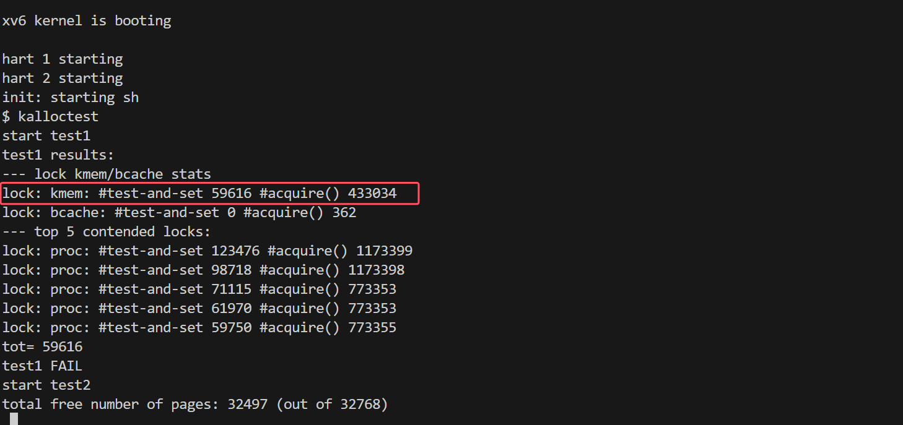
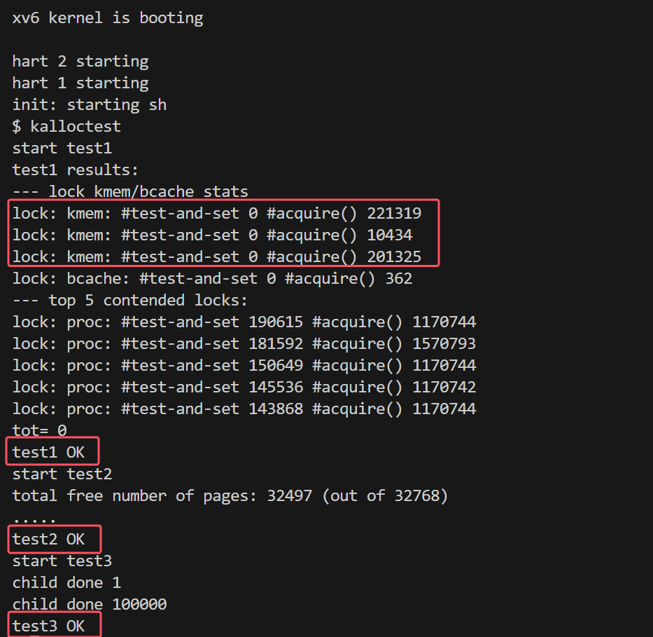

# Lab 8 locks

在多核机器上，锁竞争（lock contention）是并行性不足的常见症状。在 xv6 的内存分配器中，内存分配和释放函数 `kalloc()` 和 `kfree()` 使用了全局的 `kmem.lock` 锁，导致多个核心上的线程在执行这些函数时产生较大的锁竞争。


## 8.1 Memory allocator

### 实验目的

本实验的目标是通过重新设计内存分配器以减少锁竞争。你需要实现每个 CPU 的独立空闲链表，每个链表有自己独立的锁。这样，不同 CPU 可以并行地分配和释放内存，因为它们操作不同的链表。

当一个 CPU 的空闲链表为空时，允许它从其他 CPU 的空闲链表中“偷”一部分内存。这种“偷取”操作可能会引入一些锁竞争，但希望这种情况很少发生。

### 实现步骤

未改动时：



#### 1. 定义`kmem[NCPU]` 

```C
struct {
  struct spinlock lock;
  struct run *freelist;
} kmem[NCPU]; // 每个CPU有自己的空闲内存链表和锁
```

#### 2. 在`kinit()`中初始化锁

```C
void
kinit()
{
  for (int i = 0; i < NCPU; i++)
    initlock(&kmem[i].lock, "kmem"); // 初始化所有锁
  freerange(end, (void*)PHYSTOP);
}
```

#### 3. 根据CPU_id来处理`kfree()`

根据实验指导，获取`cpuid`必须关中断。取得id后即可获取相应的锁、操作相应的空闲链表。

```C
void
kfree(void *pa)
{
  struct run *r;

  if(((uint64)pa % PGSIZE) != 0 || (char*)pa < end || (uint64)pa >= PHYSTOP)
    panic("kfree");

  // Fill with junk to catch dangling refs.
  memset(pa, 1, PGSIZE);

  r = (struct run*)pa;

  // 必须关闭中断才能获取 CPU ID
  push_off();
  int cpu = cpuid();
  pop_off();

  // 根据 CPU ID 获取相应的锁、操作相应的空闲链表
  acquire(&kmem[cpu].lock);
  r->next = kmem[cpu].freelist;
  kmem[cpu].freelist = r;
  release(&kmem[cpu].lock);
}
```

#### 4.修改`kalloc`、实现从别的CPU拿取内存的功能

有空闲页则直接分配；没有空闲页则检查别的CPU的`freelist`。注意相应的锁的获取和释放。

```C
void *
kalloc(void)
{
  struct run *r;

  // 必须关闭中断才能获取 CPU ID
  push_off();
  int cpu = cpuid();
  pop_off();

  acquire(&kmem[cpu].lock);
  r = kmem[cpu].freelist;
  if (r)                            // 有空闲页直接用
  {
    kmem[cpu].freelist = r->next;
    release(&kmem[cpu].lock);
  }
  else                              // 没空闲页，从别的CPU那里拿来
  {
    release(&kmem[cpu].lock);
    for (int new_cpu = 0; new_cpu < NCPU; ++new_cpu)  // 遍历别的CPU
    {
      if (new_cpu == cpu) // 排除自身
        continue;
      acquire(&kmem[new_cpu].lock);
      r = kmem[new_cpu].freelist;
      if (r) // 找到空闲页
      {
        kmem[new_cpu].freelist = r->next;
        release(&kmem[new_cpu].lock);
        break;
      }
      release(&kmem[new_cpu].lock);
    }
  }

  if(r)
    memset((char*)r, 5, PGSIZE); // fill with junk
  return (void*)r;
}

```

验证结果，锁的争用现象得到缓解，能够通过`kalloctest`：



### 实验中遇到的问题和解决方法

**在 if/else 分支中处理锁**：申请锁后，不可以只在部分分支的代码中释放锁。需要确保运行到任何一个分支，获取锁和释放锁的逻辑都能顺利完成。

**死锁**：初次测试时，我把`release(&kmem[cpu].lock);`写在代码更下方的位置，`test3`跑了两分多钟都没有动静，发生了死锁。后来我把`release(&kmem[cpu].lock);`提前，避免这段程序在持有`kmem[cpu].lock`的同时还去申请`kmem[new_cpu].lock`，能够防止死锁的发生。

### 实验心得

锁可以保护数据的安全访问，但另一方面锁的争用问题也在限制性能。在多核的计算机中，对锁机制进行合理的改良，能够提高并行性，从而提升性能。

本实验偷取（stealing）别的CPU的`freelist`的想法很有意思，解决了把`kmem`分成多个锁、`freelist`分到各个CPU后，单个CPU内存不足的情形。


## 8.2 Buffer cache

### 实验目的

在 xv6 中，文件系统的缓存块（block cache）是通过 `bcache.lock` 锁来保护的。当多个进程密集使用文件系统时，这个锁会引发严重的锁竞争。为了减少锁竞争，实验要求重新设计缓存块的锁机制。

通过为缓存块实现一个基于哈希表的锁机制，减少对全局 `bcache.lock` 的依赖，减少锁竞争。你将为哈希表中的每个桶（bucket）分配一个独立的锁，避免不同块的并发访问产生冲突。

### 实现步骤

未改动时：


#### 1. 定义哈希表

哈希表使用13个桶来管理缓冲区，每个桶对应一个锁，以及一个双向循环链表头节点，用于存储该桶中的缓冲区。这样的设计允许对不同桶中的缓冲区并行访问，从而减少锁竞争。

```C
#define NBUCKETS 13
#define hash(num) num % NBUCKETS
struct
{
  struct spinlock bucket_lock[NBUCKETS];
  struct buf buf[NBUF];
  struct buf bucket_head[NBUCKETS];
} bcache;
```

哈希函数足够简单，直接写成宏定义了。


#### 2. 在`binit()`中初始化

在初始化函数`binit()`中，为每个桶的锁进行初始化，并设置每个桶的头结点，以形成空的循环链表。此外，将所有缓冲区根据其块号分配到相应的桶中。

```C
void
binit(void)
{
  struct buf *b;

  for (int i = 0; i < NBUCKETS; i++){
    initlock(&bcache.bucket_lock[i], "bcache"); 
  }

  // Create linked list of buffers
  for (int i = 0; i < NBUCKETS; i++){
    bcache.bucket_head[i].prev = &bcache.bucket_head[i]; // 初始化空循环链表
    bcache.bucket_head[i].next = &bcache.bucket_head[i];
  }

  for(b = bcache.buf; b < bcache.buf+NBUF; b++){
    b->next = bcache.bucket_head[hash(b->blockno)].next; // 根据blockno，把buffer放入不同的桶中
    b->prev = &bcache.bucket_head[hash(b->blockno)];
    initsleeplock(&b->lock, "buffer");
    bcache.bucket_head[hash(b->blockno)].next->prev = b;
    bcache.bucket_head[hash(b->blockno)].next = b;
  }
}
```

#### 3. 缓冲区的获取`bget()`

`bget()`函数用于获取或创建一个指定块号和设备的缓冲区。

首先尝试在相应的哈希桶中查找缓冲区，如果找到，增加引用计数并返回该缓冲区；如果没有找到，尝试从其他桶中回收一个未使用的缓冲区，设置该缓冲区的设备、块号、有效性、引用计数等信息，并将其移动到正确的桶中。由于是刚刚使用，将其插入到链表头。

```C
static struct buf*
bget(uint dev, uint blockno)
{
  struct buf *b;

  int id = hash(blockno);

  acquire(&bcache.bucket_lock[id]);

  // Is the block already cached?
  for (b = bcache.bucket_head[id].next; b != &bcache.bucket_head[id]; b = b->next)
  {
    if (b->dev == dev && b->blockno == blockno)
    {
      b->refcnt++;
      release(&bcache.bucket_lock[id]);
      acquiresleep(&b->lock);
      return b;
    }
  }

  // Not cached.
  // Recycle the least recently used (LRU) unused buffer.
  for (int i = (id + 1) % NBUCKETS; i != id; i = (i + 1) % NBUCKETS)
  {
    acquire(&bcache.bucket_lock[i]);
    struct buf *b;
    for (b = bcache.bucket_head[i].prev; b != &bcache.bucket_head[i]; b = b->prev)
    {
      if (b->refcnt == 0)
      {
        b->dev = dev;
        b->blockno = blockno;
        b->valid = 0;
        b->refcnt = 1;

        // Disconnect this buffer from its current position
        b->prev->next = b->next;
        b->next->prev = b->prev;

        release(&bcache.bucket_lock[i]);

        // Insert this buffer into the new bucket's chain
        b->prev = &bcache.bucket_head[id];
        b->next = bcache.bucket_head[id].next;
        b->next->prev = b;
        b->prev->next = b;
        release(&bcache.bucket_lock[id]);

        acquiresleep(&b->lock);
        return b;
      }
    }
    release(&bcache.bucket_lock[i]);
  }

  panic("bget: no buffers"); // If all buffers are in use, panic
}
```

#### 4. 缓冲区的释放

`brelse()`函数用于释放一个缓冲区。首先将缓冲区的引用计数减一。如果缓冲区的引用计数变为零，表示没有线程在等待该缓冲区，可以从链表中移除。

```C
void
brelse(struct buf *b)
{
  if(!holdingsleep(&b->lock))
    panic("brelse");

int id = hash(b->blockno);

  releasesleep(&b->lock);

  acquire(&bcache.bucket_lock[id]);
  b->refcnt--;
  if (b->refcnt == 0) {
    // no one is waiting for it.
    b->next->prev = b->prev;
    b->prev->next = b->next;
    b->next = bcache.bucket_head[id].next;
    b->prev = &bcache.bucket_head[id];
    bcache.bucket_head[id].next->prev = b;
    bcache.bucket_head[id].next = b;
  }

  release(&bcache.bucket_lock[id]);
}
```

#### 5. refcnt的增减

变化不大，获取到哈希桶id即可，带锁更改即可。

```C
void
bpin(struct buf *b) {
  int id = hash(b->blockno);
  acquire(&bcache.bucket_lock[id]);
  b->refcnt++;
  release(&bcache.bucket_lock[id]);
}

void
bunpin(struct buf *b) {
  int id = hash(b->blockno);
  acquire(&bcache.bucket_lock[id]);
  b->refcnt--;
  release(&bcache.bucket_lock[id]);
}
```


### 实验中遇到的问题和解决方法

**本实验有一个sleeplock，一个spinlock，有什么区别？**

首先是锁自身特点上的区别：睡眠锁（sleeplock）允许线程在无法获取锁时进入睡眠状态，减少了CPU的忙等，但增加了线程调度的开销；自旋锁（spinlock）是忙等待锁，会在获取锁之前一直忙等，这可能会导致CPU资源的浪费，但可以减少上下文切换的开销。前者适合于适合于锁持有时间较长或不需要频繁访问的资源，后者适合访问频繁且处理快速的情况。

### 实验心得

Buffer cache实验和之前的Memory allocator有共性。它们都是通过把单个的、保护整个数据结构的大锁，拆分成多个、保护数据结构各个部分的小锁，这样能减少争用现象。

此外，本实验还让我重新温习了双向循环链表的指针处理，以及LRU的替换机制。


make grade：


