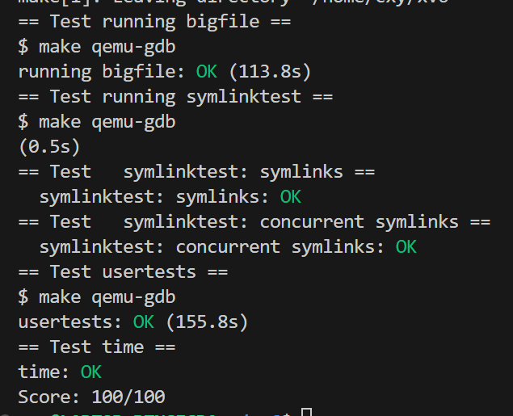

# Lab 9 File system

## 9.1 Large files

### 实验目的

当前 xv6 文件系统的限制是每个文件只能有 268 个块（12 个直接块 + 256 个单重间接块）。我们将通过添加一个“双重间接”块来扩展文件的大小，这个块可以指向 256 个单重间接块，每个单重间接块可以指向 256 个数据块，因此总共可以存储 65803 个块（256*256+256+11）。

### 实验步骤

xv6 book P95 figure 8.3：


单重间接块是一个指向其他数据块地址的块，而这些数据块实际存储了文件的数据。

- 一个单重间接块包含多个指向数据块的指针。由于每个指针可以指向一个数据块，单重间接块可以扩展文件能够使用的数据块数量。
- 例如，在 xv6 中，一个块的大小为 1024 字节（`BSIZE = 1024`），如果每个指针占用 4 字节（`sizeof(uint) = 4`），那么一个单重间接块可以存储 256 个数据块的指针。这就意味着通过一个单重间接块，文件可以访问额外的 256 个数据块。

- 文件系统的 inode 结构包含 12 个直接块指针和 1 个单重间接块指针。那么这个文件最多可以使用 `12 + 256 = 268` 个数据块。

我们要做的是加一个双重间接块，也就是一个指向单重间接块地址的块：

- 一个双重间接块可以指向 256 个单重间接块，而每个单重间接块可以再指向 256 个数据块。因此，通过一个双重间接块，文件最多可以访问 `256 * 256 = 65536` 个数据块。

- 现在要是把文件系统的 inode 结构改成11 个直接块指针、1 个单重间接块指针和 1 个双重间接块指针，那么这个文件最多可以使用 `11 + 256 + 65536 = 65803` 个数据块，也就达成了本实验`Large files`的目的了。

#### 1. 结构体与常量定义的修改

首先，我们对文件系统中的一些关键数据结构和常量进行了修改。

- 将 `NDIRECT` 由12个直接块减少为11个直接块，以便为双重间接块腾出位置。

- 增加了 `NDOUBLEINDIRECT` 常量，用于计算双重间接块的容量。

- 修改 `inode` 结构中的 `addrs` 数组，将其大小由 `NDIRECT + 1` 扩展为 `NDIRECT + 2`，以存储双重间接块的地址。

  ```C
  (fs.h)
  #define NDIRECT 11                                    // 11个直接
  #define NINDIRECT (BSIZE / sizeof(uint))              // 1个单重间接
  #define NDOUBLEINDIRECT (NINDIRECT * NINDIRECT)       // 1个双重间接
  #define MAXFILE (NDIRECT + NINDIRECT + NDOUBLEINDIRECT)
  
  // On-disk inode structure
  struct dinode {
    short type;           // File type
    short major;          // Major device number (T_DEVICE only)
    short minor;          // Minor device number (T_DEVICE only)
    short nlink;          // Number of links to inode in file system
    uint size;            // Size of file (bytes)
    uint addrs[NDIRECT+2];   // Data block addresses
  };
  ```

  ```C
  (file.h)
  // in-memory copy of an inode
  struct inode {
    uint dev;           // Device number
    uint inum;          // Inode number
    int ref;            // Reference count
    struct sleeplock lock; // protects everything below here
    int valid;          // inode has been read from disk?
  
    short type;         // copy of disk inode
    short major;
    short minor;
    short nlink;
    uint size;
    uint addrs[NDIRECT+2];
  };
  ```

  

#### 2. 块映射函数 `bmap` 的修改

`bmap` 函数用于根据文件的逻辑块号查找或分配对应的物理块地址。我们在这个函数中增加了对双重间接块的处理逻辑。

- 当逻辑块号超出单重间接块的范围时，进入双重间接块的处理逻辑。

- 检查双重间接块是否存在，如果不存在则分配一个新的块，并将其地址存储在 `inode` 的 `addrs` 数组中。

- 使用两级索引机制，首先从双重间接块中找到单重间接块，然后再从单重间接块中找到实际的数据块地址。

- 如果对应的单重间接块或数据块不存在，分配新的块并更新相应的地址。

  ```C
  static uint
  bmap(struct inode *ip, uint bn)
  {
  ....
  
  // 双间接
    bn -= NINDIRECT;
  
    if (bn < NDOUBLEINDIRECT)
    {
      // 如果文件的双间接块不存在，则分配一个
      if ((addr = ip->addrs[NDIRECT + 1]) == 0)
      {
        addr = balloc(ip->dev);
        if (addr == 0)
          return 0;
        ip->addrs[NDIRECT + 1] = addr;
      }
  
      // 读取双间接块
      bp = bread(ip->dev, addr);
      a = (uint *)bp->data;
  
      // 计算在单间接块数组中的索引，即第几个单间接块
      uint index1 = bn / NINDIRECT;
  
      // 如果这个单间接块不存在，则分配一个
      if ((addr = a[index1]) == 0)
      {
        addr = balloc(ip->dev);
        if (addr == 0)
          return 0;
        a[bn / NINDIRECT] = addr;
        log_write(bp); // Record changes in the log
      }
      brelse(bp);
  
      // 读取相应的单间接块
      bp = bread(ip->dev, addr);
      a = (uint *)bp->data;
  
      // 计算在单间接块中的索引，即单间接块中的第几个数据块
      uint index2 = bn % NINDIRECT;
  
      // 如果这个数据块不存在，则分配一个
      if ((addr = a[index2]) == 0)
      {
        addr = balloc(ip->dev);
        if (addr == 0)
          return 0;
        a[bn % NINDIRECT] = addr;
        log_write(bp); // Record changes in the log
      }
      brelse(bp);
      return addr; // Returns the actual data block
    }
  ```


#### 3. 释放 `itrunc` 的修改

`itrunc` 函数用于释放文件所占用的所有数据块。当文件被删除或其大小被缩小时，需要释放这些块。

- 在 `itrunc` 中增加了对双重间接块的处理逻辑。

- 释放顺序确保了先释放低层次的数据块，然后再释放上层的索引块（单重间接块和双重间接块）。这保证了不会留下孤立的块引用。

  ```C
  void
  itrunc(struct inode *ip)
  {
    int i, j;
    struct buf *bp;
    uint *a;
  
    for(i = 0; i < NDIRECT; i++){
      if(ip->addrs[i]){
        bfree(ip->dev, ip->addrs[i]);
        ip->addrs[i] = 0;
      }
    }
  
    if(ip->addrs[NDIRECT]){
      bp = bread(ip->dev, ip->addrs[NDIRECT]);
      a = (uint*)bp->data;
      for(j = 0; j < NINDIRECT; j++){
        if(a[j])
          bfree(ip->dev, a[j]);
      }
      brelse(bp);
      bfree(ip->dev, ip->addrs[NDIRECT]);
      ip->addrs[NDIRECT] = 0;
    }
  
    if (ip->addrs[NDIRECT + 1])
    {
      // 读取双间接块
      bp = bread(ip->dev, ip->addrs[NDIRECT + 1]);
      a = (uint *)bp->data;
  
      for (i = 0; i < NINDIRECT; ++i)
      {
        if (a[i] == 0)
          continue;
  
        // 读取单间接块
        struct buf *bp2 = bread(ip->dev, a[i]);
        uint *b = (uint *)bp2->data;
        for (j = 0; j < NINDIRECT; ++j)
        {
          if (b[j])
            bfree(ip->dev, b[j]); // 释放数据块
        }
        brelse(bp2);
  
        bfree(ip->dev, a[i]); // 释放单间接块
        a[i] = 0;
      }
      brelse(bp);
  
      bfree(ip->dev, ip->addrs[NDIRECT + 1]); // 释放双间接块
      ip->addrs[NDIRECT + 1] = 0;
    }
  
    ip->size = 0;
    iupdate(ip);
  }
  
  ```

### 实验中遇到的问题和解决方法

* **理解逻辑块号到物理块号的映射**

  双重间接块涉及到两级索引，首先要找到双重间接块，然后在其中找到相应的单重间接块，最后找到实际的数据块地址，这一过程实现起来比我预想得复杂一些；再加上本来的`bmap()`函数内很多变量都是两个字母命名，例如`ip`、`bn`、`bp`等，有些难以理解，导致写代码时，逻辑层次不清晰，容易导致错误。

  解决办法是从头跟着`bmap()`函数走一遍，参考单重间接块的思路来实现两级索引的流程。

### 实验心得

通过本实验，在代码中阅读了xv6的inode等数据结构，又跟随实验指导查看了xv6 book对于文件系统的介绍，了解并修改了xv6从逻辑块号到物理块号的映射过程，建立了两级索引，扩大了xv6的文件大小上限，加深了我对 xv6 文件系统的了解。

## 9.2 Symbolic links

### 实验目的

在这个实验将向 xv6 文件系统添加符号链接（或软链接）功能。符号链接通过路径名引用一个文件，当符号链接被打开时，内核会跟随链接指向的文件。虽然符号链接类似于硬链接，但硬链接仅限于指向同一磁盘上的文件，而符号链接可以跨越磁盘设备。虽然 xv6 不支持多个设备，实现这个系统调用将有助于理解路径名查找的工作原理。

### 实验步骤

1. **添加系统调用的基本步骤：** 

   系统调用编号、声明、系统调用入口、用户态的测试程序等等。和Lab2相同，不再赘述。

   * `kernel/syscall.h`：

     ```c
     #define SYS_symlink 22  // lab 9.2
     ```

   * `kernel/syscall.c`：

     ```c
     extern uint64 SYS_symlink(void);
     
     static uint64 (*syscalls[])(void) = {
         ...
         [SYS_symlink] sys_symlink,
     };
     ```

   * `user/usys.pl` ：

     ```c
     entry("symlink");
     ```

   * `user/user.h`：

     ```c
     int symlink(char*, char*);
     ```

   

2. **宏定义：** 

   在 `fcntl.h` 中添加了新的标志 `O_NOFOLLOW`，用于 `open` 系统调用，指示在打开符号链接时不跟随链接。

   ```c
   #define O_NOFOLLOW 0x004
   ```

   在 `kernel/stat.h` 中添加一个新的文件类型 `T_SYMLINK`，用于表示符号链接。这

   ```c
   #define T_SYMLINK 4 
   ```

   在 `fs.h` 中添加了符号链接的最大深度定义 `NSYMLINK_MAX`，限制符号链接的最大嵌套深度。

   ```c
   #define NSYMLINK_MAX 10
   ```

   

3. **在 `kernel/sysfile.c` 中实现 `sys_symlink` 函数。**

   `sys_symlink` 函数即用来生成符号链接。

   - `sys_symlink` 从用户空间获取参数，

   - 调用 `create` 函数来创建一个新的文件，用`path` 指定符号链接的路径，`T_SYMLINK` 指定文件类型为符号链接。

   - `writei(ip, 0, (uint64)target, 0, MAXPATH)`：将目标路径 `target` 写入到符号链接文件 `ip` 中。`writei` 是一个写入数据到文件的函数，`(uint64)target` 是目标路径的地址。
   - `begin_op()`：开始一个新的操作，确保文件系统的操作是原子性的，并获得对文件系统的锁。
     `iunlockput(ip)`：释放文件 `ip` 的锁，并将其放回到 inode 缓存。
     `end_op()` 结束操作。

   ```c
   uint64 sys_symlink(void)
   {
     char path[MAXPATH], target[MAXPATH];
     struct inode *ip;
   
     if (argstr(0, target, MAXPATH) < 0 || argstr(1, path, MAXPATH) < 0)
       return -1;
   
     begin_op();
     if ((ip = create(path, T_SYMLINK, 0, 0)) == 0)
     {
       end_op();
       return -1;
     }
   
     if (writei(ip, 0, (uint64)target, 0, MAXPATH) < MAXPATH)
     {
       iunlockput(ip);
       end_op();
       return -1;
     }
   
     iunlockput(ip);
     end_op();
     return 0;
   }
   ```

   

4. **修改`sys_open()`：**

   `sys_open()` 函数用于打开文件的，对于符号链接一般情况下需要打开的是其链接的目标文件，因此需要对符号链接文件进行额外处理。

   - 如果 `omode` 不包含 `O_CREATE`，则需要处理路径中的符号链接。

   - `namei(path)` 查找路径 `path` 的 inode。

   - 如果 inode 的类型是符号链接（`T_SYMLINK`），并且 `omode` 不包含 `O_NOFOLLOW` 标志，则解析符号链接。

   - 跟踪符号链接的深度，如果超过了定义的最大深度 `NSYMLINK_MAX`，返回 `-1`。

   - 读取符号链接目标路径，更新 `path`，并继续解析。

   - 如果符号链接处理失败或读取目标路径失败，结束操作并返回 `-1`。

   ```c
   else
   {
     int depth = 0;
     while (1)
     {
       if ((ip = namei(path)) == 0)
       {
         end_op();
         return -1;
       }
       ilock(ip);
       if (ip->type == T_SYMLINK && (omode & O_NOFOLLOW) == 0)
       {
         if (++depth > NSYMLINK_MAX)
         {
           iunlockput(ip);
           end_op();
           return -1;
         }
         if (readi(ip, 0, (uint64)path, 0, MAXPATH) < MAXPATH)
         {
           iunlockput(ip);
           end_op();
           return -1;
         }
         iunlockput(ip);
       }
       else
         break;
     }
   }
   ```

### 实验中遇到的问题和解决方法

* **begin_op和end_op是什么？**

  我通过这两个函数，了解到了xv6的文件系统存在一个logging层，有利于提高文件系统的可靠性和一致性。`begin_op` 和 `end_op` 是 xv6 文件系统中用于管理文件系统操作的事务机制函数，它们能够包围一组需要原子执行的文件系统操作，为文件系统提供原子性，可以确保这些操作要么全部完成，要么在出现问题时系统能够回滚到操作前的一致状态。

### 实验心得

符号链接是一个类似于快捷方式的功能，此次修改在 xv6 操作系统中增加了符号链接的支持，能够方便地进行跳转，并且有最大层数检测和成环检测，增强了xv6文件系统的灵活性和功能，也加深了我对于文件系统的理解。


make grade：


